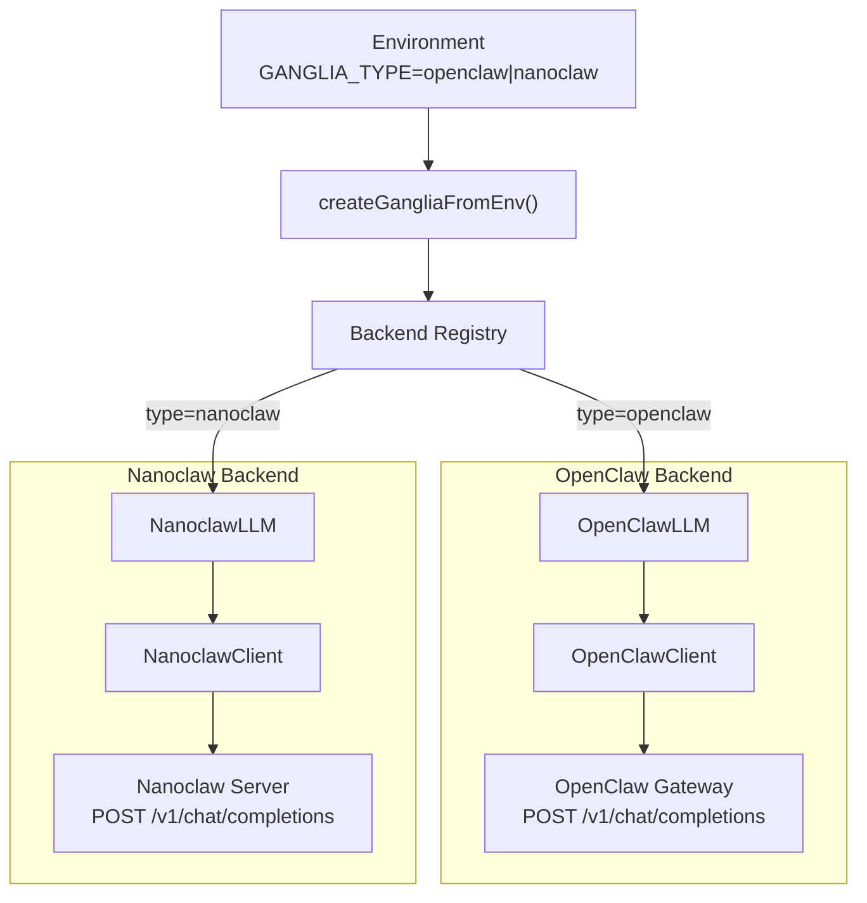

# Brain Plugin (Ganglia)

The `@knittt/livekit-agent-ganglia` package implements the LiveKit Agents `llm.LLM` interface, bridging the voice pipeline to OpenClaw or Nanoclaw reasoning backends. The name references lobster ganglia — distributed nerve clusters connecting multiple "brains" to a single interface.

## Architecture

Ganglia uses a factory-and-registry pattern. Backends register themselves on import, and the factory instantiates the correct one based on configuration.



## Factory System

### Registration

Backends self-register via `registerGanglia()`:

```typescript
registerGanglia('openclaw', async () => OpenClawLLM)
registerGanglia('nanoclaw', async () => NanoclawLLM)
```

New backends can be added without modifying factory code.

### Instantiation

`createGangliaFromEnv()` reads environment variables and creates the appropriate backend:

| Variable | Backend | Default |
|----------|---------|---------|
| `GANGLIA_TYPE` (or `BRAIN_TYPE`) | Both | `openclaw` |
| `OPENCLAW_GATEWAY_URL` | OpenClaw | `http://localhost:8080` |
| `OPENCLAW_API_KEY` | OpenClaw | (required) |
| `NANOCLAW_URL` | Nanoclaw | `http://localhost:18789` |
| `NANOCLAW_CHANNEL_PREFIX` | Nanoclaw | `lk` |

### GangliaLLM Interface

All backends implement this interface (extending `llm.LLM`):

```typescript
interface GangliaLLM extends llm.LLM {
  setDefaultSession?(session: GangliaSessionInfo): void;
  setSessionKey?(sessionKey: SessionKey): void;
  gangliaType(): string;  // 'openclaw' or 'nanoclaw'
}
```

## OpenClaw Backend

### OpenClawLLM

Extends `LLMBase` from `@livekit/agents`. On each `chat()` call, it creates an `OpenClawChatStream` that:

1. Converts LiveKit `ChatContext` items to OpenClaw message format
2. Attaches session routing headers (see [Session Routing](session-routing.md))
3. Opens an SSE connection to the gateway
4. Parses response chunks into LiveKit `ChatChunk` events

### OpenClawClient

Handles HTTP communication with the OpenClaw Gateway.

**Endpoint:** `POST {baseUrl}/v1/chat/completions`

**Authentication:** `Authorization: Bearer {apiKey}` (if provided)

**Request body:** OpenAI-compatible chat completions format with `stream: true`

**Session routing** is applied via headers and body fields based on the active `SessionKey`:

| SessionKey Type | Header | Body |
|-----------------|--------|------|
| `owner` | `x-openclaw-session-key: "main"` | — |
| `guest` | — | `user: "guest_{identity}"` |
| `room` | — | `user: "room_{roomName}"` |

Legacy session headers (`X-OpenClaw-Session-Id`, `X-OpenClaw-Room-SID`, etc.) are also sent for backward compatibility.

**Response format:** Server-Sent Events (SSE), one JSON object per `data:` line, terminated by `data: [DONE]`.

### Error Types

```typescript
class AuthenticationError extends Error {
  code: 'UNAUTHORIZED' | 'FORBIDDEN' | 'INVALID_TOKEN' | 'TOKEN_EXPIRED';
  statusCode: number;
}

class SessionError extends Error {
  sessionId: string;
  reason: 'expired' | 'invalid' | 'not_found';
}
```

## Nanoclaw Backend

Nanoclaw is the single-user development backend. It runs on localhost without authentication.

### Key Differences from OpenClaw

| Aspect | OpenClaw | Nanoclaw |
|--------|----------|----------|
| Authentication | API key required | None |
| Session model | Multi-user with routing | Single-user |
| Channel ID | Session headers | JID (Jabber ID) format |
| Extended events | No | Status + Artifact events |

### Channel Identification

Nanoclaw uses a JID-style channel identifier sent via `X-Nanoclaw-Channel` header:

```
Format: {prefix}:{participantIdentity}
Example: lk:user-12345
```

When a `SessionKey` is set, it maps to channels:
- `owner` → `"main"`
- `guest` → `"guest:{identity}"`
- `room` → `"room:{roomName}"`

### Extended Events

Nanoclaw streams can include non-standard events alongside chat completion chunks:

- **StatusEvent** — what the agent is currently doing (thinking, reading files, etc.)
- **ArtifactEvent** — visual content produced by tool execution (diffs, code, search results)

These are forwarded to the mobile client via the data channel. See [Data Channel Protocol](data-channel-protocol.md).

## Streaming Architecture

Both backends use the same streaming pattern:

1. **Request:** HTTP POST with `stream: true`
2. **Response:** SSE stream with JSON payloads per line
3. **Parsing:** Line-by-line, skip empty lines and `data: [DONE]`
4. **Chunk format:**

```typescript
interface OpenClawChatResponse {
  id: string;
  choices: [{
    delta: {
      role?: string;
      content?: string;         // Text token
      tool_calls?: ToolCallDelta[];  // Function call fragments
    };
    finish_reason?: string;     // 'stop' | 'tool_calls' | null
  }];
}
```

5. **Tool calls** arrive as deltas — the `id` and `function.name` come in the first chunk, subsequent chunks append to `function.arguments`

## Logging

Ganglia uses a two-tier logging system:

| Tier | Library | Purpose | Enable With |
|------|---------|---------|-------------|
| Trace | `debug` | Request/response details, chunk counts, session metadata | `DEBUG=ganglia:*` |
| Production | Injected `Logger` | Errors, warnings, lifecycle events | Pass logger to factory |

**Debug namespaces:**
- `ganglia:factory` — backend selection and instantiation
- `ganglia:openclaw:stream` — OpenClaw SSE parsing
- `ganglia:openclaw:client` — OpenClaw HTTP requests
- `ganglia:nanoclaw:stream` — Nanoclaw SSE parsing
- `ganglia:nanoclaw:client` — Nanoclaw HTTP requests

**Logger interface:**
```typescript
interface Logger {
  debug(msg: string, ...args: unknown[]): void;
  info(msg: string, ...args: unknown[]): void;
  warn(msg: string, ...args: unknown[]): void;
  error(msg: string, ...args: unknown[]): void;
}
```

The default logger (`noopLogger`) is silent. In the voice agent, a `pino` logger is injected via `createGangliaFromEnv({ logger })`.

## Public API

The package exports everything needed to use or extend Ganglia:

- **Factory:** `createGanglia()`, `createGangliaFromEnv()`, `registerGanglia()`
- **Backends:** `OpenClawLLM`, `NanoclawLLM` (and their clients)
- **Session routing:** `resolveSessionKey()`, `resolveSessionKeySimple()`, `SessionKey`
- **Events:** `StatusEvent`, `ArtifactEvent`, `ContentEvent`, type guards
- **Tool interception:** `ToolInterceptor`, `EventInterceptor`
- **Logging:** `noopLogger`, `Logger`

## Related Documents

- [Voice Pipeline](voice-pipeline.md) — how Ganglia fits into the audio flow
- [Session Routing](session-routing.md) — SessionKey resolution and wire protocol
- [Data Channel Protocol](data-channel-protocol.md) — event delivery to the mobile client
- [System Overview](system-overview.md) — three-layer architecture context
