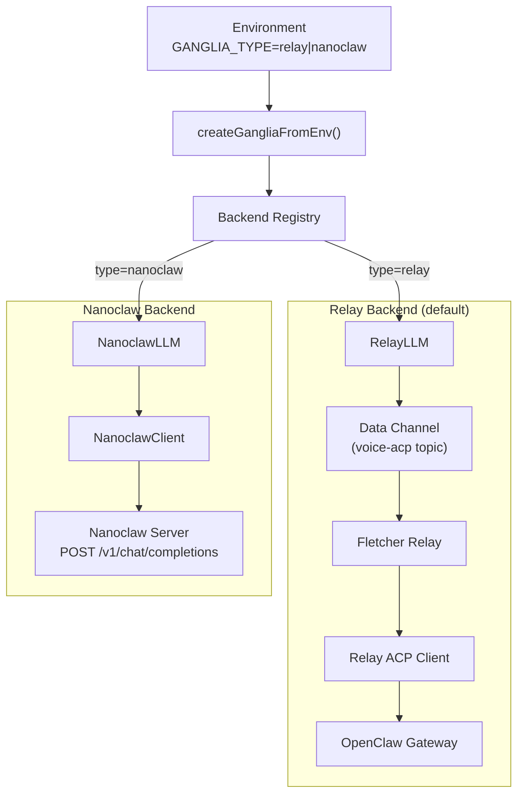

# Brain Plugin (Ganglia)

The `@knittt/livekit-agent-ganglia` package implements the LiveKit Agents `llm.LLM` interface, bridging the voice pipeline to ACP backends via the relay. Used only in voice mode — text mode bypasses Ganglia entirely and routes through the relay directly. The name references lobster ganglia — distributed nerve clusters connecting multiple "brains" to a single interface.

## Architecture

Ganglia uses a factory-and-registry pattern. Backends register themselves on import, and the factory instantiates the correct one based on configuration.


```mermaid
flowchart TD
    ENV["Environment<br/>GANGLIA_TYPE=relay|nanoclaw"]
    F["createGangliaFromEnv()"]
    R["Backend Registry"]

    subgraph "Relay Backend (default)"
        RLLM["RelayLLM"]
        DC["Data Channel<br/>(voice-acp topic)"]
        RELAY["Fletcher Relay"]
        RAC["Relay ACP Client"]
        RGW["OpenClaw Gateway"]
    end

    subgraph "Nanoclaw Backend"
        NLLM["NanoclawLLM"]
        NC["NanoclawClient"]
        NW["Nanoclaw Server<br/>POST /v1/chat/completions"]
    end

    ENV --> F
    F --> R
    R -->|"type=relay"| RLLM
    R -->|"type=nanoclaw"| NLLM
    RLLM --> DC --> RELAY --> RAC --> RGW
    NLLM --> NC --> NW
```

## Factory System

### Registration

Backends self-register via `registerGanglia()`:

```typescript
registerGanglia('relay', async () => RelayLLM)
registerGanglia('nanoclaw', async () => NanoclawLLM)
```

New backends can be added without modifying factory code.

### Instantiation

`createGangliaFromEnv()` reads environment variables and creates the appropriate backend:

| Variable | Backend | Default |
|----------|---------|---------|
| `GANGLIA_TYPE` (or `BRAIN_TYPE`) | All | `relay` |
| `NANOCLAW_URL` | Nanoclaw | `http://localhost:18789` |
| `NANOCLAW_CHANNEL_PREFIX` | Nanoclaw | `lk` |

**Optional callbacks and options:**

```typescript
const llm = await createGangliaFromEnv({
  logger,                                    // pino-compatible logger
  historyMode: 'latest',                     // 'full' sends entire history, 'latest' sends only new messages
  onPondering: (phrase) => { ... },          // Rotating phrases while waiting for first content token; null when cleared
  onContent: (delta, fullText) => { ... },   // Called for each content-bearing LLM chunk
});
```

- **`onPondering`** — enables the voice agent to publish "thinking" status events to the data channel while the LLM backend processes. See [Voice Pipeline](voice-pipeline.md#visual-pondering-status-phrases) for details.
- **`onContent`** — fires for each content-bearing chunk with the text delta and accumulated full text. The voice agent uses this to publish `agent_transcript` events via the data channel, bypassing the SDK's transcription pipeline (see [Voice Pipeline — Agent Transcript Bypass](voice-pipeline.md#agent-transcript-bypass)).

### GangliaLLM Interface

All backends implement this interface (extending `llm.LLM`):

```typescript
interface GangliaLLM extends llm.LLM {
  setDefaultSession?(session: GangliaSessionInfo): void;
  setSessionKey?(sessionKey: SessionKey): void;
  gangliaType(): string;  // 'relay' or 'nanoclaw'
}
```

## OpenClaw Backend

### OpenClawLLM

Extends `LLMBase` from `@livekit/agents`. On each `chat()` call, it creates an `OpenClawChatStream` that:

1. Converts LiveKit `ChatContext` items to OpenClaw message format
2. Attaches session routing headers (see [Session Routing](session-routing.md))
3. Opens an SSE connection to the gateway
4. Starts the pondering timer (if `onPondering` callback is set) — emits rotating phrases every 3s
5. Parses response chunks into LiveKit `ChatChunk` events
6. On first content chunk: clears pondering and proceeds with normal streaming
7. On each content chunk: fires `onContent(delta, fullText)` with the text delta and accumulated response

When `historyMode` is `'latest'` (the default for OpenClaw), only the most recent user message and any subsequent tool-call/result items are sent. OpenClaw maintains server-side conversation history, so sending the full context is redundant and wastes tokens.

### OpenClawClient

Handles HTTP communication with the OpenClaw Gateway.

**Endpoint:** `POST {baseUrl}/v1/chat/completions`

**Authentication:** `Authorization: Bearer {apiKey}` (if provided)

**Request body:** OpenAI-compatible chat completions format with `stream: true`

**Session routing** is applied via headers and body fields based on the active `SessionKey`:

| SessionKey Type | Header | Body |
|-----------------|--------|------|
| `owner` | `x-openclaw-session-key: "main"` | — |
| `guest` | — | `user: "guest_{identity}"` |
| `room` | — | `user: "room_{roomName}"` |

Legacy session headers (`X-OpenClaw-Session-Id`, `X-OpenClaw-Room-SID`, etc.) are also sent for backward compatibility.

**Response format:** Server-Sent Events (SSE), one JSON object per `data:` line, terminated by `data: [DONE]`.

### Error Types

```typescript
class AuthenticationError extends Error {
  code: 'UNAUTHORIZED' | 'FORBIDDEN' | 'INVALID_TOKEN' | 'TOKEN_EXPIRED';
  statusCode: number;
}

class SessionError extends Error {
  sessionId: string;
  reason: 'expired' | 'invalid' | 'not_found';
}
```

## Relay Backend (Default)

The relay backend (`GANGLIA_TYPE=relay`, default) routes LLM requests through the Fletcher Relay via the LiveKit data channel, rather than spawning a local ACP subprocess. This keeps the voice-agent container thin — just the audio pipeline with no OpenClaw dependency.

### How It Works

1. Voice-agent publishes a JSON-RPC 2.0 `session/prompt` request on the `voice-acp` data channel topic
2. The relay (already in the same LiveKit room) receives the request
3. Relay forwards it to its ACP subprocess
4. Streaming response chunks are sent back as `session/update` JSON-RPC notifications on the same topic
5. Final result is sent as a JSON-RPC response

### `voice-acp` Data Channel Protocol

Uses JSON-RPC 2.0 on a dedicated topic (`voice-acp`), separate from the mobile↔relay `acp` topic:

- **Request:** `session/prompt` — voice-agent sends user message
- **Streaming:** `session/update` — relay sends `agent_message_chunk` content deltas as notifications
- **Result:** JSON-RPC response with `stopReason`
- **Cancel:** `session/cancel` — voice-agent cancels in-flight request (e.g., on user interruption / barge-in)

### Why a Separate Topic?

The relay's `acp` topic is owned by the mobile client for chat mode. Voice-mode requests use `voice-acp` to:
- Avoid collisions when both voice-agent and mobile are in the room
- Allow independent lifecycle management (voice requests can be cancelled by the agent without affecting chat)
- Enable future mutual-exclusion enforcement at the relay level

## Nanoclaw Backend

Nanoclaw is the single-user development backend. It runs on localhost without authentication.

### Key Differences from OpenClaw

| Aspect | OpenClaw | Nanoclaw |
|--------|----------|----------|
| Authentication | API key required | None |
| Session model | Multi-user with routing | Single-user |
| Channel ID | Session headers | JID (Jabber ID) format |
| History mode | `latest` (backend manages state) | `full` (no server-side history) |
| Extended events | No | Status + Artifact events |

Nanoclaw defaults to `historyMode: 'full'` since it does not maintain server-side conversation history.

### Channel Identification

Nanoclaw uses a JID-style channel identifier sent via `X-Nanoclaw-Channel` header:

```
Format: {prefix}:{participantIdentity}
Example: lk:user-12345
```

When a `SessionKey` is set, it maps to channels:
- `owner` → `"main"`
- `guest` → `"guest:{identity}"`
- `room` → `"room:{roomName}"`

### Extended Events

Nanoclaw streams can include non-standard events alongside chat completion chunks:

- **StatusEvent** — what the agent is currently doing (thinking, reading files, etc.)
- **ArtifactEvent** — visual content produced by tool execution (diffs, code, search results)

These are forwarded to the mobile client via the data channel. See [Data Channel Protocol](data-channel-protocol.md).

## Streaming Architecture

Both backends use the same streaming pattern:

1. **Request:** HTTP POST with `stream: true`
2. **Response:** SSE stream with JSON payloads per line
3. **Parsing:** Line-by-line, skip empty lines and `data: [DONE]`
4. **Chunk format:**

```typescript
interface OpenClawChatResponse {
  id: string;
  choices: [{
    delta: {
      role?: string;
      content?: string;         // Text token
      tool_calls?: ToolCallDelta[];  // Function call fragments
    };
    finish_reason?: string;     // 'stop' | 'tool_calls' | null
  }];
}
```

5. **Tool calls** arrive as deltas — the `id` and `function.name` come in the first chunk, subsequent chunks append to `function.arguments`

### Abort Signal Propagation

When the LiveKit SDK detects a participant disconnect or interruption, it calls `LLMStream.close()` which fires `abortController.abort()`. The stream threads this signal through to the client's `fetch()` call via `AbortSignal.any()`, combining it with the client's internal abort controller. This ensures:

1. The in-flight HTTP request is immediately terminated (TCP RST)
2. The upstream gateway detects the client disconnect and releases any session lane locks
3. Subsequent requests on the same session key are not blocked by stale turns

Without this, a network drop during an active LLM request would leave the gateway lane locked indefinitely, causing all future requests to return 0 chunks.

## Logging

Ganglia uses a two-tier logging system:

| Tier | Library | Purpose | Enable With |
|------|---------|---------|-------------|
| Trace | `debug` | Request/response details, chunk counts, session metadata | `DEBUG=ganglia:*` |
| Production | Injected `Logger` | Errors, warnings, lifecycle events | Pass logger to factory |

**Debug namespaces:**
- `ganglia:factory` — backend selection and instantiation
- `ganglia:relay:stream` — relay data channel message handling
- `ganglia:relay:client` — relay transport and connection
- `ganglia:openclaw:stream` — OpenClaw SSE parsing (legacy, used by relay internals)
- `ganglia:openclaw:client` — OpenClaw HTTP requests (legacy)
- `ganglia:nanoclaw:stream` — Nanoclaw SSE parsing
- `ganglia:nanoclaw:client` — Nanoclaw HTTP requests

**Logger interface:**
```typescript
interface Logger {
  debug(msg: string, ...args: unknown[]): void;
  info(msg: string, ...args: unknown[]): void;
  warn(msg: string, ...args: unknown[]): void;
  error(msg: string, ...args: unknown[]): void;
}
```

The default logger (`noopLogger`) is silent. In the voice agent, a `pino` logger is injected via `createGangliaFromEnv({ logger })`.

## Public API

The package exports everything needed to use or extend Ganglia:

- **Factory:** `createGanglia()`, `createGangliaFromEnv()`, `registerGanglia()`
- **Backends:** `RelayLLM`, `NanoclawLLM` (and their clients/transports)
- **Session routing:** `resolveSessionKey()`, `resolveSessionKeySimple()`, `SessionKey`
- **Events:** `StatusEvent`, `ArtifactEvent`, `ContentEvent`, type guards
- **Tool interception:** `ToolInterceptor`, `EventInterceptor`
- **Logging:** `noopLogger`, `Logger`

## Related Documents

- [Voice Pipeline](voice-pipeline.md) — how Ganglia fits into the audio flow
- [Session Routing](session-routing.md) — SessionKey resolution and wire protocol
- [Data Channel Protocol](data-channel-protocol.md) — event delivery to the mobile client
- [System Overview](system-overview.md) — three-layer architecture context
