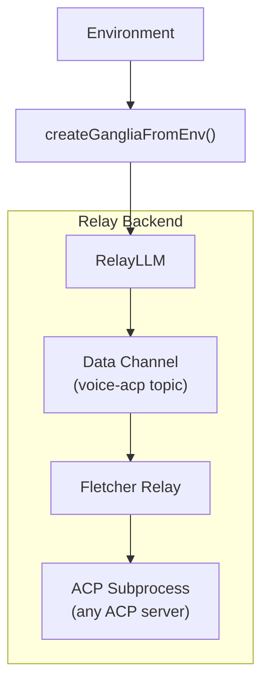

# Brain Plugin (Ganglia)

The `@knittt/livekit-agent-ganglia` package implements the LiveKit Agents `llm.LLM` interface, bridging the voice pipeline to the ACP backend via the Fletcher Relay. Used only in voice mode — text mode bypasses Ganglia entirely and routes through the relay directly. The name references lobster ganglia — distributed nerve clusters connecting multiple "brains" to a single interface.

Ganglia is a focused package: `RelayLLM` + `SessionKey` routing + slim factory. It routes voice-mode LLM requests through the relay's data channel — the voice agent has no direct ACP dependency.

## Architecture


```mermaid
flowchart TD
    ENV["Environment"]
    F["createGangliaFromEnv()"]

    subgraph "Relay Backend"
        RLLM["RelayLLM"]
        DC["Data Channel<br/>(voice-acp topic)"]
        RELAY["Fletcher Relay"]
        ACP["ACP Subprocess<br/>(any ACP server)"]
    end

    ENV --> F --> RLLM
    RLLM --> DC --> RELAY --> ACP
```

## Factory System

### Instantiation

`createGangliaFromEnv()` creates the relay backend:

```typescript
const llm = await createGangliaFromEnv({
  logger,                                    // pino-compatible logger
  onPondering: (phrase) => { ... },          // Rotating phrases while waiting for first content token; null when cleared
  onContent: (delta, fullText) => { ... },   // Called for each content-bearing LLM chunk
});
```

**Callbacks:**

- **`onPondering`** — enables the voice agent to publish "thinking" status events to the data channel while the LLM backend processes. See [Voice Pipeline](voice-pipeline.md#visual-pondering-status-phrases) for details.
- **`onContent`** — fires for each content-bearing chunk with the text delta and accumulated full text. The voice agent uses this to publish `agent_transcript` events via the data channel, bypassing the SDK's transcription pipeline (see [Voice Pipeline — Agent Transcript Bypass](voice-pipeline.md#agent-transcript-bypass)).

### GangliaLLM Interface

```typescript
interface GangliaLLM extends llm.LLM {
  setDefaultSession?(session: GangliaSessionInfo): void;
  setSessionKey?(sessionKey: SessionKey): void;
  gangliaType(): string;  // 'relay'
}
```

## Relay Backend

The relay backend routes LLM requests through the Fletcher Relay via the LiveKit data channel. This keeps the voice-agent container thin — just the audio pipeline, no ACP dependency.

### How It Works

1. Voice-agent publishes a JSON-RPC 2.0 `session/prompt` request on the `voice-acp` data channel topic
2. The relay (already in the same LiveKit room) receives the request
3. Relay forwards it to its ACP subprocess over stdio
4. Streaming response chunks are sent back as `session/update` JSON-RPC notifications on the same topic
5. Final result is sent as a JSON-RPC response

### `voice-acp` Data Channel Protocol

Uses JSON-RPC 2.0 on a dedicated topic (`voice-acp`), separate from the mobile↔relay `acp` topic:

- **Request:** `session/prompt` — voice-agent sends user message
- **Streaming:** `session/update` — relay sends `agent_message_chunk` content deltas as notifications
- **Result:** JSON-RPC response with `stopReason`
- **Cancel:** `session/cancel` — voice-agent cancels in-flight request (e.g., on user interruption / barge-in)

### Why a Separate Topic?

The relay's `acp` topic is owned by the mobile client for chat mode. Voice-mode requests use `voice-acp` to:
- Avoid collisions when both voice-agent and mobile are in the room
- Allow independent lifecycle management (voice requests can be cancelled by the agent without affecting chat)
- Enable the relay to dual-publish responses to both topics in voice mode

### Streaming

The `RelayChatStream` handles the response lifecycle:

1. Publishes `session/prompt` on the `voice-acp` data channel
2. Starts the pondering timer (if `onPondering` callback is set) — emits rotating phrases every 3s
3. Receives `session/update` notifications with streaming content
4. On first content chunk: clears pondering and begins normal streaming
5. On each content chunk: fires `onContent(delta, fullText)` and emits `ChatChunk` for AgentSession → TTS
6. On stream close: emits final chunk

### Abort Signal Propagation

When the LiveKit SDK detects a participant disconnect or interruption, it calls `LLMStream.close()` which fires `abortController.abort()`. The `RelayChatStream` sends `session/cancel` on the `voice-acp` topic. This ensures:

1. The relay cancels the in-flight ACP request
2. The upstream ACP subprocess releases any locks
3. Subsequent requests on the same session are not blocked by stale turns

## Logging

Ganglia uses a two-tier logging system:

| Tier | Library | Purpose | Enable With |
|------|---------|---------|-------------|
| Trace | `debug` | Request/response details, chunk counts, session metadata | `DEBUG=ganglia:*` |
| Production | Injected `Logger` | Errors, warnings, lifecycle events | Pass logger to factory |

**Debug namespaces:**
- `ganglia:factory` — backend selection and instantiation
- `ganglia:relay:stream` — relay data channel message handling
- `ganglia:relay:client` — relay transport and connection

**Logger interface:**
```typescript
interface Logger {
  debug(msg: string, ...args: unknown[]): void;
  info(msg: string, ...args: unknown[]): void;
  warn(msg: string, ...args: unknown[]): void;
  error(msg: string, ...args: unknown[]): void;
}
```

The default logger (`noopLogger`) is silent. In the voice agent, a `pino` logger is injected via `createGangliaFromEnv({ logger })`.

## Public API

The package exports:

- **Factory:** `createGanglia()`, `createGangliaFromEnv()`, `registerGanglia()`
- **Backend:** `RelayLLM`, `DataChannelTransport`, `VOICE_ACP_TOPIC`
- **Session routing:** `resolveSessionKey()`, `resolveSessionKeySimple()`, `SessionKey`
- **Pondering:** phrase rotation utilities
- **Logging:** `noopLogger`, `Logger`

## Related Documents

- [Voice Pipeline](voice-pipeline.md) — how Ganglia fits into the audio flow
- [Session Routing](session-routing.md) — SessionKey resolution and wire protocol
- [Data Channel Protocol](data-channel-protocol.md) — event delivery and the one-pipeline principle
- [System Overview](system-overview.md) — three-layer architecture context
