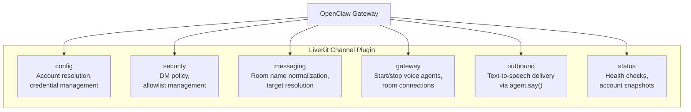
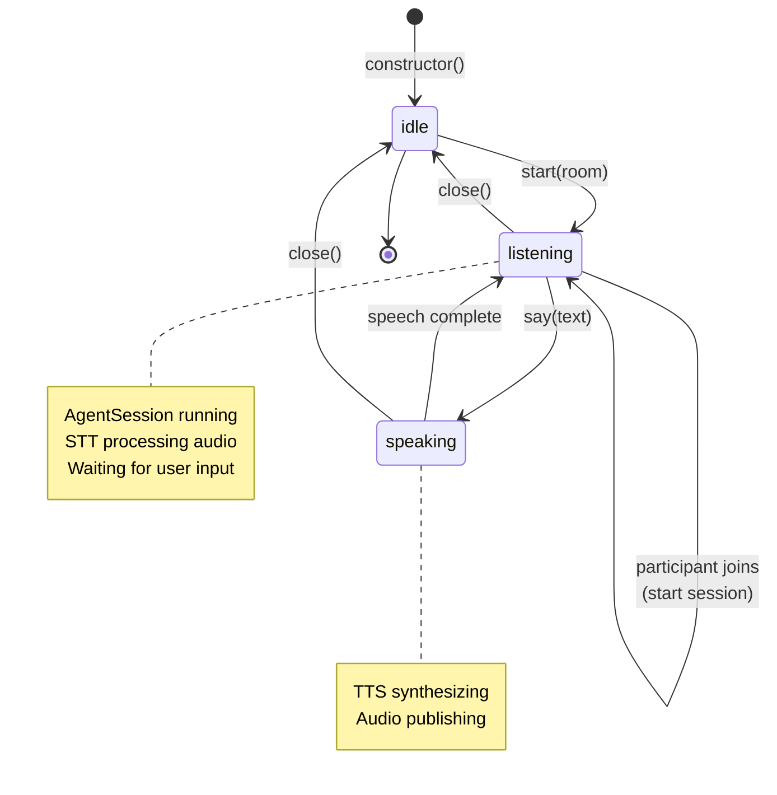
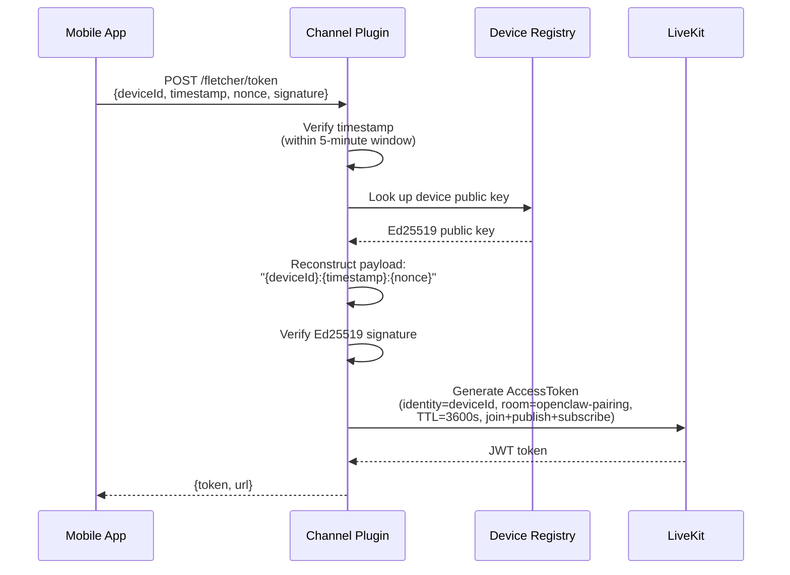

# Channel Plugin

The `@openclaw/channel-livekit` package implements the OpenClaw Channel Plugin interface, making LiveKit voice conversations available as a first-class OpenClaw channel alongside text-based channels like Telegram or WhatsApp.

## Plugin Registration

The plugin registers with OpenClaw during gateway startup:

```typescript
plugin = {
  id: "livekit",
  name: "LiveKit Voice",
  description: "Real-time voice conversations with <1.5s latency",
  configSchema: LivekitConfigSchema,
  register(api: OpenClawPluginApi) {
    // Store runtime and logger
    // Register channel plugin (livekitPlugin)
    // Register HTTP route: POST /fletcher/token
  }
}
```

## Six Adapter Interfaces

The channel plugin exposes its capabilities through six adapters that OpenClaw queries:



### Config Adapter

Manages multi-account LiveKit configurations with cascading fallbacks:

1. Account-specific config (`channels.livekit.accounts.{id}`)
2. Top-level config (`channels.livekit.*`) — legacy single-account mode
3. Environment variables (`LIVEKIT_URL`, `LIVEKIT_API_KEY`, etc.)
4. Hardcoded defaults

Each resolved account includes:
- LiveKit connection credentials (URL, API key, secret)
- Room prefix (default: `"openclaw-"`)
- STT config (Deepgram Nova-3)
- TTS config (Cartesia Sonic or ElevenLabs)
- DM policy (open, allowlist, or pairing)

### Security Adapter

Controls who can initiate voice conversations:

| Policy | Behavior |
|--------|----------|
| `open` | Anyone can connect |
| `allowlist` | Only listed identities can connect |
| `pairing` | Requires Sovereign Pairing (Ed25519 device authentication) |

### Messaging Adapter

Normalizes room names — strips `livekit://` prefixes and validates format.

### Gateway Adapter

**`startAccount(ctx)`** — Creates and starts a voice agent:
1. Generate agent token with `roomJoin`, `roomCreate`, publish, and subscribe grants
2. Connect to a LiveKit room
3. Create `VoiceAgent` and call `agent.start(room)`
4. Register abort signal listener for graceful shutdown

**`stopAccount(ctx)`** — Closes the voice agent and disconnects from the room.

### Outbound Adapter

Delivers text as synthesized speech via `agent.say(text)`. Used when OpenClaw wants to proactively speak (not in response to user input).

### Status Adapter

Provides health checks and account snapshots:
- `probeAccount()` — attempts token generation as a connectivity check
- `buildAccountSnapshot()` — returns enabled/configured/active status
- `buildChannelSummary()` — counts active agents and rooms

## VoiceAgent Lifecycle



### Internal Components

When `start(room)` is called, the VoiceAgent creates:

| Component | Source | Purpose |
|-----------|--------|---------|
| `deepgram.STT` | Account STT config | Speech-to-text |
| `cartesia.TTS` | Account TTS config | Text-to-speech |
| `GangliaLLM` | `createGanglia()` | LLM bridge |
| `voice.Agent` | Empty shell | LiveKit agent container |
| `voice.AgentSession` | STT + TTS + LLM | Pipeline orchestrator |
| `ParticipantTracker` | Room events | Join/leave notifications |

The `voice.Agent` is deliberately empty — no instructions, no tools. OpenClaw owns personality and tool execution. The agent is a passthrough to the brain backend.

### Session Start Trigger

The `ParticipantTracker` listens for `RoomEvent.ParticipantConnected`. When the first remote participant joins, it triggers `startSession()`, which creates the `AgentSession` and begins the STT/TTS loop.

If participants are already in the room when the agent connects, the session starts immediately.

## Token Generation (Sovereign Pairing)

The plugin registers a `POST /fletcher/token` HTTP endpoint for device authentication using Ed25519 signatures.



**Current status:** Server-side verification is implemented. The Flutter app does not yet use it — it relies on pre-generated tokens stored in `.env`. The device registry is in-memory (`Map<string, DeviceIdentity>`); production will need persistent storage.

## Participant Tracking

The `ParticipantTracker` maintains a map of connected participants:

```typescript
interface ParticipantInfo {
  identity: string;
  name?: string;
  joinedAt: Date;
  isSpeaking: boolean;
}
```

It subscribes to:
- `RoomEvent.ParticipantConnected` — adds to map, fires `onJoin` callback
- `RoomEvent.ParticipantDisconnected` — fires `onLeave` callback, removes from map

The tracker is used for:
- Triggering session start on first participant join
- Providing participant count to session routing
- Converting participants to `Speaker` objects for OpenClaw message context

## Audio Buffering

The package includes an `AudioBuffer` and `JitterBuffer` for smoothing network jitter:

| Setting | Default |
|---------|---------|
| Target buffer | 100ms |
| Max buffer | 500ms |
| Jitter min buffer | 50ms |
| Sample rate | 48kHz |
| Channels | Mono |
| Bit depth | 16-bit |

The buffer drops oldest chunks on overflow to prevent unbounded latency growth.

## Related Documents

- [System Overview](system-overview.md) — how the channel plugin fits in the three-layer architecture
- [Voice Pipeline](voice-pipeline.md) — the STT/LLM/TTS flow managed by VoiceAgent
- [Session Routing](session-routing.md) — how participants map to sessions
- [Infrastructure](infrastructure.md) — configuration schema and environment variables
