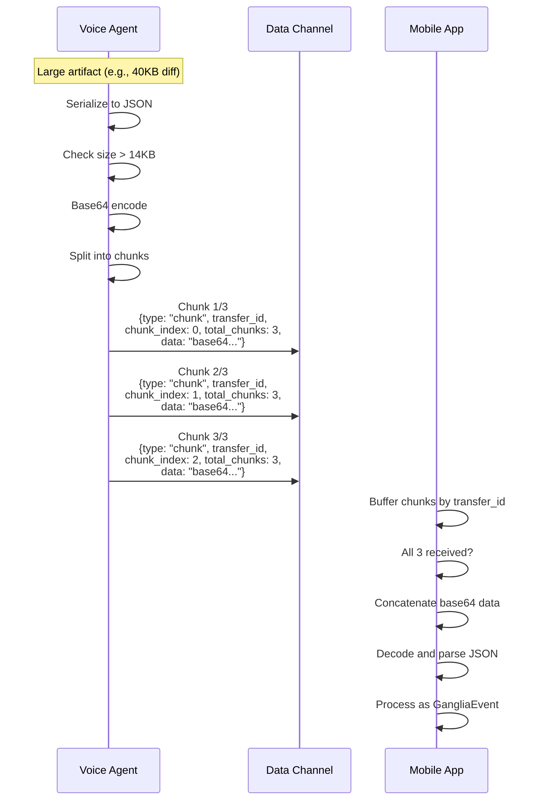

# Data Channel Protocol

Beyond the audio pipeline, Fletcher sends structured metadata from the voice agent to the mobile client via LiveKit's data transport. This includes real-time transcriptions, agent status updates, and visual artifacts (code diffs, search results, etc.).

## Transport Channels

| Channel | Transport | Direction | Content |
|---------|-----------|-----------|---------|
| `lk.transcription` | LiveKit Text Streams | Agent → Client | Real-time transcription of user and agent speech |
| `ganglia-events` | LiveKit Data Channel | Agent → Client | Status events, artifacts, content events |

## Transcription Streams

Transcriptions are sent via LiveKit's built-in text stream API on the `lk.transcription` topic.

### Message Model

Each transcription segment has a unique `segmentId` and arrives as a series of chunks:

```typescript
// Per-segment state on the client
interface TranscriptEntry {
  id: string;            // segmentId from LiveKit
  role: 'user' | 'agent';
  text: string;
  isFinal: boolean;
  timestamp: DateTime;
}
```

### Update Semantics

User and agent transcripts use different update strategies:

| Speaker | Semantics | Behavior |
|---------|-----------|----------|
| User | **Full replacement** | Each chunk contains the complete text so far |
| Agent | **Delta** | Each chunk appends to previous content |

### Client-Side Lifecycle

1. `TextStreamReader` emits chunks for a segment
2. Content accumulates in a `segmentContent` map keyed by `segmentId`
3. `upsertTranscript()` updates or creates the `TranscriptEntry`
4. On final chunk: 3-second timer starts, then subtitle auto-clears
5. On stream close: segment state removed, entry marked final

## Ganglia Events

Status updates and artifacts are sent as binary-encoded UTF-8 JSON on the `ganglia-events` data channel topic.

### Event Types

```typescript
type GangliaEvent = StatusEvent | ArtifactEvent | ContentEvent;
```

#### StatusEvent

Reports what the agent is currently doing:

```typescript
interface StatusEvent {
  type: 'status';
  action: StatusAction;
  detail?: string;        // File path, search query, command, etc.
  startedAt?: number;     // Timestamp (ms)
}

type StatusAction =
  | 'thinking'
  | 'searching_files'
  | 'reading_file'
  | 'writing_file'
  | 'editing_file'
  | 'web_search'
  | 'executing_command'
  | 'analyzing';
```

Status events are generated by the `ToolInterceptor` when tools execute. A mapping table converts tool names to actions:

| Tool Name | Status Action |
|-----------|---------------|
| `Read`, `read_file` | `reading_file` |
| `Write`, `write_file` | `writing_file` |
| `Edit`, `edit_file` | `editing_file` |
| `Grep`, `Glob`, `search`, `grep`, `glob` | `searching_files` |
| `WebSearch`, `web_search` | `web_search` |
| `Bash`, `bash` | `executing_command` |

Status events are **debounced** — the same action must wait 500ms before being sent again. Different actions are sent immediately.

The mobile app displays these in the `StatusBar` widget and auto-clears them after 5 seconds.

#### ArtifactEvent

Visual content produced by tool execution:

```typescript
type ArtifactType = 'diff' | 'code' | 'markdown' | 'file' | 'search_results' | 'error';

// Example: DiffArtifact
interface DiffArtifact {
  type: 'artifact';
  artifact_type: 'diff';
  file: string;
  diff: string;         // Unified diff format
  title?: string;
}

// Example: CodeArtifact
interface CodeArtifact {
  type: 'artifact';
  artifact_type: 'code';
  language?: string;
  content: string;
  file?: string;
  startLine?: number;
  title?: string;
}

// Example: SearchResultsArtifact
interface SearchResultsArtifact {
  type: 'artifact';
  artifact_type: 'search_results';
  query: string;
  results: Array<{ file: string; line: number; content: string }>;
  title?: string;
}

// Example: ErrorArtifact
interface ErrorArtifact {
  type: 'artifact';
  artifact_type: 'error';
  message: string;
  stack?: string;
  title?: string;
}
```

The mobile app displays these in the `ArtifactViewer` widget (a tabbed bottom sheet), keeping the most recent 10 artifacts.

#### ContentEvent

Text content from the agent response stream:

```typescript
interface ContentEvent {
  type: 'content';
  delta: string;    // Text token
}
```

### Type Guards

```typescript
function isStatusEvent(event: GangliaEvent): event is StatusEvent;
function isArtifactEvent(event: GangliaEvent): event is ArtifactEvent;
function isContentEvent(event: GangliaEvent): event is ContentEvent;
```

## Chunking Protocol

LiveKit data channels have a typical MTU of ~16KB. Messages larger than 14KB (headroom under the MTU) are split into chunks.



### Chunk Message Format

```typescript
interface ChunkMessage {
  type: 'chunk';
  transfer_id: string;     // Unique ID for this transfer
  chunk_index: number;      // 0-based index
  total_chunks: number;     // Total expected chunks
  data: string;             // Base64-encoded fragment
}
```

### Client-Side Reassembly

The mobile app (`LiveKitService`) maintains a buffer map:

```dart
Map<String, Map<int, String>> _chunks;  // transfer_id → {index → data}
```

When all chunks for a `transfer_id` are received:
1. Concatenate `data` fields in order
2. Base64 decode
3. Parse as JSON
4. Process as a normal `GangliaEvent`

Incomplete transfers are cleared on disconnect.

## Tool Interception Pipeline

The `ToolInterceptor` and `EventInterceptor` classes generate events from tool execution:

```
Tool Call → ToolInterceptor → StatusEvent (emitted before execution)
                            → Execute tool
                            → ArtifactEvent (emitted after success)
                            → ErrorArtifact (emitted on failure)

EventInterceptor → Status debouncing (500ms same-action)
                 → Size check (> 14KB?)
                 → Chunking if needed
                 → publishData() to data channel
```

### Artifact Generation

The interceptor automatically creates artifacts based on tool type:

| Tool | Artifact |
|------|----------|
| `Read` / `read_file` | `CodeArtifact` or `MarkdownArtifact` (based on file extension) |
| `Edit` / `edit_file` | `DiffArtifact` (generates unified diff from old/new strings) |
| `Grep` / `Glob` / `search` | `SearchResultsArtifact` (parses `file:line:content` format) |
| Any failing tool | `ErrorArtifact` |

Language detection for code artifacts uses file extension mapping (`.ts` → TypeScript, `.dart` → Dart, etc.).

## Related Documents

- [Voice Pipeline](voice-pipeline.md) — the audio flow that runs alongside data channels
- [Brain Plugin](brain-plugin.md) — where extended events originate (Nanoclaw backend)
- [Mobile Client](mobile-client.md) — how the Flutter app renders transcriptions and artifacts
