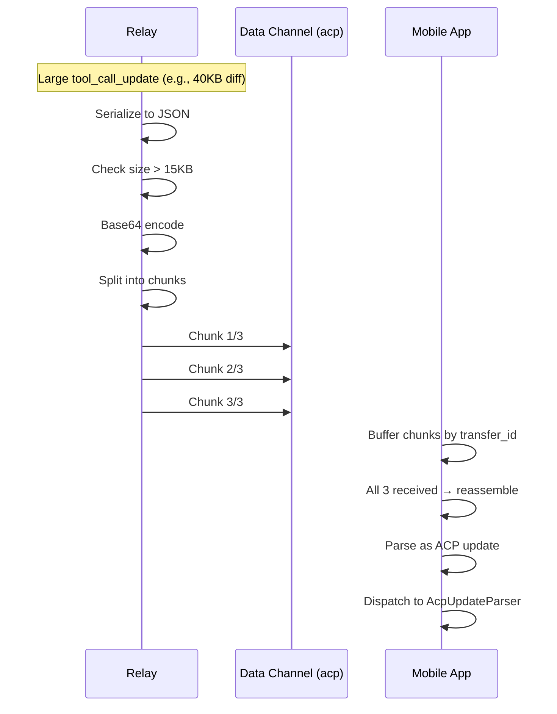

# Data Channel Protocol

Fletcher uses LiveKit data channels and text streams as the transport between the mobile ACP client and the server-side components (relay and voice agent). The relay is the single source of ACP content — mobile subscribes to the `acp` topic in both text and voice mode. The voice agent publishes voice-control events on a separate `ganglia-events` topic.

## Transport Channels

| Channel | Transport | Direction | Content |
|---------|-----------|-----------|---------|
| `acp` | LiveKit Data Channel | Relay ↔ Client | ACP JSON-RPC 2.0: messages, tool calls, thought chunks, prompt results, session lifecycle |
| `voice-acp` | LiveKit Data Channel | Voice Agent ↔ Relay | Voice-mode LLM requests/responses (text tokens for TTS) |
| `lk.transcription` | LiveKit Text Streams | Voice Agent → Client | Real-time transcription of user speech (STT output) |
| `ganglia-events` | LiveKit Data Channel | Bidirectional | Voice control only: pondering, session_hold, tts-mode, agent_transcript, pipeline_info |

## One Pipeline Principle

The relay is the single source of ACP content for mobile in both text and voice mode. There is one content pipeline, not two.

```
Text mode:
  Mobile ──session/prompt──▶ Relay ──stdio──▶ ACP Agent
  Mobile ◀──session/update── Relay ◀──stdio── ACP Agent

Voice mode (dual-publish):
  Voice Agent ──session/prompt──▶ Relay (voice-acp) ──stdio──▶ ACP Agent
  Voice Agent ◀──session/update── Relay (voice-acp) ◀──stdio── ACP Agent
  Mobile      ◀──session/update── Relay (acp, dual-published)
```

In voice mode, the relay detects a mobile participant in the room and dual-publishes `session/update` events to both `voice-acp` (for TTS text extraction) and `acp` (for mobile UI rendering). The voice agent gets text tokens; mobile gets the full content blocks.

## ACP Content Pipeline

ACP content arrives on the `acp` topic as JSON-RPC 2.0 `session/update` notifications. The mobile `AcpUpdateParser` dispatches by update type:

| Update Type | Content | Mobile Handling |
|-------------|---------|-----------------|
| `agent_message_chunk` | `content` → ContentBlock | RendererRegistry dispatch |
| `tool_call` | `kind`, `title`, `status` | StatusBar + ToolCallCard |
| `tool_call_update` | `content[]` → ContentBlock[] | RendererRegistry dispatch |
| `agent_thought_chunk` | Thinking text | ThinkingBlock |
| `available_commands_update` | Command list | MacroRegistry command pool |

### ContentBlock Model

ACP content blocks are represented as a Dart sealed class hierarchy, replacing the legacy `ArtifactEvent`/`ArtifactType` model. Each variant maps 1:1 to an ACP content block type.

```dart
sealed class ContentBlock {
  factory ContentBlock.fromJson(Map<String, dynamic> json);
}

class TextContent extends ContentBlock {
  final String text;
  final String? mimeType;  // text/plain, text/markdown
}

class ImageContent extends ContentBlock {
  final String data;       // base64
  final String mimeType;   // image/png, image/jpeg, etc.
}

class AudioContent extends ContentBlock {
  final String data;       // base64
  final String mimeType;   // audio/wav, audio/mp3, etc.
}

class ResourceContent extends ContentBlock {
  final String uri;
  final String? mimeType;
  final String? text;      // text resource
  final String? blob;      // blob resource (base64)
}

class ResourceLinkContent extends ContentBlock {
  final String uri;
  final String name;
  final String? mimeType;
  final int? size;
}

class DiffContent extends ContentBlock {
  final String path;
  final String? oldText;
  final String newText;
}

class TerminalContent extends ContentBlock {
  final String terminalId;
}

class RawContent extends ContentBlock {
  final Map<String, dynamic> json;  // unknown type fallback
}
```

The `fromJson` factory dispatches on the `type` field. Unknown types produce `RawContent` for forward compatibility. Tool call content wrappers (`{ type: "content", content: {...} }`) are unwrapped to the inner ContentBlock.

### RendererRegistry

Renderers register against ContentBlock type and MIME pattern. Adding a new content type requires one file: the renderer widget + its registration.

```
ContentBlock → RendererRegistry dispatch:
  DiffContent         → DiffRenderer (structural dispatch)
  text/markdown       → MarkdownRenderer
  text/*              → TextRenderer / CodeRenderer
  image/*             → ImageRenderer
  audio/*             → AudioRenderer
  ResourceLinkContent → ResourceLinkCard (structural dispatch)
  */* fallback        → RawJsonRenderer
```

Structural dispatch (by sealed class variant) takes priority over MIME glob matching (`image/*`, `text/*`), which takes priority over the fallback renderer.

### Status from Tool Calls

The StatusBar displays tool execution status from ACP `tool_call` events. Each tool call carries:

- **`kind`**: `read`, `edit`, `delete`, `move`, `search`, `execute`, `think`, `fetch`, `other`
- **`title`**: Human-readable description (e.g., "Reading configuration file")
- **`status`**: `pending`, `in_progress`, `completed`, `failed`

The StatusBar shows `title` when available, falling back to a display label derived from `kind`:

| Kind | Display Label |
|------|--------------|
| `read` | Reading |
| `edit` | Editing |
| `search` | Searching |
| `execute` | Running |
| `think` | Thinking |
| `fetch` | Fetching |
| `delete` | Deleting |
| `move` | Moving |
| `other` | *(use title)* |

Status auto-clears 5 seconds after `completed` or `failed`.

## Transcription Streams

Transcriptions are sent via LiveKit's built-in text stream API on the `lk.transcription` topic.

### Message Model

Each transcription segment has a unique `segmentId` and arrives as a series of chunks:

```typescript
// Per-segment state on the client
interface TranscriptEntry {
  id: string;            // segmentId from LiveKit
  role: 'user' | 'agent';
  text: string;
  isFinal: boolean;
  timestamp: DateTime;
}
```

### Update Semantics

User and agent transcripts use different update strategies:

| Speaker | Semantics | Behavior |
|---------|-----------|----------|
| User | **Full replacement** | Each chunk contains the complete text so far |
| Agent | **Delta** | Each chunk appends to previous content |

### Client-Side Lifecycle

1. `TextStreamReader` emits chunks for a segment
2. Content accumulates in a `segmentContent` map keyed by `segmentId`
3. `upsertTranscript()` updates or creates the `TranscriptEntry`
4. On final chunk: 3-second timer starts, then subtitle auto-clears
5. On stream close: segment state removed, entry marked final

## Voice Control Events (ganglia-events)

The `ganglia-events` data channel carries voice-control events only — no content, no artifacts, no tool-call status. These are published by the voice agent for voice-mode UX.

### Agent → Client Events

#### Pondering

While the LLM stream is open but no content tokens have arrived, the voice agent emits rotating fun phrases as status events:

```typescript
interface PonderingEvent {
  type: 'status';
  action: 'thinking';
  detail: string;        // "Dreaming of electric sheep...", etc.
  startedAt: number;
}
```

Phrases rotate every 3 seconds from a shuffled list of ~30 whimsical phrases (`pondering.ts`). Cleared when the first content token arrives — no explicit clearing event is sent.

#### Agent Transcript

Agent response text for subtitle display, bypassing the SDK's built-in transcription pipeline:

```json
{
  "type": "agent_transcript",
  "segmentId": "seg_1",
  "delta": "Hello, ",
  "text": "Hello, how can I help?",
  "final": false
}
```

Each LLM stream gets a unique `segmentId`. The Flutter app feeds these into the same `_upsertTranscript()` used by the `lk.transcription` protocol. See [Voice Pipeline — Agent Transcript Bypass](voice-pipeline.md#agent-transcript-bypass) for why the SDK's built-in pipeline is bypassed.

#### Session Hold

Sent when the voice agent enters hold mode (idle timeout), ~500ms before disconnecting:

```typescript
interface SessionHoldEvent {
  type: 'session_hold';
  reason: 'idle';
}
```

The client sets a `_holdModeActive` flag, producing "On hold — tap or speak to resume" instead of the generic disconnect message.

#### Pipeline Info

TTS provider status changes from the `FallbackAdapter`:

| Event | When | Meaning |
|-------|------|---------|
| Voice Degraded | Primary TTS unavailable | Fallback (Piper) serving audio |
| Voice Restored | Primary TTS recovered | High-fidelity voice back |
| Voice Unavailable | All TTS failed | Text-only mode |

Debounced at most once per 60 seconds.

### Client → Agent Events

#### TTS Mode Toggle

Disables or re-enables TTS synthesis. When off, responses arrive as text only via the `acp` topic. STT remains active.

```typescript
interface TtsModeEvent {
  type: 'tts-mode';
  value: 'on' | 'off';
}
```

The client sends the current state on room connect and reconnect. Persisted in `SharedPreferences` across app restarts. On the agent side, `session.output.setAudioEnabled(enabled)` toggles TTS inference natively.

## Chunking Protocol

LiveKit data channels have a typical MTU of ~16KB. Messages larger than 15KB are split into chunks. The relay applies chunking on the `acp` topic for large ACP payloads (e.g., tool call content with inline images or long diffs).

### Chunk Message Format

```typescript
interface ChunkMessage {
  type: 'chunk';
  transfer_id: string;     // Unique ID for this transfer
  chunk_index: number;      // 0-based index
  total_chunks: number;     // Total expected chunks
  data: string;             // Base64-encoded fragment
}
```

### Reassembly

The mobile app maintains a buffer map:

```dart
Map<String, Map<int, String>> _chunks;  // transfer_id → {index → data}
```

When all chunks for a `transfer_id` are received:
1. Concatenate `data` fields in order
2. Base64 decode
3. Parse as JSON
4. Process as a normal ACP update

Incomplete transfers are cleared on disconnect. Stale transfers (no new chunk within timeout) are also cleared to prevent memory leaks.


```mermaid
sequenceDiagram
    participant Relay as Relay
    participant DC as Data Channel (acp)
    participant App as Mobile App

    Note over Relay: Large tool_call_update (e.g., 40KB diff)

    Relay->>Relay: Serialize to JSON
    Relay->>Relay: Check size > 15KB
    Relay->>Relay: Base64 encode
    Relay->>Relay: Split into chunks

    Relay->>DC: Chunk 1/3
    Relay->>DC: Chunk 2/3
    Relay->>DC: Chunk 3/3

    App->>App: Buffer chunks by transfer_id
    App->>App: All 3 received → reassemble
    App->>App: Parse as ACP update
    App->>App: Dispatch to AcpUpdateParser
```

## Related Documents

- [Relay Lifecycle](relay-lifecycle.md) — room lifecycle, dual-publish trigger, ACP recovery
- [Voice Pipeline](voice-pipeline.md) — the audio flow and agent transcript bypass
- [Brain Plugin](brain-plugin.md) — Ganglia relay transport and voice-acp protocol
- [Mobile Client](mobile-client.md) — how the Flutter app renders content blocks and transcriptions
- [Macro Shortcuts](macro-shortcuts.md) — available_commands_update handling
