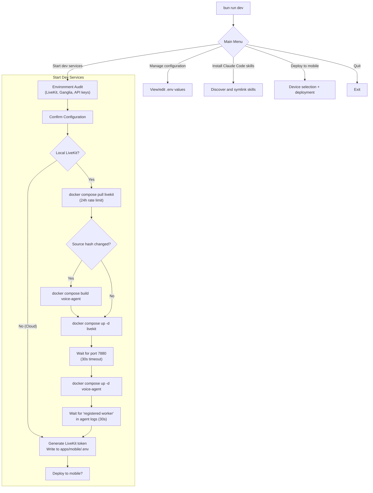

# Developer Workflow

Fletcher provides a TUI (Terminal User Interface) launcher that orchestrates all development services — LiveKit server, voice agent, mobile app deployment — from a single interactive menu. Services can also be started manually.

## TUI Launcher

Start the TUI with:

```bash
bun run dev
```

This runs `packages/tui/src/cli.ts`, which presents an interactive menu.

### Startup Sequence



### Environment Audit

On first run (or when credentials are missing), the TUI prompts for:

1. **LiveKit target** — local (Docker) or cloud. Cloud credentials are persisted as `LIVEKIT_CLOUD_*` env vars so switching doesn't lose them.
2. **Ganglia backend** — OpenClaw (multi-user, requires API key) or Nanoclaw (single-user, localhost).
3. **OpenClaw API key** — attempts to read from `~/.openclaw/openclaw.json` before prompting.
4. **Voice provider keys** — Deepgram (STT) and Cartesia (TTS) API keys.

All values are persisted to the root `.env` file.

### Build Caching

The TUI avoids unnecessary Docker rebuilds by hashing source files:

1. Glob all files matching `VOICE_AGENT_SOURCES` patterns
2. Compute SHA-256 of relative paths + content
3. Compare to `.docker-build-hash`
4. Rebuild only if hash differs

### Mobile Deployment

The TUI detects available devices via ADB:

| Device Type | Deployment Path |
|-------------|-----------------|
| **Offline AVD** | Boot emulator → wait → `flutter run -d <serial>` (hot reload attached) |
| **Running emulator** | `flutter run -d <serial>` (hot reload attached) |
| **Physical device** | `ensure-mobile-ready.sh --force-build` (one-shot APK install) |

Before deploying, the TUI updates `apps/mobile/.env`:
- Replaces `localhost`/`127.0.0.1` with the machine's LAN IP
- Detects Tailscale IP and writes `LIVEKIT_URL_TAILSCALE`

### Signal Handling

The TUI re-registers SIGINT/SIGTERM handlers after each `@clack/prompts` spinner (workaround for a Bun compatibility issue). On shutdown:
1. SIGTERM child processes
2. `docker compose down`
3. SIGKILL any remaining processes

## Manual Workflow

For developers who prefer direct commands:

### 1. Start LiveKit

```bash
docker compose up -d livekit
```

Wait for port 7880 to be ready.

### 2. Start Voice Agent

```bash
docker compose up -d voice-agent
```

Or run directly (outside Docker):

```bash
bun run apps/voice-agent/src/agent.ts dev
```

### 3. Generate Token

```bash
bun run scripts/generate-token.ts --room fletcher-dev --identity user-1
```

This writes the token to `apps/mobile/.env`.

### 4. Run Mobile App

```bash
cd apps/mobile
flutter run -d <device-id>
```

## Testing

### Brain Plugin Tests

```bash
cd packages/livekit-agent-ganglia
bun test
```

Tests are co-located with source files (e.g., `src/client.spec.ts`).

### Channel Plugin Tests

```bash
cd packages/openclaw-channel-livekit
bun test
```

### All Tests

```bash
bun run test   # From workspace root
```

## Key Scripts

| Script | Purpose |
|--------|---------|
| `scripts/generate-token.ts` | Generate LiveKit JWT token, write to mobile `.env` |
| `scripts/bootstrap.sh` | Initialize dev environment (Nix, Bun, Android SDK, etc.) |
| `scripts/ensure-mobile-ready.sh` | Boot emulator, build APK, install to device |
| `scripts/run-mobile.sh` | Flutter-specific device runner |

## Workspace Commands

| Command | Description |
|---------|-------------|
| `bun run dev` | Launch TUI |
| `bun run build` | Build all packages |
| `bun run test` | Test all packages |
| `bun run lint` | Lint all packages |
| `bun run format` | Prettier formatting |
| `bun run channel:dev` | Watch mode for channel plugin |
| `bun run brain:dev` | Watch mode for brain plugin |
| `bun run agent:dev` | Run voice agent |
| `bun run voice:dev` | Run voice agent (alias) |
| `bun run voice:connect` | Connect agent to specific room |
| `bun run mobile:dev` | Run Flutter app |
| `bun run mobile:build:android` | Build APK |
| `bun run token:generate` | Generate LiveKit token |
| `bun run skills:install` | Install Claude Code skills |

## Related Documents

- [Infrastructure](infrastructure.md) — Docker Compose, LiveKit config, environment variables
- [System Overview](system-overview.md) — monorepo structure and package relationships
- [Mobile Client](mobile-client.md) — Flutter app architecture
