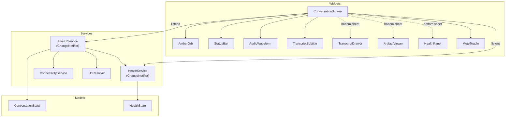
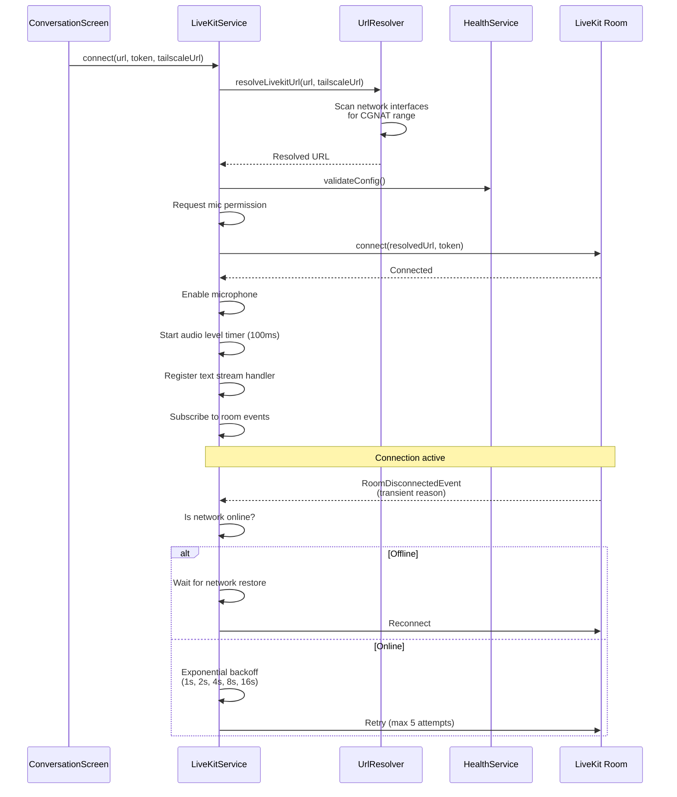

# Mobile Client

The Flutter mobile app (`apps/mobile`) provides the voice interface for Fletcher. It connects to a LiveKit room, captures microphone audio, displays real-time transcriptions and artifacts, and handles network transitions including Tailscale VPN detection.

## Service Architecture

The app follows a service-oriented architecture where stateful services notify widgets through `ChangeNotifier`.



### LiveKitService

The central service managing the entire LiveKit lifecycle:

- **Room connection** — connects to LiveKit with resolved URL and token
- **Audio capture** — enables microphone, tracks audio levels at 100ms intervals
- **Transcription processing** — handles text streams with per-segment state
- **Ganglia events** — processes status updates and artifacts from the data channel
- **Reconnection** — automatic recovery from network changes and disconnects
- **Mute state** — persists across reconnects

### HealthService

Runs diagnostic checks and reports overall system health:

| Check | What It Validates |
|-------|-------------------|
| `livekit_url` | URL has `ws://` or `wss://` scheme |
| `livekit_token` | JWT format, not expired |
| `network` | Device is online, Tailscale status |
| `mic_permission` | Microphone permission granted |
| `room_joined` | LiveKit room connected |
| `agent_present` | Voice agent is in the room |

**Overall health:** `healthy` (all OK), `degraded` (has warnings), `unhealthy` (has errors).

### ConnectivityService

Lightweight network state tracker. Listens to `Connectivity.onConnectivityChanged` and emits boolean state transitions (online/offline).

### UrlResolver

Detects Tailscale VPN by scanning network interfaces for the CGNAT IP range (`100.64.0.0/10`). See [Network Connectivity](network-connectivity.md) for the full decision matrix.

## State Model

All UI state lives in an immutable `ConversationState` updated via `copyWith()`:

```typescript
ConversationState {
  status: ConversationStatus       // connecting | reconnecting | idle | userSpeaking | processing | aiSpeaking | muted | error
  userAudioLevel: double           // 0.0 - 1.0 (server-computed)
  aiAudioLevel: double             // 0.0 - 1.0 (remote participant)
  errorMessage: String?
  transcript: List<TranscriptEntry>    // Full history (max 100)
  currentStatus: StatusEvent?          // Agent activity (auto-clears 5s)
  artifacts: List<ArtifactEvent>       // Recent artifacts (max 10)
  userWaveform: List<double>           // Rolling buffer (~30 samples)
  aiWaveform: List<double>             // Rolling buffer (~30 samples)
  currentUserTranscript: TranscriptEntry?   // Subtitle display
  currentAgentTranscript: TranscriptEntry?  // Subtitle display
}
```

### Status Transitions

| From | Trigger | To |
|------|---------|----|
| `connecting` | Room connected | `idle` |
| `idle` | User audio > 0.05 | `userSpeaking` |
| `userSpeaking` | User audio drops | `processing` (500ms) → `idle` |
| `idle` | Agent audio > 0.05 | `aiSpeaking` |
| `aiSpeaking` | Agent audio drops | `idle` |
| Any | Mute toggled | `muted` / previous |
| Any | Connection lost | `reconnecting` |
| Any | Error | `error` |

## Connection Lifecycle



### Reconnection Strategy

Fletcher uses two layers of reconnection:

**Layer 1 — SDK auto-reconnect:** LiveKit's built-in reconnection (up to 10 attempts over ~40 seconds). State is fully preserved. The app shows "Reconnecting..." during this window.

**Layer 2 — App-level reconnect:** If SDK reconnection fails (fires `RoomDisconnectedEvent`), the app takes over:
- **Transient disconnect:** Exponential backoff from 1s to 16s, max 5 attempts
- **Network offline:** Waits for `ConnectivityService` to report online, then retries
- **Non-transient:** Shows error state (room deleted, duplicate identity, participant removed, etc.)
- **Device change:** Audio route changes (headphone plug/unplug) trigger a 1-second debounced reconnect

Transcripts are preserved across reconnects via `disconnect(preserveTranscripts: true)`.

### App Lifecycle

The screen registers as a `WidgetsBindingObserver`. When the app resumes from background, it calls `tryReconnect()` to recover the connection.

## Widget Overview

### AmberOrb

The central animated element. A gradient circle with context-dependent animations:
- **Idle:** Slow 4-second breathing animation (scale oscillation)
- **User speaking:** Ripple rings emanate outward (up to 3 concurrent)
- **Agent speaking:** Pulse scales with AI audio level (1.0x - 1.15x)
- **Processing:** Shimmer overlay animation
- **Error:** Red tint
- **Muted/Connecting:** Dimmed opacity

### StatusBar

Displays the agent's current activity with an icon:
- Blue for search operations
- Green for read operations
- Orange for write/edit operations
- Auto-hides when no status event is active

### AudioWaveform

Custom painter rendering 15 vertical bars from a rolling sample buffer. Bar height maps to audio amplitude. Two instances: amber for user, gray for agent.

### TranscriptSubtitle

Shows the most recent transcription text near the bottom of the screen. Prefers agent transcript if both exist. Tappable to open the full transcript drawer.

### TranscriptDrawer

Bottom sheet (70% screen height) showing the complete conversation as chat-style bubbles. Amber for user, gray for agent. Auto-scrolls to latest entry.

### ArtifactViewer

Tabbed bottom sheet (70% screen height) displaying artifacts:
- **Diff:** Color-coded lines (green for additions, red for removals)
- **Code:** Line numbers with language badge
- **Markdown:** Rendered with `flutter_markdown`
- **Search results:** File path, line number, and content snippets
- **Error:** Message with optional stack trace

### HealthPanel

Bottom sheet (55% screen height) with expandable diagnostic rows. Each check shows a status icon (green checkmark, amber warning, red X) with details and actionable suggestions.

### MuteToggle

Circular button with microphone icon. Amber border when muted.

## Dependencies

| Package | Version | Purpose |
|---------|---------|---------|
| `livekit_client` | 2.5.0 | LiveKit WebRTC SDK |
| `flutter_dotenv` | 5.2.1 | Environment variable loading |
| `flutter_markdown` | 0.7.6 | Markdown rendering in artifacts |
| `connectivity_plus` | 6.1.4 | Network state monitoring |
| `permission_handler` | 11.3.0 | Microphone permission management |

## Related Documents

- [Data Channel Protocol](data-channel-protocol.md) — message formats for transcriptions and artifacts
- [Network Connectivity](network-connectivity.md) — Tailscale URL resolution details
- [Voice Pipeline](voice-pipeline.md) — the server-side audio flow
- [Developer Workflow](developer-workflow.md) — deploying the app to devices
