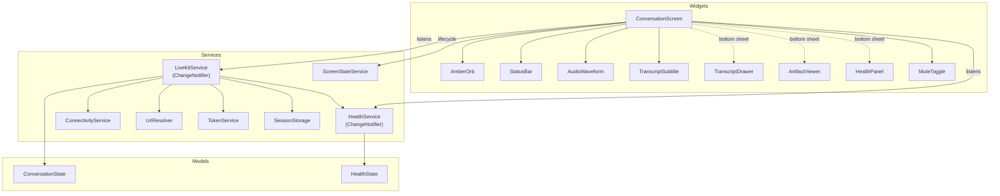
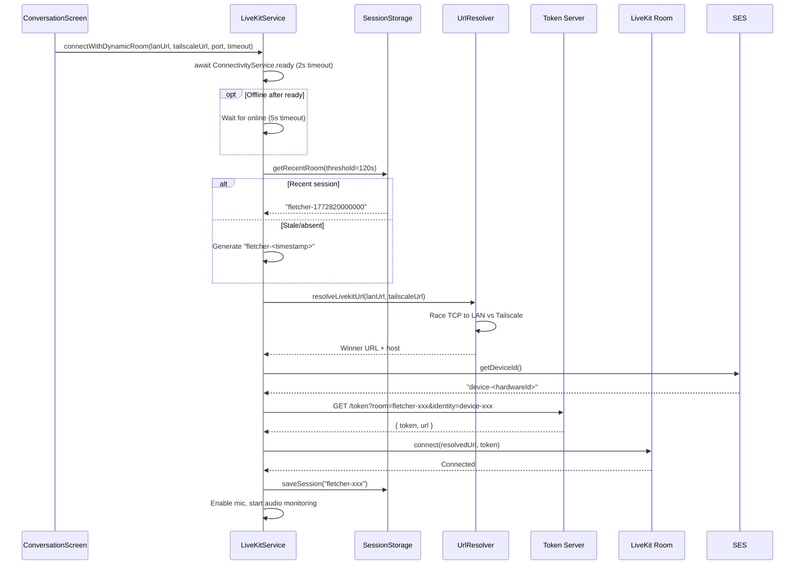
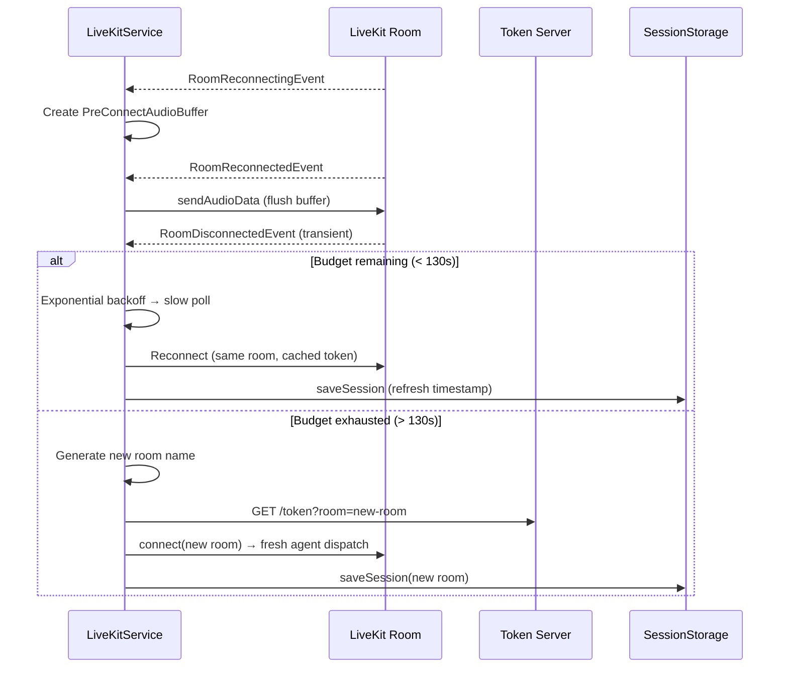

# Mobile Client

The Flutter mobile app (`apps/mobile`) is Fletcher's ACP client — the mobile frontend for any ACP-compatible agent. It connects to a LiveKit room, supports dual-mode input (voice and text), renders tool-call cards, thinking blocks, and artifacts, and handles network transitions including Tailscale VPN detection.

## Service Architecture

The app follows a service-oriented architecture where stateful services notify widgets through `ChangeNotifier`.


```mermaid
flowchart TD
    subgraph "Widgets"
        CS["ConversationScreen"]
        AO["AmberOrb"]
        SB["StatusBar"]
        AW["AudioWaveform"]
        TS["TranscriptSubtitle"]
        TD["TranscriptDrawer"]
        AV["ArtifactViewer"]
        HP["HealthPanel"]
        MT["MuteToggle"]
    end

    subgraph "Services"
        LKS["LiveKitService<br/>(ChangeNotifier)"]
        HS["HealthService<br/>(ChangeNotifier)"]
        CONN["ConnectivityService"]
        SSS["ScreenStateService"]
        UR["UrlResolver"]
        TKS["TokenService"]
        SES["SessionStorage"]
    end

    subgraph "Models"
        STATE["ConversationState"]
        HEALTH["HealthState"]
    end

    CS --> AO & SB & AW & TS & MT
    CS -.->|"bottom sheet"| TD & AV & HP

    LKS --> STATE
    HS --> HEALTH
    LKS --> HS
    LKS --> CONN
    LKS --> UR
    LKS --> TKS
    LKS --> SES
    CS -->|"lifecycle"| SSS

    CS -->|"listens"| LKS
    CS -->|"listens"| HS
```

### LiveKitService

The central service managing the entire LiveKit lifecycle:

- **Room connection** — connects to LiveKit with resolved URL and token
- **Audio capture** — enables microphone, tracks audio levels at 100ms intervals
- **RelayChatService** — active in both text and voice mode; subscribes to the `acp` topic, sends `session/prompt` via relay for typed text in both modes
- **ACP content pipeline** — parses `session/update` events into ContentBlock instances via `AcpUpdateParser`, dispatches to RendererRegistry
- **Transcription processing** — handles text streams with per-segment state
- **Voice control events** — processes pondering, session hold, TTS mode, and agent transcripts from `ganglia-events` (voice mode only, no content)
- **Reconnection** — automatic recovery from network changes and disconnects
- **Background timeout** — 10-minute countdown when app is backgrounded (not screen-locked), updates foreground notification with countdown, disconnects on expiry
- **Mute state** — persists across reconnects

### Audio Capture Configuration

The app configures explicit WebRTC audio processing options via `RoomOptions.defaultAudioCaptureOptions`. These are passed through to the browser/native WebRTC layer as media track constraints.

| Option | Value | Purpose |
|--------|-------|---------|
| `echoCancellation` | `true` | Removes agent TTS leaking back through mic (AEC) |
| `noiseSuppression` | `true` | WebRTC's built-in noise suppression |
| `autoGainControl` | `true` | Normalizes volume for near-field speech |
| `voiceIsolation` | `true` | ML-based voice extraction (WebRTC neural noise suppression) |
| `highPassFilter` | `true` | Cuts low-frequency rumble (wind, handling noise) |
| `typingNoiseDetection` | `true` | Suppresses keyboard noise |

Audio is published at `AudioPreset.speech` (24kbps) rather than the default `music` (48kbps). Voice doesn't need music-quality bandwidth, and the lower bitrate lets the codec focus on voice frequencies. DTX (discontinuous transmission) saves bandwidth during silence.

These options are explicitly set even when they match SDK defaults, so the configuration is auditable and won't silently change if defaults shift in a future SDK version. The `highPassFilter` is the one non-default option — it's off by default in LiveKit but useful for mobile where handling noise and wind are common.

### HealthService

Runs diagnostic checks and reports overall system health:

| Check | What It Validates |
|-------|-------------------|
| `livekit_url` | URL has `ws://` or `wss://` scheme |
| `livekit_token` | JWT format, not expired |
| `network` | Device is online, Tailscale status |
| `mic_permission` | Microphone permission granted |
| `room_joined` | LiveKit room connected |
| `agent_present` | Voice agent is in the room |

**Overall health:** `healthy` (all OK), `degraded` (has warnings), `unhealthy` (has errors).

### AgentPresenceService

Manages the agent lifecycle for on-demand dispatch (Epic 20). When the agent is absent, the service listens for speech via audio level monitoring and dispatches a fresh agent on detection.

**State machine:**
```
AGENT_ABSENT → (speech / text / unmute) → DISPATCHING → (agent connected) → AGENT_PRESENT
DISPATCHING → (dispatch failed) → AGENT_ABSENT
AGENT_PRESENT → (agent disconnected) → AGENT_ABSENT
```

**Hold mode:** When the agent disconnects due to idle timeout (hold mode), the service receives `onAgentDisconnected(holdMode: true)` and emits "On hold — tap or speak to resume" instead of the generic "Disconnected — speak to reconnect". The hold flag is set by `LiveKitService` when it receives a `session_hold` event on the `ganglia-events` data channel just before the agent disconnects. This provides clear UX feedback that the session is paused, not broken — the user can resume by speaking, tapping, or sending a text message.

### ConnectivityService

Lightweight network state tracker. Listens to `Connectivity.onConnectivityChanged` and emits boolean state transitions (online/offline). Detects network interface switches (e.g. WiFi → cellular) while staying online and emits a synthetic offline→online pulse so reconnect logic triggers (BUG-046).

Exposes a `ready` future that completes when the initial `checkConnectivity()` platform call finishes. Callers (e.g. `connectWithDynamicRoom()`) await this before reading `isOnline` to avoid acting on the stale default value during cold start (BUG-049).

### UrlResolver

Races TCP connections to LAN and Tailscale URLs, using whichever responds first. See [Network Connectivity](network-connectivity.md) for the full URL resolution logic.

### TokenService

Fetches LiveKit JWTs from the token endpoint (`scripts/token-server.ts`). Called by `LiveKitService.connectWithDynamicRoom()` before every fresh connection. The token endpoint host is derived from the URL resolver winner (same host, port from `TOKEN_SERVER_PORT` env var).

**Participant identity** is a stable hardware device ID (via `device_info_plus`) rather than an ephemeral timestamp. This means the same physical device always connects with the same identity, allowing the voice agent to recognize a returning participant after a disconnect/rejoin cycle. See `SessionStorage.getDeviceId()`.

### SessionStorage

Persists room name and connection timestamp via SharedPreferences. Used to decide whether to rejoin an existing room or create a new one:
- **Recent session** (< `DEPARTURE_TIMEOUT_S`): reuse room name
- **Stale/absent**: generate new `fletcher-<timestamp>` room name

Also provides `getDeviceId()` — a stable participant identity derived from the hardware device ID:
- **Android:** `Settings.Secure.ANDROID_ID` (persists across reinstalls, resets on factory reset)
- **iOS:** `identifierForVendor` (persists while any app from the same vendor is installed)
- Prefixed as `device-<platformId>` for readability in logs
- Cached in-memory after first call (the hardware ID never changes at runtime)

Updated on every successful connect and reconnect.

## State Model

All UI state lives in an immutable `ConversationState` updated via `copyWith()`:

```typescript
ConversationState {
  status: ConversationStatus       // connecting | reconnecting | idle | userSpeaking | processing | aiSpeaking | muted | error
  userAudioLevel: double           // 0.0 - 1.0 (server-computed)
  aiAudioLevel: double             // 0.0 - 1.0 (remote participant)
  errorMessage: String?
  transcript: List<TranscriptEntry>    // Full history (max 100)
  currentStatus: ToolCallStatus?       // Tool execution status from ACP tool_call (auto-clears 5s)
  contentBlocks: List<ContentBlock>    // ACP content blocks (rendered via RendererRegistry)
  userWaveform: List<double>           // Rolling buffer (~30 samples)
  aiWaveform: List<double>             // Rolling buffer (~30 samples)
  currentUserTranscript: TranscriptEntry?   // Subtitle display
  currentAgentTranscript: TranscriptEntry?  // Subtitle display
}
```

### Status Transitions

| From | Trigger | To |
|------|---------|----|
| `connecting` | Room connected | `idle` |
| `idle` | User audio > 0.05 | `userSpeaking` |
| `userSpeaking` | User audio drops | `processing` (500ms) → `idle` |
| `idle` | Agent audio > 0.05 | `aiSpeaking` |
| `aiSpeaking` | Agent audio drops | `idle` |
| Any | Mute toggled | `muted` / previous |
| Any | Connection lost | `reconnecting` |
| Any | Error | `error` |

## Connection Lifecycle

### Initial Connection (Dynamic Rooms)


```mermaid
sequenceDiagram
    participant App as ConversationScreen
    participant LK as LiveKitService
    participant SS as SessionStorage
    participant UR as UrlResolver
    participant TS as Token Server
    participant Room as LiveKit Room

    App->>LK: connectWithDynamicRoom(lanUrl, tailscaleUrl, port, timeout)
    LK->>LK: await ConnectivityService.ready (2s timeout)
    opt Offline after ready
        LK->>LK: Wait for online (5s timeout)
    end
    LK->>SS: getRecentRoom(threshold=120s)
    alt Recent session
        SS-->>LK: "fletcher-1772820000000"
    else Stale/absent
        LK->>LK: Generate "fletcher-<timestamp>"
    end

    LK->>UR: resolveLivekitUrl(lanUrl, tailscaleUrl)
    UR->>UR: Race TCP to LAN vs Tailscale
    UR-->>LK: Winner URL + host

    LK->>SES: getDeviceId()
    SES-->>LK: "device-<hardwareId>"
    LK->>TS: GET /token?room=fletcher-xxx&identity=device-xxx
    TS-->>LK: { token, url }

    LK->>Room: connect(resolvedUrl, token)
    Room-->>LK: Connected

    LK->>SS: saveSession("fletcher-xxx")
    LK->>LK: Enable mic, start audio monitoring
```

### Reconnection


```mermaid
sequenceDiagram
    participant LK as LiveKitService
    participant Room as LiveKit Room
    participant TS as Token Server
    participant SS as SessionStorage

    Room-->>LK: RoomReconnectingEvent
    LK->>LK: Create PreConnectAudioBuffer

    Room-->>LK: RoomReconnectedEvent
    LK->>Room: sendAudioData (flush buffer)

    Room-->>LK: RoomDisconnectedEvent (transient)

    alt Budget remaining (< 130s)
        LK->>LK: Exponential backoff → slow poll
        LK->>Room: Reconnect (same room, cached token)
        LK->>SS: saveSession (refresh timestamp)
    else Budget exhausted (> 130s)
        LK->>LK: Generate new room name
        LK->>TS: GET /token?room=new-room
        LK->>Room: connect(new room) → fresh agent dispatch
        LK->>SS: saveSession(new room)
    end
```

### Reconnection Strategy

Fletcher uses two layers of reconnection:

**Layer 1 — SDK auto-reconnect:** LiveKit's built-in reconnection (up to 10 attempts over ~40 seconds). State is fully preserved. The app shows "Reconnecting..." during this window.

**Layer 2 — App-level reconnect:** If SDK reconnection fails (fires `RoomDisconnectedEvent`), the app takes over with a time-budgeted strategy (budget = departure_timeout + 10s):
- **Phase 1 (fast):** 5 attempts with exponential backoff (1s, 2s, 4s, 8s, 16s)
- **Phase 2 (slow):** Poll every 10s until budget expires (~130s total)
- **Phase 3 (recovery):** Budget exhausted → generate new room name → fetch fresh token → connect to new room. LiveKit dispatches a fresh agent to the new room.
- **Network offline:** Pauses retries until `ConnectivityService` reports online, then resumes
- **Non-transient disconnect:** Shows error state (room deleted, duplicate identity, participant removed, etc.)
- **Cold start failure:** If the initial `connectWithDynamicRoom()` fails before `connect()` is reached (no cached credentials), `tryReconnect()` falls back to a fresh `connectWithDynamicRoom()` call instead of the credential-dependent `_reconnectRoom()` path (BUG-049).

Transcripts are preserved across reconnects and room transitions via `disconnect(preserveTranscripts: true)`.

**Reconnection audio buffering:** During SDK reconnection (Layer 1), the app creates a `PreConnectAudioBuffer` (from `livekit_client`) to capture microphone audio natively while the WebRTC transport is down. On `RoomReconnectedEvent`, the buffered audio is sent to agent participants via `sendAudioData()` which uses `streamBytes()` on the `lk.agent.pre-connect-audio-buffer` topic. The buffer has a 10MB ring limit and a 60-second recording timeout. If the room fully disconnects (Layer 2), the buffer is discarded since the room can't send data.

**Audio device recovery:** When Bluetooth headphones connect/disconnect or the audio route changes, `Hardware.instance.onDeviceChange` fires. The app debounces these events (2 seconds for Bluetooth settling time), then calls `LocalTrack.restartTrack()` on the published audio track. This uses WebRTC's `RTCRtpSender.replaceTrack()` to atomically swap the audio capture source — the track stays published throughout, so the agent session is unaffected. This is deliberately **not** a reconnect: `setMicrophoneEnabled(false)` would unpublish the track and cause the agent to close the session.

### ScreenStateService

A thin Dart wrapper around a platform method channel (`com.fletcher.fletcher/screen_state`) that exposes a single static method: `isScreenLocked()`.

- **Android:** Calls `KeyguardManager.isKeyguardLocked` (in `MainActivity.kt`)
- **iOS:** Uses `UIScreen.main.brightness == 0` as a heuristic (in `AppDelegate.swift`). iOS doesn't expose a clean "screen locked" API, so this may false-negative — acceptable since iOS kills backgrounded apps aggressively anyway.
- **Fallback:** Returns `false` on any error (meaning the background timeout will always start if detection fails).

### App Lifecycle

The screen registers as a `WidgetsBindingObserver` and handles three lifecycle transitions:

| Event | Action |
|-------|--------|
| `paused` (screen locked) | No timeout. Session stays alive (user may be talking via earbuds). |
| `paused` (app switched) | Start 10-minute background timeout. Foreground notification updates with countdown ("Disconnecting in N min"). |
| `resumed` | Cancel background timeout if active. Reset notification to "Voice session active". Call `tryReconnect()` if connection was lost. |
| `detached` | Immediate `disconnect()`. |

**Screen lock vs app-switch:** Both trigger `AppLifecycleState.paused`. The app calls `ScreenStateService.isScreenLocked()` to distinguish them. If the screen is locked, no timeout starts — the user may be intentionally talking with the screen off.

**Swipe-away (Android):** The foreground service has `android:stopWithTask="true"` in `AndroidManifest.xml`. When the user swipes Fletcher from recents, `onTaskRemoved()` fires in the `flutter_foreground_task` plugin, which calls `stopSelf()`. This immediately stops the foreground service and notification — no timeout, no delay.

**Background timeout details:** `LiveKitService` manages two timers:
- `_backgroundTimeoutTimer` — fires after 10 minutes, calls `disconnect()`
- `_backgroundCountdownTimer` — fires every minute, updates the foreground notification text with the remaining time

Both timers are cancelled on resume or disconnect. The notification countdown gives the user visibility if they check the notification shade.

## Widget Overview

### AmberOrb

The central animated element. A gradient circle with context-dependent animations:
- **Idle:** Slow 4-second breathing animation (scale oscillation)
- **User speaking:** Ripple rings emanate outward (up to 3 concurrent)
- **Agent speaking:** Pulse scales with AI audio level (1.0x - 1.15x)
- **Processing:** Shimmer overlay animation
- **Error:** Red tint
- **Muted/Connecting:** Dimmed opacity

### StatusBar

Displays the agent's current activity with an icon:
- Blue for search operations
- Green for read operations
- Orange for write/edit operations
- Auto-hides when no status event is active

### VoiceControlBar

Unified bottom bar replacing the legacy `HeaderBar` + `TextInputBar` pair. Contains three animated zones:

| Zone | Voice mode | Text mode |
|------|-----------|-----------|
| Left | User histogram (cyan, tap = mute without exiting voice mode) | Text field |
| Center | Mic button | Mic button |
| Right | Agent histogram (amber, tap = toggle TTS) | — |

Histograms reveal with a 300ms `easeOutCubic` SizeTransition + FadeTransition, with a 50ms stagger (user histogram first). The `_HistogramPainter` is a unified CustomPainter with configurable direction; samples are reversed so newest data appears closest to the mic button.

The `LiveKitService.isVoiceModeActive` flag drives histogram visibility. It stays `true` when muted via histogram tap (`muteOnly()`), but becomes `false` when exiting voice mode via mic button (`toggleInputMode()`).

### MicButton

56dp square button with visual states driven by `ConversationStatus`:
- **Idle/listening:** Breathing amber glow (500ms, `easeInOut`)
- **AI speaking:** Pulse synced to `aiAudioLevel`
- **Processing:** Spinning `SweepGradient` arc overlay (1200ms)
- **Muted:** Dimmed `mic_off` icon
- **Error/reconnecting:** Red/yellow border

### TranscriptSubtitle

Shows the most recent transcription text near the bottom of the screen. Prefers agent transcript if both exist. Tappable to open the full transcript drawer.

### TranscriptDrawer

Bottom sheet (70% screen height) showing the complete conversation as chat-style bubbles. Amber for user, gray for agent. Auto-scrolls to latest entry.

### ContentBlockViewer

Renders ACP content blocks via the `RendererRegistry`. Each ContentBlock is dispatched to a registered renderer by type and MIME pattern:

- **DiffContent** → DiffRenderer: color-coded lines (green additions, red removals)
- **text/markdown** → MarkdownRenderer: rendered with `flutter_markdown`
- **text/*** → CodeRenderer: line numbers with language badge
- **image/*** → ImageRenderer: base64 decode with loading/error states
- **audio/*** → AudioRenderer: metadata card with play button
- **ResourceLinkContent** → ResourceLinkCard: name, MIME type, size display
- **RawContent** → RawJsonRenderer: fallback for unknown types

See [Data Channel Protocol](data-channel-protocol.md#rendererregistry) for the dispatch logic.

### HealthPanel

Bottom sheet (55% screen height) with expandable diagnostic rows. Each check shows a status icon (green checkmark, amber warning, red X) with details and actionable suggestions.

### MuteToggle

Circular button with microphone icon. Amber border when muted.

## Dependencies

| Package | Version | Purpose |
|---------|---------|---------|
| `livekit_client` | 2.5.4 | LiveKit WebRTC SDK |
| `flutter_foreground_task` | 8.17.0 | Foreground service for background mic access + notification |
| `flutter_dotenv` | 5.2.1 | Environment variable loading |
| `flutter_markdown` | 0.7.6 | Markdown rendering in artifacts |
| `connectivity_plus` | 6.1.4 | Network state monitoring |
| `device_info_plus` | 11.3.0 | Stable hardware device ID for participant identity |
| `permission_handler` | 11.3.0 | Microphone permission management |
| `shared_preferences` | 2.3.0 | Session persistence (room name + timestamp) |

## Related Documents

- [Data Channel Protocol](data-channel-protocol.md) — message formats for transcriptions and artifacts
- [Network Connectivity](network-connectivity.md) — Tailscale URL resolution details
- [Voice Pipeline](voice-pipeline.md) — the server-side audio flow
- [Developer Workflow](developer-workflow.md) — deploying the app to devices
