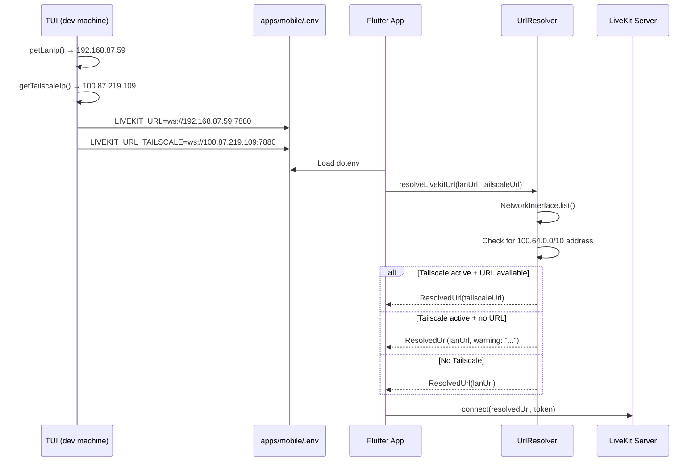

# Network Connectivity: Tailscale-Aware URL Resolution

## Overview

The Fletcher mobile app connects to a LiveKit server running on the developer's machine. The connection path depends on the phone's network state:

- **LAN** (default): Phone and dev machine on the same WiFi network. The TUI rewrites `LIVEKIT_URL` in `apps/mobile/.env` from `localhost` to the dev machine's LAN IP (e.g., `ws://192.168.87.59:7880`).
- **Tailscale**: When Tailscale VPN is active on the phone, Android VPN routing blackholes LAN traffic. The app must use the dev machine's Tailscale IP instead (e.g., `ws://100.87.219.109:7880`).

The app detects the network state at runtime and selects the correct URL automatically. The TUI provides both URLs; the app decides which to use.

## Flow

## Network Detection Logic

Detection is in `apps/mobile/lib/services/url_resolver.dart`.

The `hasTailscaleInterface()` function calls `NetworkInterface.list()` and checks if any interface has an IPv4 address in the **100.64.0.0/10** CGNAT range (first octet `100`, second octet `64–127`). This range is reserved for Carrier-Grade NAT and is used by Tailscale for all node addresses.

Detection is by IP range rather than interface name (`tun0`, `tailscale0`, etc.) because interface naming varies across Android OEM skins and is not reliable.

## Decision Matrix

| Tailscale on phone? | `LIVEKIT_URL_TAILSCALE` in `.env`? | URL used | Diagnostics |
|---|---|---|---|
| No | N/A | LAN URL | None |
| Yes | Yes | Tailscale URL | None |
| Yes | No | LAN URL (will fail) | Warning in health panel |

## Reconnection Flow

URL resolution runs on every connection attempt, not just the initial one:

1. **`connect()`**: Resolves URL before connecting. Caches `_tailscaleUrl` for reconnects.
2. **`_doReconnectAttempt()`** (disconnect/sleep recovery): Passes cached `_tailscaleUrl` to `connect()`, which re-resolves the URL. If the user toggled Tailscale during the disconnect, the new URL is picked up.
3. **`_reconnectAudioDevice()`** (headphone plug/unplug): Same — re-resolves URL on reconnect.
4. **`disconnect(preserveTranscripts: false)`**: Clears `_tailscaleUrl` alongside `_url` and `_token`.

## Health Diagnostics

When Tailscale is detected but no `LIVEKIT_URL_TAILSCALE` is configured, the URL resolver returns a warning string. The `LiveKitService` passes this to `healthService.updateNetworkStatus()` with a `warning` parameter, which sets the network health check to `HealthCheckStatus.warning` with the warning as the `suggestion` field. This surfaces in the health panel as an actionable diagnostic.

## Key Files

| File | Responsibility |
|---|---|
| `packages/tui/src/mobile.ts` | `getLanIp()`, `getTailscaleIp()`, writes both URLs to `.env` |
| `apps/mobile/lib/services/url_resolver.dart` | `hasTailscaleInterface()`, `resolveLivekitUrl()`, `ResolvedUrl` |
| `apps/mobile/lib/main.dart` | Reads `LIVEKIT_URL_TAILSCALE` from dotenv, passes to screen |
| `apps/mobile/lib/screens/conversation_screen.dart` | Forwards `livekitUrlTailscale` to `LiveKitService.connect()` |
| `apps/mobile/lib/services/livekit_service.dart` | Calls resolver before every connect, surfaces warnings |
| `apps/mobile/lib/services/health_service.dart` | `updateNetworkStatus(warning:)` for Tailscale mismatch diagnostics |
