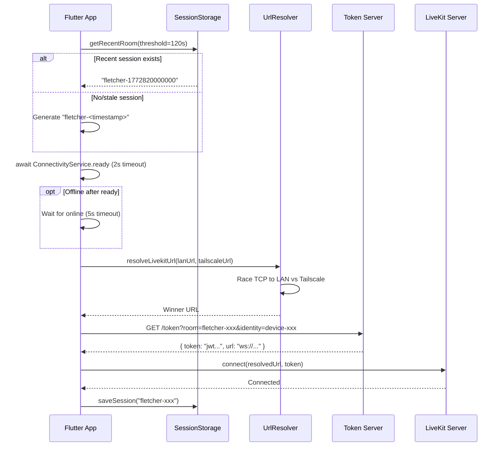

# Network Connectivity: URL Resolution & Dynamic Rooms

## Overview

The Fletcher mobile app connects to a LiveKit server running on the developer's machine. The connection path depends on the phone's network state:

- **LAN** (default): Phone and dev machine on the same WiFi network. The TUI rewrites `LIVEKIT_URL` in `apps/mobile/.env` from `localhost` to the dev machine's LAN IP (e.g., `ws://192.168.87.59:7880`).
- **Tailscale**: When the phone is on cellular or otherwise off the LAN, it needs the dev machine's Tailscale IP (e.g., `ws://100.87.219.109:7880`). Tailscale also handles same-LAN routing efficiently, so using the Tailscale URL on WiFi adds negligible overhead.

When both URLs are configured, the app races a TCP connection to both and uses whichever responds first. This handles all network scenarios without platform-specific VPN detection.

## Connection Flow

```mermaid
sequenceDiagram
    participant App as Flutter App
    participant SS as SessionStorage
    participant Resolver as UrlResolver
    participant TS as Token Server
    participant LK as LiveKit Server

    App->>SS: getRecentRoom(threshold=120s)
    alt Recent session exists
        SS-->>App: "fletcher-1772820000000"
    else No/stale session
        App->>App: Generate "fletcher-<timestamp>"
    end

    App->>App: await ConnectivityService.ready (2s timeout)
    opt Offline after ready
        App->>App: Wait for online (5s timeout)
    end
    App->>Resolver: resolveLivekitUrl(lanUrl, tailscaleUrl)
    Resolver->>Resolver: Race TCP to LAN vs Tailscale
    Resolver-->>App: Winner URL

    App->>TS: GET /token?room=fletcher-xxx&identity=device-xxx
    TS-->>App: { token: "jwt...", url: "ws://..." }

    App->>LK: connect(resolvedUrl, token)
    LK-->>App: Connected
    App->>SS: saveSession("fletcher-xxx")
```

## Dynamic Room Names

Room names follow the format `fletcher-<unix-millis>` (e.g., `fletcher-1772820000000`). The client generates a new name on each fresh connection and reuses an existing name if the previous session is recent enough.

### Session Staleness

`SessionStorage` (SharedPreferences) saves the last room name and connection timestamp. On app launch:

- If the saved session is **< departure_timeout** old: reuse that room name (the room and agent may still be alive)
- If **stale or absent**: generate a new room name (guarantees a fresh agent dispatch)

### Token Endpoint

A lightweight Bun HTTP server (`scripts/token-server.ts`) generates JWT tokens on demand:

- `GET /token?room=<name>&identity=<id>` → `{ "token": "<jwt>", "url": "ws://..." }`
- Grants: `roomJoin`, `roomCreate`, `canPublish`, `canSubscribe`, `canPublishData`
- TTL: 24h
- Port: 7882 (configurable via `TOKEN_SERVER_PORT`)
- Runs as a separate Docker service from the voice agent, so tokens are available even during agent restarts
- **Firewall:** Port 7882/tcp must be open on the host for LAN clients (Tailscale bypasses the firewall)

### Timeout Coordination

Three values derive from the same source — `departure_timeout`:

| Component | Value | Config | Purpose |
|-----------|-------|--------|---------|
| Server `departure_timeout` | 120s | `livekit.yaml` | How long room stays alive after last participant leaves |
| Client reconnect budget | 130s | `reconnect_scheduler.dart` | departure_timeout + 10s margin |
| Client session staleness | 120s | `session_storage.dart` | How long a saved room name is worth retrying |

### Recovery on Budget Exhaustion

When the reconnect budget expires (> 130s disconnected), instead of showing an error, the client:
1. Generates a new room name
2. Fetches a fresh token from the token endpoint
3. Connects to LiveKit → agent is dispatched to the new room
4. Saves the new session

This solves BUG-005: agent not dispatched after worker restart.

## URL Resolution Logic

Resolution is in `apps/mobile/lib/services/url_resolver.dart`.

When both LAN and Tailscale URLs are configured, the app races TCP connections to both and uses whichever succeeds first. This handles all network scenarios:
- **On LAN with Tailscale active** → both succeed, LAN usually wins (lower latency)
- **On LAN without Tailscale** → only LAN succeeds
- **On cellular with Tailscale** → only Tailscale succeeds
- **Neither reachable** → timeout after 3s, fall back to LAN URL

### Why Not Runtime Detection?

The previous implementation used `NetworkInterface.list()` to scan for Tailscale's CGNAT IP range (`100.64.0.0/10`). This approach is **broken on Android 11+**: the OS hides VPN tunnel interfaces (`tun0`) created by other apps from `getifaddrs()`, so the app never sees Tailscale's interface even when the VPN is active. Field testing confirmed this — the resolver returned "No Tailscale interface" 11 consecutive times despite Tailscale being verified active via `adb shell ip addr show`.

Using the Tailscale URL unconditionally avoids this platform limitation entirely. Tailscale's same-LAN optimization (DERP bypass, direct WireGuard connection) means there's no meaningful latency penalty when both devices are on the same network.

See [task 018](../../tasks/09-connectivity/018-url-resolver-vpn-detection.md) for the full root cause analysis.

## Reconnection Flow

URL resolution runs on every connection attempt, not just the initial one:

1. **`connect()`**: Resolves URL before connecting. Caches `_tailscaleUrl` for reconnects.
2. **`_doReconnectAttempt()`** (disconnect/sleep recovery): Passes cached `_tailscaleUrl` to `connect()`, which re-resolves the URL.
3. **`tryReconnect()`** (tap-to-retry / app resume): If cached `_url`/`_token` exist, resets the budget and calls `_reconnectRoom()`. If no credentials are cached (initial connection never succeeded — e.g. cold start failure), falls back to `connectWithDynamicRoom()` which includes network readiness checks and fresh URL resolution (BUG-049).
4. **`_refreshAudioTrack()`** (Bluetooth/headphone change): Does **not** reconnect — uses `restartTrack()` to swap audio capture in-place. URL is unaffected.
5. **`disconnect(preserveTranscripts: false)`**: Clears `_tailscaleUrl` alongside `_url` and `_token`.

### Network Readiness on Cold Start

On cold start, Android's network stack may not have functional routes when the Dart VM boots. `connectWithDynamicRoom()` waits for `ConnectivityService.ready` (up to 2 seconds) to ensure the initial platform connectivity check has completed, then checks `isOnline`. If offline, it waits up to 5 seconds for the network to come up before racing URLs. When the network is already up (the common case), both checks complete instantly with zero latency impact.

## Required Ports

| Port | Protocol | Service | Purpose |
|------|----------|---------|---------|
| 7880 | TCP | LiveKit | WebSocket signaling |
| 7881 | TCP | LiveKit | TCP fallback for WebRTC |
| 7882 | TCP | Token server | JWT endpoint for dynamic rooms |
| 50000-60000 | UDP | LiveKit | ICE/WebRTC media |

On NixOS, these must be explicitly opened in the firewall for LAN clients. Tailscale traffic bypasses the firewall (trusted interface). See `docs/troubleshooting/networking.md` for firewall configuration.

## ICE and Network Transitions

Even when the WebSocket signaling URL is fixed, the underlying WebRTC media path can migrate between networks via ICE restart:

1. App connects on WiFi → WebRTC established via Tailscale
2. Phone switches to cellular → ICE restart discovers new path (still via Tailscale)
3. Audio continues without a full reconnect

If the connection is **fully lost** (ICE restart fails, SDK gives up), the app-level reconnect creates a fresh WebSocket connection using the resolved URL. With the Tailscale URL, this works from both WiFi and cellular.

## Key Files

| File | Responsibility |
|---|---|
| `scripts/token-server.ts` | Token endpoint — generates JWTs on demand |
| `packages/tui/src/mobile.ts` | `getLanIp()`, `getTailscaleIp()`, writes both URLs to `.env` |
| `apps/mobile/lib/services/url_resolver.dart` | `resolveLivekitUrl()`, TCP race between LAN/Tailscale |
| `apps/mobile/lib/services/token_service.dart` | `fetchToken()` — calls token endpoint |
| `apps/mobile/lib/services/session_storage.dart` | Persists room name + timestamp via SharedPreferences |
| `apps/mobile/lib/services/livekit_service.dart` | `connectWithDynamicRoom()`, `_connectToNewRoom()`, reconnection |
| `apps/mobile/lib/services/reconnect_scheduler.dart` | Two-phase reconnect with configurable budget from departure_timeout |
| `apps/mobile/lib/main.dart` | Reads TOKEN_SERVER_PORT, DEPARTURE_TIMEOUT_S from dotenv |
| `apps/mobile/lib/screens/conversation_screen.dart` | Calls `connectWithDynamicRoom()` |

## Related Documents

- [Infrastructure](infrastructure.md) — Docker Compose, LiveKit config, and Tailscale IP pinning
- [Mobile Client](mobile-client.md) — Flutter app connection lifecycle and reconnection strategy
- [Developer Workflow](developer-workflow.md) — TUI launcher and mobile deployment
- [System Overview](system-overview.md) — deployment topology showing network boundaries
