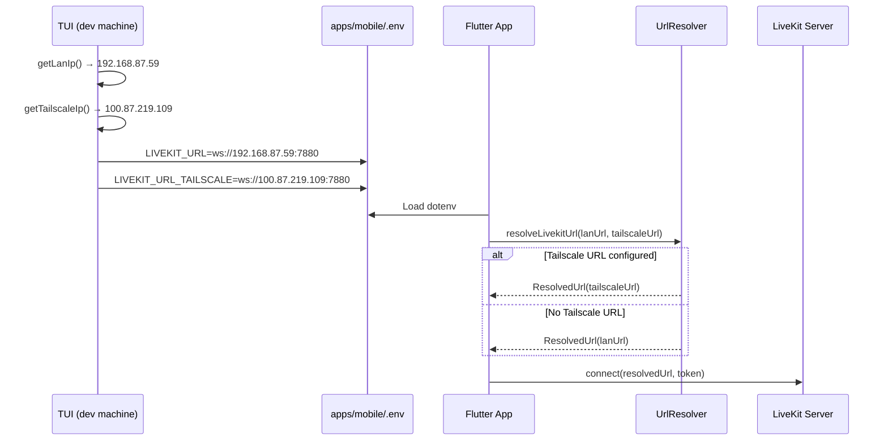

# Network Connectivity: Tailscale-Aware URL Resolution

## Overview

The Fletcher mobile app connects to a LiveKit server running on the developer's machine. The connection path depends on the phone's network state:

- **LAN** (default): Phone and dev machine on the same WiFi network. The TUI rewrites `LIVEKIT_URL` in `apps/mobile/.env` from `localhost` to the dev machine's LAN IP (e.g., `ws://192.168.87.59:7880`).
- **Tailscale**: When the phone is on cellular or otherwise off the LAN, it needs the dev machine's Tailscale IP (e.g., `ws://100.87.219.109:7880`). Tailscale also handles same-LAN routing efficiently, so using the Tailscale URL on WiFi adds negligible overhead.

When a Tailscale URL is configured, the app always uses it. This is simpler and more reliable than runtime VPN detection (see "Why Not Runtime Detection" below).

## Flow

```mermaid
sequenceDiagram
    participant TUI as TUI (dev machine)
    participant Env as apps/mobile/.env
    participant App as Flutter App
    participant Resolver as UrlResolver
    participant LK as LiveKit Server

    TUI->>TUI: getLanIp() → 192.168.87.59
    TUI->>TUI: getTailscaleIp() → 100.87.219.109
    TUI->>Env: LIVEKIT_URL=ws://192.168.87.59:7880
    TUI->>Env: LIVEKIT_URL_TAILSCALE=ws://100.87.219.109:7880

    App->>Env: Load dotenv
    App->>Resolver: resolveLivekitUrl(lanUrl, tailscaleUrl)

    alt Tailscale URL configured
        Resolver-->>App: ResolvedUrl(tailscaleUrl)
    else No Tailscale URL
        Resolver-->>App: ResolvedUrl(lanUrl)
    end

    App->>LK: connect(resolvedUrl, token)
```

## URL Resolution Logic

Resolution is in `apps/mobile/lib/services/url_resolver.dart`.

The strategy is simple: if `LIVEKIT_URL_TAILSCALE` is configured in `.env`, always use it. Otherwise fall back to the LAN URL. No runtime VPN detection is performed.

### Decision Matrix

| `LIVEKIT_URL_TAILSCALE` in `.env`? | URL used | Notes |
|---|---|---|
| Yes | Tailscale URL | Works on both WiFi and cellular |
| No | LAN URL | Only works on the home LAN |

### Why Not Runtime Detection?

The previous implementation used `NetworkInterface.list()` to scan for Tailscale's CGNAT IP range (`100.64.0.0/10`). This approach is **broken on Android 11+**: the OS hides VPN tunnel interfaces (`tun0`) created by other apps from `getifaddrs()`, so the app never sees Tailscale's interface even when the VPN is active. Field testing confirmed this — the resolver returned "No Tailscale interface" 11 consecutive times despite Tailscale being verified active via `adb shell ip addr show`.

Using the Tailscale URL unconditionally avoids this platform limitation entirely. Tailscale's same-LAN optimization (DERP bypass, direct WireGuard connection) means there's no meaningful latency penalty when both devices are on the same network.

See [task 018](../../tasks/09-connectivity/018-url-resolver-vpn-detection.md) for the full root cause analysis.

## Reconnection Flow

URL resolution runs on every connection attempt, not just the initial one:

1. **`connect()`**: Resolves URL before connecting. Caches `_tailscaleUrl` for reconnects.
2. **`_doReconnectAttempt()`** (disconnect/sleep recovery): Passes cached `_tailscaleUrl` to `connect()`, which re-resolves the URL.
3. **`_refreshAudioTrack()`** (Bluetooth/headphone change): Does **not** reconnect — uses `restartTrack()` to swap audio capture in-place. URL is unaffected.
4. **`disconnect(preserveTranscripts: false)`**: Clears `_tailscaleUrl` alongside `_url` and `_token`.

## ICE and Network Transitions

Even when the WebSocket signaling URL is fixed, the underlying WebRTC media path can migrate between networks via ICE restart:

1. App connects on WiFi → WebRTC established via Tailscale
2. Phone switches to cellular → ICE restart discovers new path (still via Tailscale)
3. Audio continues without a full reconnect

If the connection is **fully lost** (ICE restart fails, SDK gives up), the app-level reconnect creates a fresh WebSocket connection using the resolved URL. With the Tailscale URL, this works from both WiFi and cellular.

## Key Files

| File | Responsibility |
|---|---|
| `packages/tui/src/mobile.ts` | `getLanIp()`, `getTailscaleIp()`, writes both URLs to `.env` |
| `apps/mobile/lib/services/url_resolver.dart` | `resolveLivekitUrl()`, `ResolvedUrl` |
| `apps/mobile/lib/main.dart` | Reads `LIVEKIT_URL_TAILSCALE` from dotenv, passes to screen |
| `apps/mobile/lib/screens/conversation_screen.dart` | Forwards `livekitUrlTailscale` to `LiveKitService.connect()` |
| `apps/mobile/lib/services/livekit_service.dart` | Calls resolver before every connect |

## Related Documents

- [Infrastructure](infrastructure.md) — Docker Compose, LiveKit config, and Tailscale IP pinning
- [Mobile Client](mobile-client.md) — Flutter app connection lifecycle and reconnection strategy
- [Developer Workflow](developer-workflow.md) — TUI launcher and mobile deployment
- [System Overview](system-overview.md) — deployment topology showing network boundaries
