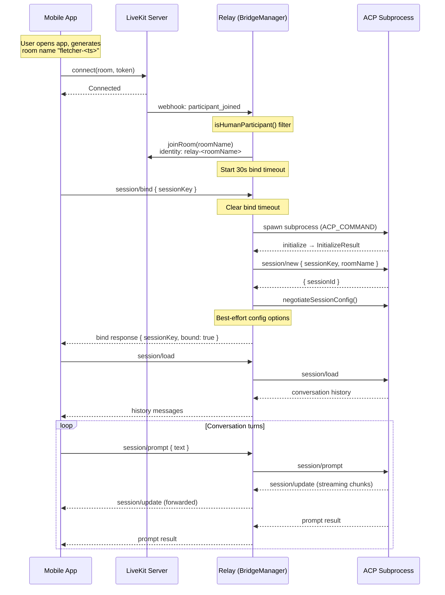
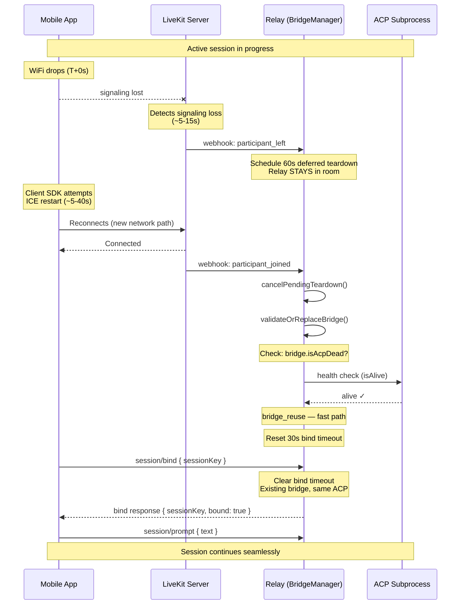
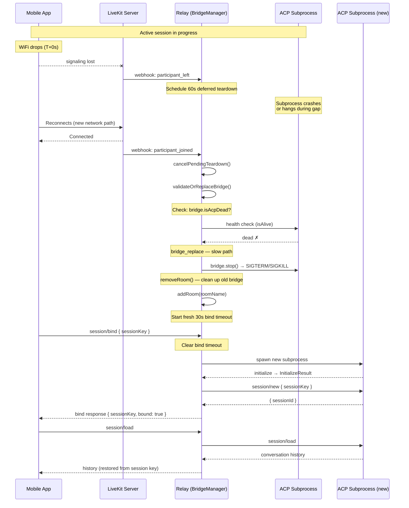
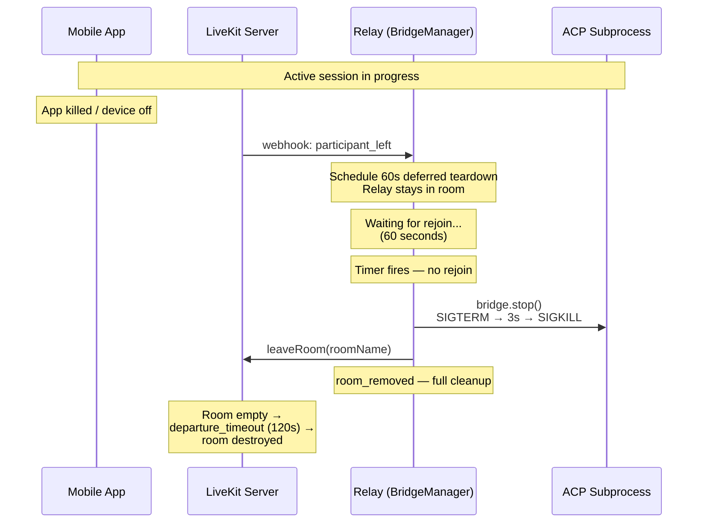
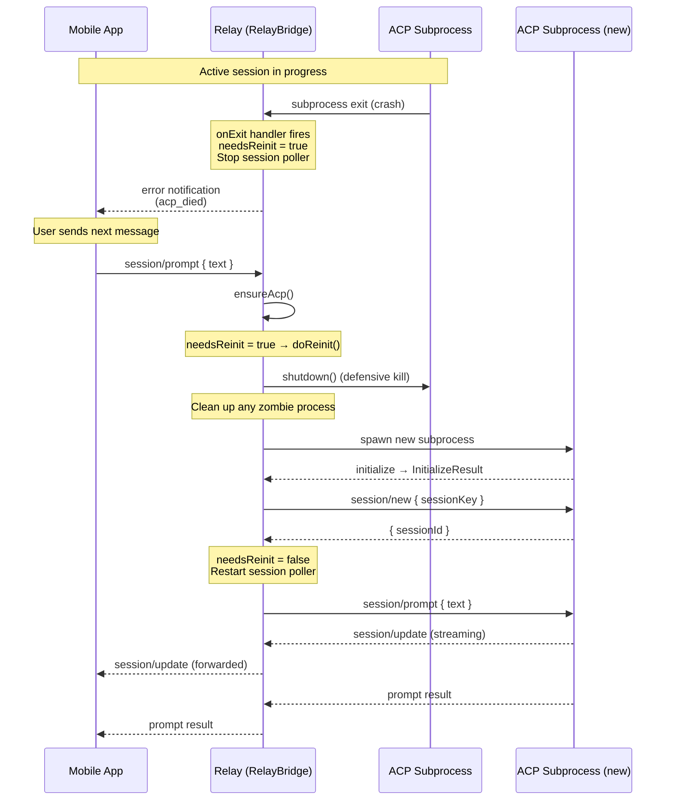
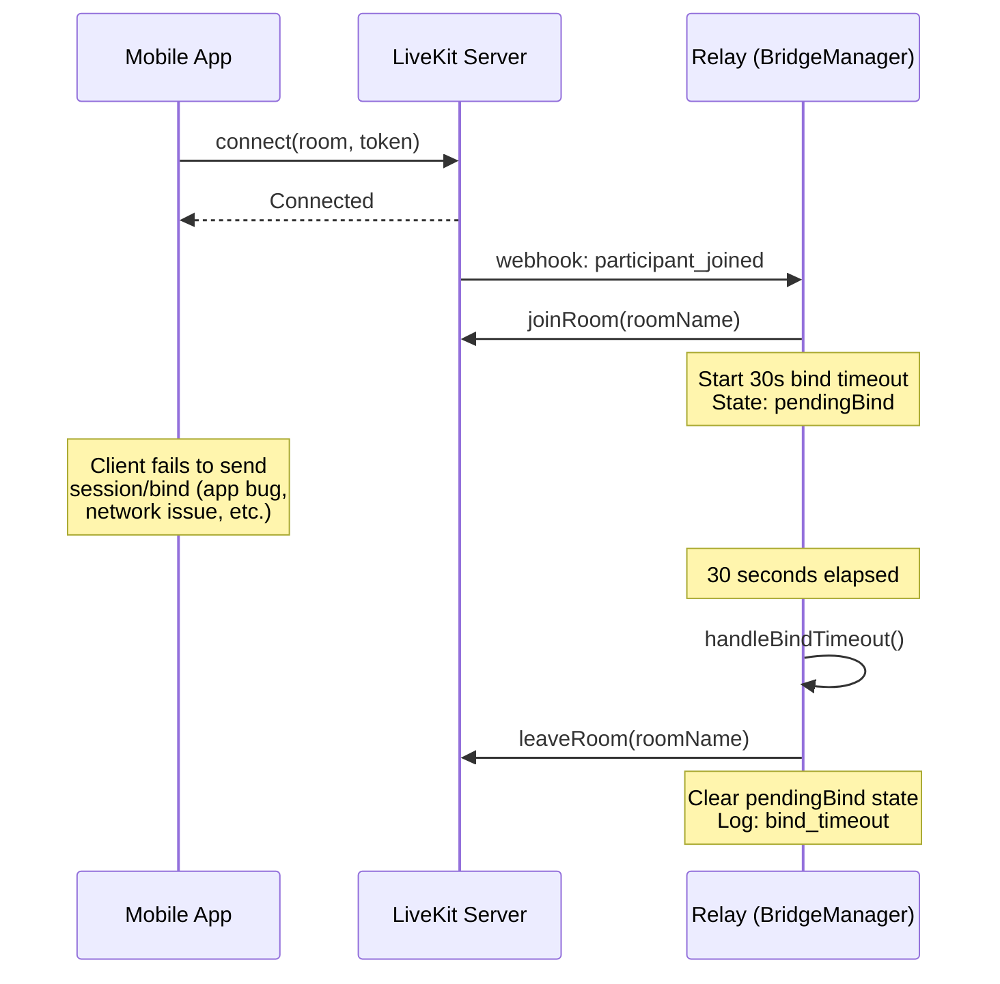

# Relay Lifecycle

The relay is Fletcher's core component — the ACP bridge between the mobile client and any ACP-compatible agent subprocess. This document describes the relay's room lifecycle — how bridges are created, maintained, recovered after network disruptions, and torn down. It covers both the current behavior and the target state after task 100 (deferred teardown with health-gated re-bind).

The relay is the critical path for network resilience: its teardown decisions determine whether a network switch costs the user 0 seconds (bridge reuse) or 3-5 seconds (full ACP restart).

## Actors

| Actor | Identity in LiveKit | Role |
|-------|-------------------|------|
| **Mobile App** | `device-<uuid>` | Flutter client — sends `session/bind`, `session/prompt`, `session/load` on `acp` topic |
| **LiveKit Server** | — | SFU — fires `participant_joined` / `participant_left` webhooks to relay |
| **Relay** (`BridgeManager` + `RoomManager`) | `relay-<roomName>` | Joins rooms, manages per-room `RelayBridge` instances, routes data channel messages to ACP |
| **ACP Subprocess** | — | Any ACP-compatible agent (OpenClaw, Claude Code, custom) spawned by the relay — owns the conversation session |

Key source files:

| File | Responsibility |
|------|---------------|
| `apps/relay/src/http/webhook.ts` | LiveKit webhook handler — `participant_joined` / `participant_left` |
| `apps/relay/src/bridge/bridge-manager.ts` | Per-room bridge lifecycle (add, remove, bind, teardown scheduling) |
| `apps/relay/src/bridge/relay-bridge.ts` | Single bridge instance — wires data channel to ACP subprocess |
| `apps/relay/src/livekit/room-manager.ts` | LiveKit room connections, data channel pub/sub, token generation |
| `apps/relay/src/index.ts` | Server startup, discovery, graceful shutdown |

## 1. Happy Path — Connect, Bind, Chat

The normal flow when a mobile client joins a fresh room.

**Key details:**

- The webhook handler filters out non-human participants (relay instances, voice agents) via `isHumanParticipant()`.
- `addRoom()` is idempotent — duplicate `participant_joined` webhooks are safely ignored.
- The 30-second bind timeout ensures the relay doesn't hold a room indefinitely if the client never sends `session/bind`. If it expires, the relay leaves the room (see [Bind Timeout](#5-bind-timeout)).
- ACP subprocess spawning (`initialize` + `session/new`) takes ~2-3 seconds. This is the cost that deferred teardown aims to avoid on reconnection.
- Config negotiation loads desired settings from `acp-session-config.json` and calls `sessionSetConfigOption()` for each — this is best-effort and does not block the bind response.

## 2. Network Switch Recovery

When a mobile device switches networks (WiFi to cellular or vice versa), LiveKit detects signaling loss and fires `participant_left` after ~5-15 seconds. The relay's response to this event determines the reconnection experience.

### Fast Path — Healthy Bridge Survives

This is the primary win of deferred teardown. The relay keeps the bridge alive during the grace period, and the client reconnects to the existing session without ACP restart.

**Key details:**

- The relay does **not** leave the room on `participant_left`. It schedules teardown but stays connected, ready to resume immediately.
- `cancelPendingTeardown()` cancels the 60-second timer before it fires.
- `validateOrReplaceBridge()` checks `bridge.isAcpDead` to determine if the ACP subprocess is still alive and responsive.
- On the fast path, no ACP respawn occurs — the client re-binds to the same bridge and session. This saves the 2-3 second ACP startup cost.
- The client sends a fresh `session/bind` after reconnecting. If the bridge already has a session, the bind handler returns `{ bound: true, sessionKey }` immediately.
- From the user's perspective, conversation resumes with no gap beyond the network switch delay itself.

### Slow Path — Unhealthy Bridge (BUG-036 Safety)

If the ACP subprocess died or became unresponsive during the disconnection window, the relay replaces the bridge entirely. This prevents the BUG-036 scenario where a client reconnects to a poisoned session.

**Key details:**

- This is the BUG-036 safety valve. The old bridge had deferred teardown without health checks — clients would silently reconnect to corrupted sessions with broken STT pipeline state or hung processes.
- The health-gated approach solves the core tension: we get the speed benefit of bridge reuse (fast path) while maintaining the safety guarantee of clean replacement (slow path).
- The slow path costs ~2-3 seconds for ACP restart but guarantees a clean session.
- Session history is preserved via `session/load` — the ACP backend retrieves conversation history by the session key, so even a fresh ACP subprocess can restore the conversation.

## 3. Grace Period Expiry

If the client never returns within the 60-second grace period (e.g., app killed, device powered off, user walked away), the deferred teardown fires and cleans up all resources.

**Key details:**

- The 60-second grace period is long enough to cover most network switches (LiveKit detection ~5-15s + ICE restart ~5-40s) but short enough to avoid resource waste.
- After grace period expiry, cleanup is identical to today's immediate teardown: bridge stopped, ACP killed (SIGTERM with 3-second escalation to SIGKILL), relay leaves room.
- The LiveKit room itself has a separate `departure_timeout` of 120 seconds. After the relay leaves, the room stays alive for another 2 minutes — but with no relay, there's nothing for the client to bind to.
- The idle room timer (default 30 minutes, `RELAY_IDLE_TIMEOUT_MS`) serves as a secondary cleanup for rooms where the relay stays connected but no messages flow.

## 4. ACP Failure and Recovery

When the ACP subprocess crashes mid-session (not during a network switch), the relay detects the exit and lazily re-initializes on the next prompt.

**Key details:**

- ACP death is detected via the subprocess `onExit` handler, which sets `needsReinit = true`.
- Re-initialization is **lazy** — it happens on the next `session/prompt` or `session/load`, not immediately. This avoids wasting resources if no more messages come.
- `ensureAcp()` coalesces concurrent re-init attempts — only one `doReinit()` runs at a time.
- `doReinit()` defensively calls `shutdown()` first to clean up any zombie process before spawning a fresh one.
- The new ACP subprocess gets the same session key, so conversation history is preserved via the backend's session persistence.
- The session poller (BUG-022 workaround) is stopped on ACP death and restarted after re-init.

## 5. Bind Timeout

If a client triggers `participant_joined` (causing the relay to join the room) but never sends `session/bind` within 30 seconds, the relay cleans up to avoid holding resources indefinitely.

**Key details:**

- The bind timeout (30 seconds, configurable via `bindTimeoutMs`) prevents resource leaks from clients that connect but never bind.
- No ACP subprocess is spawned during the pending-bind state — the subprocess is only created when `session/bind` arrives. The only resource held is the LiveKit room connection.
- The timer is `.unref()`'d so it doesn't prevent Node.js process exit during graceful shutdown.
- This scenario can occur when the client app crashes between connecting to LiveKit and sending the bind message, or when a non-Fletcher participant joins a Fletcher room.

## Design Principles

These principles guide the relay's lifecycle decisions:

1. **Deferred teardown (60s grace) on `participant_left`** — Network switches are common on mobile. The relay waits before destroying the bridge, giving the client time to reconnect via ICE restart or app-level reconnect.

2. **Health-gated re-bind** — Before reusing a surviving bridge, validate that the ACP subprocess is alive. This prevents the BUG-036 scenario where a client reconnects to a poisoned session (corrupted STT state, hung process).

3. **Relay stays in room during grace period** — The relay does not leave the LiveKit room when scheduling deferred teardown. This means the relay is immediately available when the client reconnects — no need to re-join the room.

4. **Lazy ACP recovery** — When ACP dies mid-session, re-initialization is deferred until the next message. This avoids wasting subprocess spawn cycles if no further interaction occurs.

5. **Bind timeout as resource guard** — Rooms in "pending bind" state (relay joined, no `session/bind` received) are cleaned up after 30 seconds. No ACP is spawned until bind completes.

6. **Idempotent handlers** — Both `addRoom()` and the bind handler are idempotent. Duplicate webhooks and duplicate `session/bind` messages are handled gracefully.

## Timeout Reference

| Timer | Duration | Trigger | Action on Expiry |
|-------|----------|---------|-----------------|
| **Bind timeout** | 30s | `addRoom()` | Relay leaves room |
| **Deferred teardown** | 60s | `participant_left` webhook | Bridge stopped, ACP killed, relay leaves room |
| **ACP shutdown grace** | 3s | `bridge.stop()` | SIGTERM escalates to SIGKILL |
| **Idle room timeout** | 30m | Periodic check (60s interval) | Room removed if no activity |
| **Room departure** | 120s | All participants leave | LiveKit destroys room (server-side) |
| **Rejoin backoff** | 1s, 2s, 4s | Room disconnect (network) | Exponential retry, max 3 attempts |
| **Discovery interval** | 30s | Startup | Periodic scan for orphaned rooms |

## Related Documents

- [Voice Pipeline](voice-pipeline.md) — end-to-end audio flow through the voice agent
- [Network Connectivity](network-connectivity.md) — URL resolution, reconnection strategy, timeout coordination
- [Data Channel Protocol](data-channel-protocol.md) — message formats on `acp` and `voice-acp` topics
- [Brain Plugin](brain-plugin.md) — Ganglia LLM bridge and ACP backend details
- [Session Routing](session-routing.md) — how session keys are resolved and used
- [Mobile Client](mobile-client.md) — client-side connection lifecycle and reconnection
