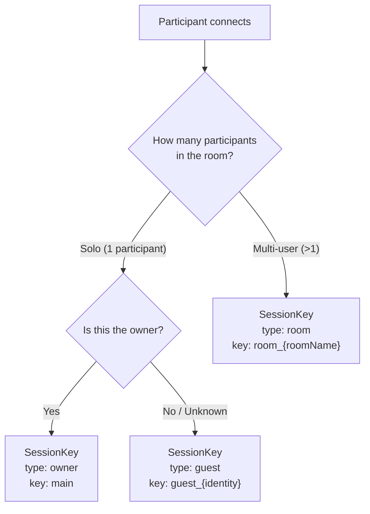
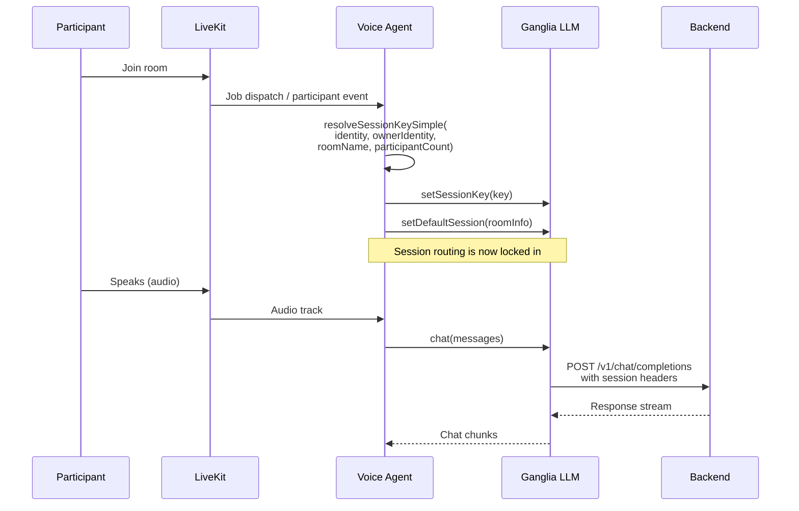

# Session Routing

Session routing maps a LiveKit participant to a persistent conversation session. The core principle: **rooms are disposable transport; sessions are persistent state.** A user can disconnect and reconnect to a new room while continuing the same conversation.

## SessionKey

Every active conversation is identified by a `SessionKey`:

```typescript
interface SessionKey {
  type: 'owner' | 'guest' | 'room';
  key: string;
}
```

| Type | Key Format | Scope |
|------|------------|-------|
| `owner` | `"main"` | Full brain access — memory, history, personality |
| `guest` | `"guest_{identity}"` | Isolated session — no access to owner's memory |
| `room` | `"room_{roomName}"` | Shared context for all participants in the room |

## Resolution Algorithm

When a participant connects, the system resolves which session they should use.



### Owner Detection

Owner detection has two planned layers (only the first is implemented):

1. **Device identity (current):** The `FLETCHER_OWNER_IDENTITY` environment variable names the participant identity that maps to the owner. If `participantIdentity === FLETCHER_OWNER_IDENTITY`, the participant is the owner.

2. **Voice fingerprinting (planned):** Speaker verification would analyze audio to confirm identity with confidence scoring. Not yet implemented — tracked in `tasks/06-voice-fingerprinting/`.

### Resolution Functions

**`resolveSessionKeySimple()`** — used by the standalone voice agent:

```typescript
function resolveSessionKeySimple(
  participantIdentity: string,
  ownerIdentity: string | undefined,  // From FLETCHER_OWNER_IDENTITY
  roomName: string,
  participantCount: number
): SessionKey
```

**`resolveSessionKey()`** — full version with speaker verification support:

```typescript
function resolveSessionKey(
  participantCount: number,
  participantIdentity: string,
  roomName: string,
  speakerVerified: 'owner' | 'guest' | 'unknown'
): SessionKey
```

## Wire Protocol

Once resolved, the SessionKey is transmitted to the backend differently depending on the backend type.

### OpenClaw Headers and Body

The `applySessionKey()` function adds routing information to the HTTP request:

| SessionKey | Header | Body Field |
|------------|--------|------------|
| `owner` | `x-openclaw-session-key: "main"` | — |
| `guest` | — | `user: "guest_{identity}"` |
| `room` | — | `user: "room_{roomName}"` |

Legacy headers are also sent for backward compatibility:
- `X-OpenClaw-Session-Id` — deterministic hash of room + participant
- `X-OpenClaw-Room-SID` — LiveKit room SID
- `X-OpenClaw-Room-Name` — human-readable room name
- `X-OpenClaw-Participant-Identity` — participant identity
- `X-OpenClaw-Participant-SID` — participant session ID

### Nanoclaw Channel

Nanoclaw uses a single `X-Nanoclaw-Channel` header. The SessionKey maps to channel names:

| SessionKey | Channel |
|------------|---------|
| `owner` | `"main"` |
| `guest` | `"guest:{identity}"` |
| `room` | `"room:{roomName}"` |

Without a SessionKey, the channel falls back to JID format: `{prefix}:{participantIdentity}` (e.g., `lk:user-12345`).

## Agent Wiring

When a participant joins a LiveKit room, the voice agent wires up session routing before conversation begins.



### Session Persistence Across Reconnects

When the mobile app disconnects (network change, app backgrounded) and reconnects:

1. A new LiveKit room may be created
2. The voice agent receives a new job dispatch
3. Session routing runs again — but if the participant identity matches, it resolves to the **same SessionKey**
4. The backend retrieves the same conversation history

This is why the SessionKey is based on identity, not room — rooms are ephemeral, identities persist.

## GangliaSessionInfo

Session metadata is captured in `GangliaSessionInfo` and passed alongside the SessionKey:

```typescript
interface GangliaSessionInfo {
  roomSid?: string;              // Unique room instance ID
  roomName?: string;             // Human-readable room name
  participantIdentity?: string;  // Unique participant ID
  participantSid?: string;       // Session-specific participant ID
  customSessionId?: string;      // Override for custom routing
}
```

This is used for:
- Generating deterministic session IDs (for legacy header compatibility)
- Debug logging (tracing which room/participant triggered a request)
- Fallback routing when no SessionKey is explicitly set

## Related Documents

- [Brain Plugin](brain-plugin.md) — how backends receive and use session routing
- [Voice Pipeline](voice-pipeline.md) — where session routing fits in the agent startup
- [Channel Plugin](channel-plugin.md) — participant tracking and room lifecycle
