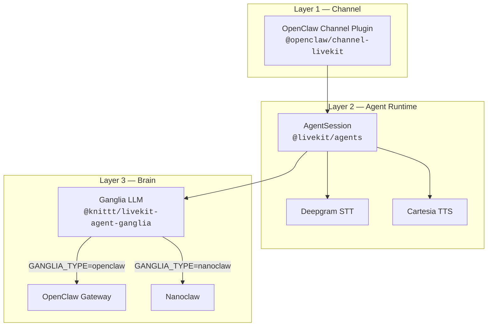
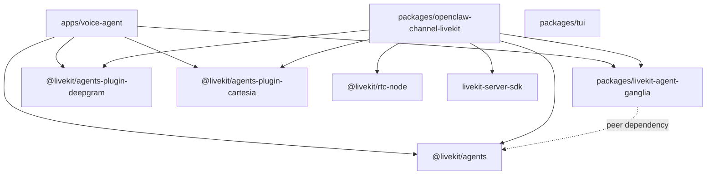
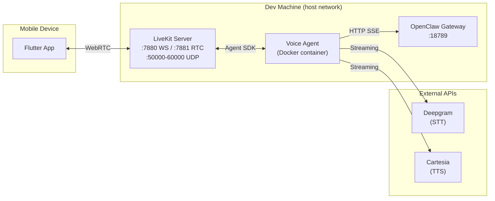

# System Overview

Fletcher is an OpenClaw channel plugin that adds real-time voice conversations via LiveKit. It bridges a Flutter mobile client to the OpenClaw reasoning engine through a voice pipeline built on the LiveKit Agents framework, targeting sub-1.5-second voice-to-voice latency.

## Three-Layer Architecture

Fletcher is structured as three layers, each independently replaceable:

| Layer | Package | Role |
|-------|---------|------|
| **Channel** | `@openclaw/channel-livekit` | OpenClaw plugin interface, LiveKit room management, token generation, participant tracking |
| **Agent Runtime** | `@livekit/agents` (framework) | STT/TTS orchestration, VAD, turn detection, interruption handling |
| **Brain** | `@knittt/livekit-agent-ganglia` | LLM bridge to OpenClaw (multi-user) or Nanoclaw (single-user) backends |

The Channel layer can be swapped for other transports (WhatsApp, Discord). The Brain layer can be used with any LiveKit agent project — it has no dependency on the Channel layer.



## Monorepo Structure

Fletcher is a Bun workspace monorepo. The Flutter mobile app is **not** part of the Bun workspace — it uses the Dart/pub ecosystem independently.

```
fletcher/
├── packages/
│   ├── openclaw-channel-livekit/   # Channel plugin (Layer 1)
│   ├── livekit-agent-ganglia/      # Brain plugin (Layer 3)
│   └── tui/                        # Developer TUI launcher
├── apps/
│   ├── voice-agent/                # Standalone agent runner
│   └── mobile/                     # Flutter app (not in Bun workspace)
├── scripts/                        # Token generation, bootstrap, mobile helpers
├── docs/
│   ├── architecture/               # This directory
│   └── specs/                      # Technical specs (planning artifacts)
├── tasks/                          # Project roadmap and progress tracking
├── docker-compose.yml              # LiveKit + voice-agent services
├── livekit.yaml                    # LiveKit server configuration
├── flake.nix                       # Nix development environment
└── package.json                    # Bun workspace root
```

## Package Dependency Graph



**Key relationships:**
- `voice-agent` is the standalone entry point — it imports Ganglia and the LiveKit agent plugins directly
- `openclaw-channel-livekit` is the OpenClaw-integrated entry point — it wraps the same pipeline behind the OpenClaw plugin interface
- `ganglia` depends on `@livekit/agents` as a **peer dependency** to avoid duplicate installs
- `tui` has no code dependencies on other packages — it orchestrates via `docker compose` and shell commands

## Two Entry Points

Fletcher can run in two modes:

### Standalone Agent (`apps/voice-agent`)

The voice agent runs as an independent LiveKit worker. It registers with LiveKit, accepts job dispatches, and connects to rooms automatically.

```bash
bun run apps/voice-agent/src/agent.ts dev      # Worker mode (accepts dispatches)
bun run apps/voice-agent/src/agent.ts connect   # Direct mode (joins specific room)
```

This is the primary development mode. The agent is packaged as a Docker container via `apps/voice-agent/Dockerfile`.

### OpenClaw Plugin (`packages/openclaw-channel-livekit`)

The channel plugin runs inside the OpenClaw Gateway process. OpenClaw manages the lifecycle — starting/stopping voice agents per account, routing messages, and providing configuration.

This is the production deployment model. The plugin registers an HTTP route (`POST /fletcher/token`) for device authentication and exposes the voice pipeline through OpenClaw's channel abstraction.

## Deployment Topology

A typical development deployment runs three services on the same host using Docker Compose with host networking:



**Networking notes:**
- All Docker services use `network_mode: host` — required for WebRTC UDP port forwarding
- LiveKit's RTC config pins a Tailscale IP (`100.87.219.109`) as `node_ip` for stable ICE candidates across network transitions
- The mobile app detects Tailscale VPN at runtime and switches URLs accordingly (see [Network Connectivity](network-connectivity.md))

## Environment Variables

The system is configured entirely through environment variables. See [Infrastructure](infrastructure.md) for the complete reference.

| Variable | Used By | Purpose |
|----------|---------|---------|
| `LIVEKIT_URL` | Voice agent, mobile | LiveKit WebSocket URL |
| `LIVEKIT_API_KEY` / `LIVEKIT_API_SECRET` | Voice agent, token gen | LiveKit authentication |
| `GANGLIA_TYPE` | Voice agent | Backend selection: `openclaw` or `nanoclaw` |
| `OPENCLAW_GATEWAY_URL` | Voice agent | Gateway HTTP endpoint |
| `OPENCLAW_API_KEY` | Voice agent | Gateway authentication |
| `DEEPGRAM_API_KEY` | Voice agent | Speech-to-text provider |
| `CARTESIA_API_KEY` | Voice agent | Text-to-speech provider |
| `FLETCHER_OWNER_IDENTITY` | Voice agent | Owner detection for session routing |

## Related Documents

- [Voice Pipeline](voice-pipeline.md) — end-to-end audio flow and latency budget
- [Brain Plugin](brain-plugin.md) — Ganglia LLM interface and backend implementations
- [Channel Plugin](channel-plugin.md) — OpenClaw integration and adapter interfaces
- [Session Routing](session-routing.md) — how conversations are mapped to sessions
- [Infrastructure](infrastructure.md) — Docker, LiveKit, Nix, and environment configuration
