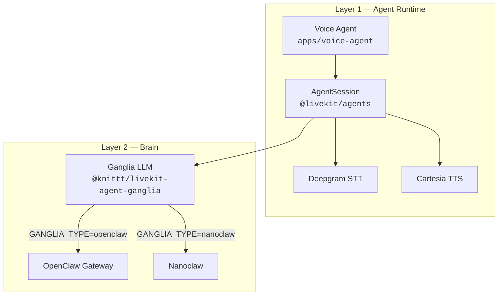
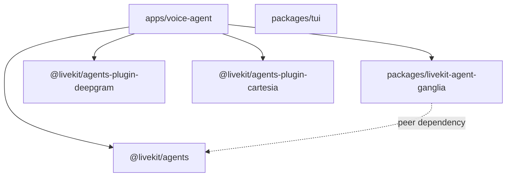
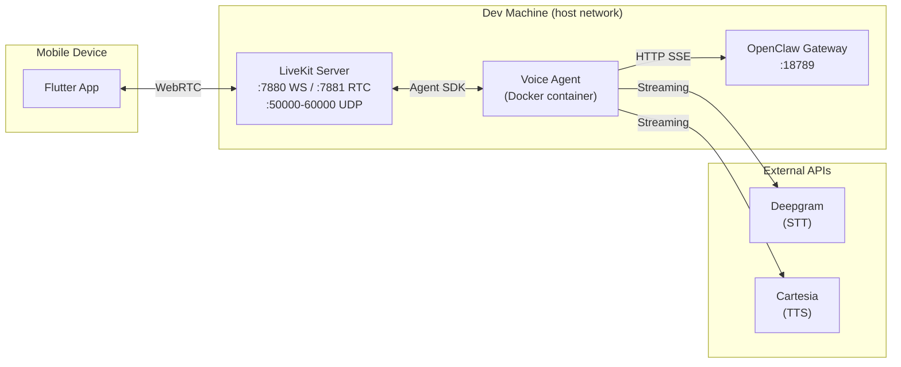

# System Overview

Fletcher is a standalone voice agent that bridges a Flutter mobile client to the OpenClaw reasoning engine through a real-time audio pipeline built on the LiveKit Agents framework, targeting sub-1.5-second voice-to-voice latency. It connects to the OpenClaw Gateway via its OpenAI-compatible completions API.

> **Design note:** We initially explored building Fletcher as an OpenClaw channel plugin (running inside the Gateway process, like Telegram or WhatsApp channels). We opted for the standalone agent approach instead — it's simpler to develop, deploy, and debug, and talks to OpenClaw through the same public API any other client would use. See `docs/architecture-comparison.md` for the full analysis.

## Two-Layer Architecture

Fletcher is structured as two layers, each independently replaceable:

| Layer | Package | Role |
|-------|---------|------|
| **Agent Runtime** | `@livekit/agents` (framework) + `apps/voice-agent` | STT/TTS orchestration, VAD, turn detection, interruption handling |
| **Brain** | `@knittt/livekit-agent-ganglia` | LLM bridge to OpenClaw (multi-user) or Nanoclaw (single-user) backends |

The Brain layer can be used with any LiveKit agent project — it has no dependency on the voice agent entry point.


```mermaid
flowchart TB
    subgraph "Layer 1 — Agent Runtime"
        VA["Voice Agent<br/><code>apps/voice-agent</code>"]
        AS["AgentSession<br/><code>@livekit/agents</code>"]
        STT["Deepgram STT"]
        TTS["Cartesia TTS"]
    end

    subgraph "Layer 2 — Brain"
        G["Ganglia LLM<br/><code>@knittt/livekit-agent-ganglia</code>"]
        OC["OpenClaw Gateway"]
        NC["Nanoclaw"]
    end

    VA --> AS
    AS --> STT
    AS --> TTS
    AS --> G
    G -->|"GANGLIA_TYPE=openclaw"| OC
    G -->|"GANGLIA_TYPE=nanoclaw"| NC
```

## Monorepo Structure

Fletcher is a Bun workspace monorepo. The Flutter mobile app is **not** part of the Bun workspace — it uses the Dart/pub ecosystem independently.

```
fletcher/
├── packages/
│   ├── livekit-agent-ganglia/      # Brain plugin (Layer 2)
│   └── tui/                        # Developer TUI launcher
├── apps/
│   ├── voice-agent/                # Voice agent entry point (Layer 1)
│   └── mobile/                     # Flutter app (not in Bun workspace)
├── scripts/                        # Token generation, bootstrap, mobile helpers
├── docs/
│   ├── architecture/               # This directory
│   └── specs/                      # Technical specs (planning artifacts)
├── tasks/                          # Project roadmap and progress tracking
├── docker-compose.yml              # LiveKit + voice-agent services
├── livekit.yaml                    # LiveKit server configuration
├── flake.nix                       # Nix development environment
└── package.json                    # Bun workspace root
```

## Package Dependency Graph


```mermaid
flowchart TD
    VA["apps/voice-agent"]
    G["packages/livekit-agent-ganglia"]
    TUI["packages/tui"]

    LA["@livekit/agents"]
    DG["@livekit/agents-plugin-deepgram"]
    CA["@livekit/agents-plugin-cartesia"]

    VA --> G
    VA --> LA
    VA --> DG
    VA --> CA

    G -.->|"peer dependency"| LA
```

**Key relationships:**
- `voice-agent` is the entry point — it imports Ganglia and the LiveKit agent plugins directly
- `ganglia` depends on `@livekit/agents` as a **peer dependency** to avoid duplicate installs
- `tui` has no code dependencies on other packages — it orchestrates via `docker compose` and shell commands

## Voice Agent (`apps/voice-agent`)

The voice agent runs as an independent LiveKit worker. It registers with LiveKit, accepts job dispatches, and connects to rooms automatically.

```bash
bun run apps/voice-agent/src/agent.ts dev      # Worker mode (accepts dispatches)
bun run apps/voice-agent/src/agent.ts connect   # Direct mode (joins specific room)
```

The agent is packaged as a Docker container via `apps/voice-agent/Dockerfile`.

## Deployment Topology

A typical development deployment runs three services on the same host using Docker Compose with host networking:


```mermaid
flowchart LR
    subgraph "Mobile Device"
        APP["Flutter App"]
    end

    subgraph "Dev Machine (host network)"
        LK["LiveKit Server<br/>:7880 WS / :7881 RTC<br/>:50000-60000 UDP"]
        VA["Voice Agent<br/>(Docker container)"]
        GW["OpenClaw Gateway<br/>:18789"]
    end

    subgraph "External APIs"
        DG["Deepgram<br/>(STT)"]
        CT["Cartesia<br/>(TTS)"]
    end

    APP <-->|"WebRTC"| LK
    LK <-->|"Agent SDK"| VA
    VA -->|"HTTP SSE"| GW
    VA -->|"Streaming"| DG
    VA -->|"Streaming"| CT
```

**Networking notes:**
- All Docker services use `network_mode: host` — required for WebRTC UDP port forwarding
- LiveKit's RTC config pins a Tailscale IP (`100.87.219.109`) as `node_ip` for stable ICE candidates across network transitions
- The mobile app detects Tailscale VPN at runtime and switches URLs accordingly (see [Network Connectivity](network-connectivity.md))

## Environment Variables

The system is configured entirely through environment variables. See [Infrastructure](infrastructure.md) for the complete reference.

| Variable | Used By | Purpose |
|----------|---------|---------|
| `LIVEKIT_URL` | Voice agent, mobile | LiveKit WebSocket URL |
| `LIVEKIT_API_KEY` / `LIVEKIT_API_SECRET` | Voice agent, token gen | LiveKit authentication |
| `GANGLIA_TYPE` | Voice agent | Backend selection: `openclaw` or `nanoclaw` |
| `OPENCLAW_GATEWAY_URL` | Voice agent | Gateway HTTP endpoint |
| `OPENCLAW_API_KEY` | Voice agent | Gateway authentication |
| `DEEPGRAM_API_KEY` | Voice agent | Speech-to-text provider |
| `CARTESIA_API_KEY` | Voice agent | Text-to-speech provider |
| `FLETCHER_OWNER_IDENTITY` | Voice agent | Owner detection for session routing |

## Related Documents

- [Voice Pipeline](voice-pipeline.md) — end-to-end audio flow and latency budget
- [Brain Plugin](brain-plugin.md) — Ganglia LLM interface and backend implementations
- [Session Routing](session-routing.md) — how conversations are mapped to sessions
- [Infrastructure](infrastructure.md) — Docker, LiveKit, Nix, and environment configuration
