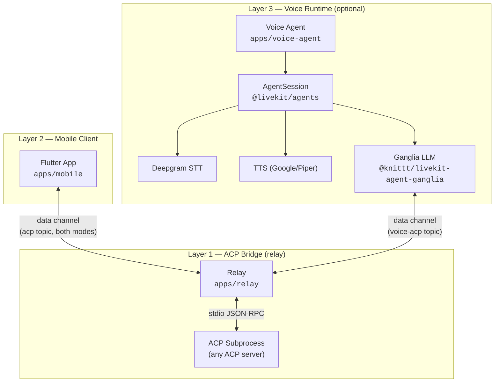
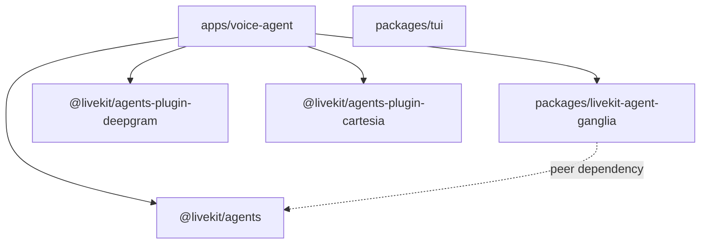
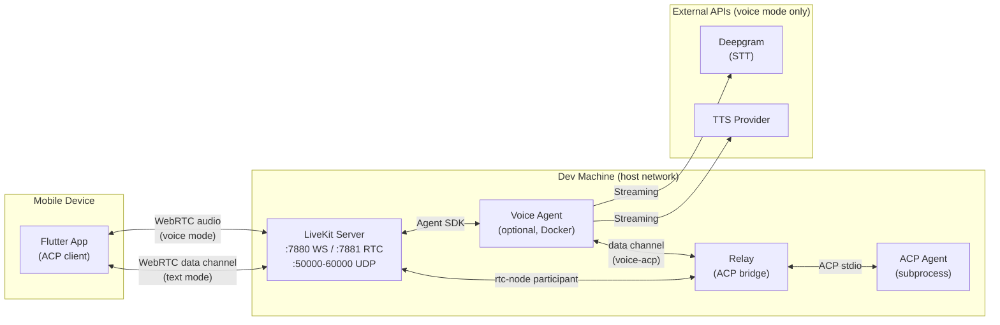

# System Overview

Fletcher is an open-source mobile ACP (Agent Communication Protocol) client with voice and text support. It connects a Flutter mobile app to any ACP-compatible agent — OpenClaw, Claude Code, or custom — through LiveKit's WebRTC infrastructure. The relay bridges ACP over stdio to the mobile client via data channels. An optional voice agent adds real-time speech (STT → LLM → TTS), targeting sub-1.5-second voice-to-voice latency.

## Three-Layer Architecture

Fletcher is structured as three layers, each independently replaceable:

| Layer | Package | Role |
|-------|---------|------|
| **ACP Bridge** | `apps/relay` | Transparent JSON-RPC 2.0 bridge: mobile data channel ↔ ACP subprocess over stdio. The core of Fletcher. |
| **Mobile Client** | `apps/mobile` | Flutter app: dual-mode input (voice + text), tool-call cards, artifacts, connection resilience |
| **Voice Runtime** (optional) | `@livekit/agents` (framework) + `apps/voice-agent` + `@knittt/livekit-agent-ganglia` | STT/TTS orchestration, VAD, turn detection, interruption handling. Joins on demand. |

Text mode works with just the relay and mobile app. Voice mode adds the agent runtime for real-time speech. In both modes, the relay is the single source of ACP content for mobile — the voice agent extracts text tokens for TTS but does not generate or publish content artifacts.


```mermaid
flowchart TB
    subgraph "Layer 1 — ACP Bridge (relay)"
        RL["Relay<br/><code>apps/relay</code>"]
        ACP_SUB["ACP Subprocess<br/>(any ACP server)"]
    end

    subgraph "Layer 2 — Mobile Client"
        APP["Flutter App<br/><code>apps/mobile</code>"]
    end

    subgraph "Layer 3 — Voice Runtime (optional)"
        VA["Voice Agent<br/><code>apps/voice-agent</code>"]
        AS["AgentSession<br/><code>@livekit/agents</code>"]
        STT["Deepgram STT"]
        TTS["TTS (Google/Piper)"]
        G["Ganglia LLM<br/><code>@knittt/livekit-agent-ganglia</code>"]
    end

    APP <-->|"data channel<br/>(acp topic, both modes)"| RL
    RL <-->|"stdio JSON-RPC"| ACP_SUB
    VA --> AS
    AS --> STT
    AS --> TTS
    AS --> G
    G <-->|"data channel<br/>(voice-acp topic)"| RL
```

## Monorepo Structure

Fletcher is a Bun workspace monorepo. The Flutter mobile app is **not** part of the Bun workspace — it uses the Dart/pub ecosystem independently.

```
fletcher/
├── packages/
│   ├── livekit-agent-ganglia/      # Brain plugin (Layer 2)
│   └── tui/                        # Developer TUI launcher
├── apps/
│   ├── voice-agent/                # Voice agent entry point (Layer 1)
│   ├── relay/                      # Text-mode ACP bridge (LiveKit data channel ↔ OpenClaw)
│   └── mobile/                     # Flutter app (not in Bun workspace)
├── scripts/                        # Token generation, bootstrap, mobile helpers
├── docs/
│   ├── architecture/               # This directory
│   └── specs/                      # Technical specs (planning artifacts)
├── tasks/                          # Project roadmap and progress tracking
├── docker-compose.yml              # LiveKit + voice-agent services
├── livekit.yaml                    # LiveKit server configuration
├── flake.nix                       # Nix development environment
└── package.json                    # Bun workspace root
```

## Package Dependency Graph


```mermaid
flowchart TD
    VA["apps/voice-agent"]
    G["packages/livekit-agent-ganglia"]
    TUI["packages/tui"]

    LA["@livekit/agents"]
    DG["@livekit/agents-plugin-deepgram"]
    CA["@livekit/agents-plugin-cartesia"]

    VA --> G
    VA --> LA
    VA --> DG
    VA --> CA

    G -.->|"peer dependency"| LA
```

**Key relationships:**
- `voice-agent` is the entry point — it imports Ganglia and the LiveKit agent plugins directly
- `ganglia` depends on `@livekit/agents` as a **peer dependency** to avoid duplicate installs. It is a focused package: `RelayLLM` + `SessionKey` routing + slim factory — no direct ACP backend or artifact generation
- `relay` is independent — it connects to LiveKit via `@livekit/rtc-node` (non-agent participant) and to the ACP subprocess over stdio. It dual-publishes responses to both `voice-acp` and `acp` topics in voice mode
- `tui` has no code dependencies on other packages — it orchestrates via `docker compose` and shell commands

## Voice Agent (`apps/voice-agent`)

The voice agent runs as an independent LiveKit worker. It registers with LiveKit, accepts job dispatches, and connects to rooms automatically.

```bash
bun run apps/voice-agent/src/agent.ts dev      # Worker mode (accepts dispatches)
bun run apps/voice-agent/src/agent.ts connect   # Direct mode (joins specific room)
```

The agent is packaged as a Docker container via `apps/voice-agent/Dockerfile`.

## Relay (`apps/relay`) — The Core

The relay is Fletcher's foundation — a **generic ACP bridge** that joins LiveKit rooms as a non-agent participant and forwards JSON-RPC 2.0 messages between the mobile client's data channel and an ACP subprocess over stdio. The backend is configured via `ACP_COMMAND` / `ACP_ARGS` — any ACP-compatible server plugs in.

The relay is a transparent passthrough — it does not parse or transform message content. It handles ACP lifecycle (`initialize`, `session/new`) internally and forwards `session/prompt`, `session/update`, and `session/cancel` between mobile and the agent.

On startup, the relay auto-discovers LiveKit rooms with active human participants (via `RoomServiceClient`) and rejoins any that lack a relay — recovering from restarts without user intervention.

**Tested backends:** `openclaw acp` (OpenClaw), `claude-agent-acp` (Claude Code via Zed adapter), custom ACP servers.

See `apps/relay/docs/architecture.md` for full design rationale, economics, and protocol details.

## Deployment Topology

A typical development deployment runs four services on the same host using Docker Compose with host networking:


```mermaid
flowchart LR
    subgraph "Mobile Device"
        APP["Flutter App<br/>(ACP client)"]
    end

    subgraph "Dev Machine (host network)"
        LK["LiveKit Server<br/>:7880 WS / :7881 RTC<br/>:50000-60000 UDP"]
        VA["Voice Agent<br/>(optional, Docker)"]
        RL["Relay<br/>(ACP bridge)"]
        ACP["ACP Agent<br/>(subprocess)"]
    end

    subgraph "External APIs (voice mode only)"
        DG["Deepgram<br/>(STT)"]
        TTS["TTS Provider"]
    end

    APP <-->|"WebRTC data channel<br/>(text mode)"| LK
    APP <-->|"WebRTC audio<br/>(voice mode)"| LK
    LK <-->|"rtc-node participant"| RL
    LK <-->|"Agent SDK"| VA
    RL <-->|"ACP stdio"| ACP
    VA <-->|"data channel<br/>(voice-acp)"| RL
    VA -->|"Streaming"| DG
    VA -->|"Streaming"| TTS
```

**Networking notes:**
- All Docker services use `network_mode: host` — required for WebRTC UDP port forwarding
- LiveKit's RTC config pins a Tailscale IP (`100.87.219.109`) as `node_ip` for stable ICE candidates across network transitions
- The mobile app detects Tailscale VPN at runtime and switches URLs accordingly (see [Network Connectivity](network-connectivity.md))

## Environment Variables

The system is configured entirely through environment variables. See [Infrastructure](infrastructure.md) for the complete reference.

| Variable | Used By | Purpose |
|----------|---------|---------|
| `LIVEKIT_URL` | Voice agent, relay, mobile | LiveKit WebSocket URL |
| `LIVEKIT_API_KEY` / `LIVEKIT_API_SECRET` | Voice agent, relay, token gen | LiveKit authentication |
| `GANGLIA_TYPE` | Voice agent | Backend selection (default: `relay`) |
| `DEEPGRAM_API_KEY` | Voice agent | Speech-to-text provider |
| `FLETCHER_OWNER_IDENTITY` | Voice agent | Owner detection for session routing |
| `ACP_COMMAND` / `ACP_ARGS` | Relay | ACP subprocess command (default: `openclaw acp`) |
| `RELAY_HTTP_PORT` | Relay | HTTP server port (default: 7890, localhost only) |
| `RELAY_IDLE_TIMEOUT_MS` | Relay | Idle room timeout (default: 5 min) |

## Related Documents

- [Voice Pipeline](voice-pipeline.md) — end-to-end audio flow and latency budget
- [Brain Plugin](brain-plugin.md) — Ganglia LLM interface and backend implementations
- [Session Routing](session-routing.md) — how conversations are mapped to sessions
- [Infrastructure](infrastructure.md) — Docker, LiveKit, Nix, and environment configuration
