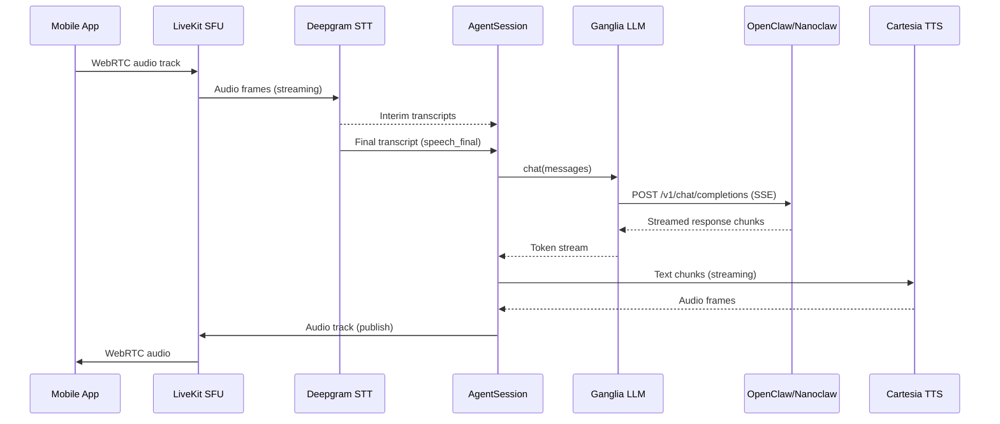

# Voice Pipeline

The voice pipeline handles the full round trip from user speech to agent speech. Audio enters the system as a WebRTC track, passes through speech-to-text, LLM reasoning, and text-to-speech, then returns as audio to the client.

## End-to-End Flow



## Pipeline Components

### Speech-to-Text (Deepgram)

- **Provider:** Deepgram via `@livekit/agents-plugin-deepgram`
- **Model:** Nova-3 (configurable)
- **Mode:** Streaming with VAD — audio is processed continuously, not in discrete chunks
- **Key signals:**
  - `is_final` — word-level finality (can be revised)
  - `speech_final` — utterance-level finality (triggers LLM call)
- **Typical latency:** 200-400ms from end of speech to final transcript

### AgentSession Orchestration

The `@livekit/agents` framework provides `AgentSession`, which coordinates the pipeline:

1. **VAD (Voice Activity Detection)** — detects when the user starts/stops speaking
2. **Turn Detection** — decides when an utterance is complete (configurable endpointing delay)
3. **Interruption Handling** — if the user speaks while the agent is responding, the agent stops
4. **Track Management** — subscribes to user audio, publishes agent audio

The voice agent creates an AgentSession with three components:

```
AgentSession({ stt, tts, llm })
```

The `Agent` object is an "empty shell" — OpenClaw owns personality, instructions, and tools. The agent passes an empty instructions string, relying entirely on the brain backend for conversation context.

### LLM Bridge (Ganglia)

Ganglia converts between the LiveKit `llm.LLM` interface and the OpenClaw/Nanoclaw HTTP API. See [Brain Plugin](brain-plugin.md) for details.

**Key behavior during streaming:**
- Ganglia opens an SSE connection to the backend
- Response chunks arrive as `data:` lines with JSON payloads
- Each chunk may contain `content` (text) or `tool_calls` (function invocations)
- Ganglia emits these as `ChatChunk` events that AgentSession forwards to TTS

### Text-to-Speech (Cartesia)

- **Provider:** Cartesia Sonic via `@livekit/agents-plugin-cartesia`
- **Model:** Sonic-3 (configurable)
- **Default voice:** The Alchemist (`597926e8-3233-4f9a-9e1d-91b53e89c62a`)
- **Options:** speed (0.5-2.0, default 1.0), emotion (default "neutral")
- **TTFB (Time to First Byte):** < 200ms
- **Alternative:** ElevenLabs Turbo v2.5 (configured but not default)

## Latency Budget

Target: **sub-1.5 second** voice-to-voice round trip.

| Stage | Current | Notes |
|-------|---------|-------|
| STT (end of speech → final transcript) | 200-400ms | Deepgram streaming + endpointing |
| LLM (request → first token) | 300-800ms | Depends on backend, network, context size |
| TTS (text → first audio frame) | 100-200ms | Cartesia Sonic streaming |
| Network overhead (WebRTC) | 50-100ms | UDP, typically low |
| **Total** | **650-1500ms** | |

### Optimization Levers (Not Yet Implemented)

1. **Endpointing tuning** — reduce default 500ms delay to 100-300ms (saves 200-400ms)
2. **Preemptive generation** — start LLM on high-confidence interim transcripts (saves 200-400ms)
3. **TTS pre-warming** — keep TTS connection warm between utterances (saves 50-100ms)

These are tracked in `tasks/05-latency-optimization/`.

## Two Entry Points

The voice pipeline can be started in two ways. The components and data flow are identical — only the lifecycle management differs.

### Standalone Agent (`apps/voice-agent`)

The agent registers as a LiveKit worker. When a client joins a room, LiveKit dispatches a job to the agent.

**Startup sequence:**
1. Validate environment variables
2. Create Ganglia LLM via `createGangliaFromEnv()`
3. Register with LiveKit via `cli.runApp()`
4. On job dispatch: create STT, TTS, and AgentSession
5. Resolve session routing via `resolveSessionKeySimple()`
6. Set session key on Ganglia for conversation continuity

**Load reporting:** The agent reports zero load (`loadFunc: async () => 0`) so LiveKit always dispatches jobs to it. This avoids unreliable CPU sampling in containers.

### OpenClaw Plugin (`packages/openclaw-channel-livekit`)

The channel plugin is started by the OpenClaw Gateway. The `gateway.startAccount()` method:

1. Generates an agent token via `generateAgentToken()`
2. Connects to a LiveKit room via `connectToRoom()`
3. Creates a `VoiceAgent` and calls `agent.start(room)`
4. `VoiceAgent` creates STT, TTS, Ganglia, and AgentSession internally
5. `ParticipantTracker` starts a session when the first participant joins

## Transcription & Data Channels

In addition to the audio pipeline, the system sends metadata to the client via LiveKit's text streams and data channels:

- **`lk.transcription` text stream** — real-time transcription of both user and agent speech
- **`ganglia-events` data channel** — status updates (what the agent is doing) and artifacts (code, diffs, search results)

See [Data Channel Protocol](data-channel-protocol.md) for the message format and chunking protocol.

## Related Documents

- [Brain Plugin](brain-plugin.md) — Ganglia LLM interface and streaming details
- [Channel Plugin](channel-plugin.md) — VoiceAgent lifecycle in the OpenClaw context
- [Data Channel Protocol](data-channel-protocol.md) — transcription and event message formats
- [Session Routing](session-routing.md) — how the pipeline selects a conversation session
