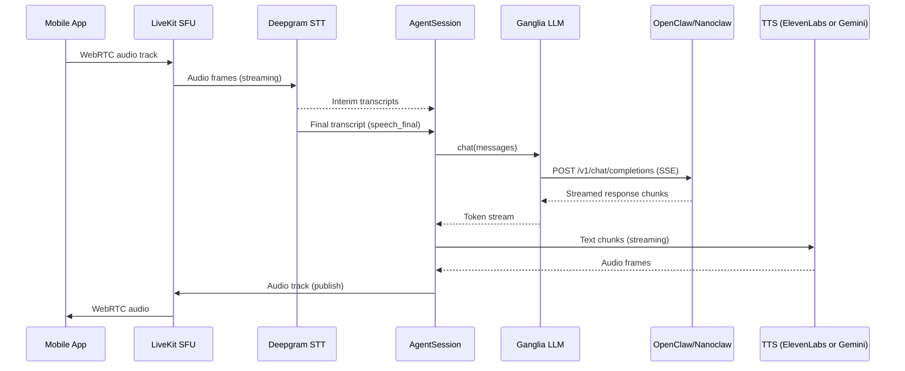

# Voice Pipeline

The voice pipeline handles the full round trip from user speech to agent speech. Audio enters the system as a WebRTC track, passes through speech-to-text, LLM reasoning, and text-to-speech, then returns as audio to the client.

## End-to-End Flow


```mermaid
sequenceDiagram
    participant Phone as Mobile App
    participant LK as LiveKit SFU
    participant STT as Deepgram STT
    participant Agent as AgentSession
    participant LLM as Ganglia LLM
    participant Brain as OpenClaw/Nanoclaw
    participant TTS as TTS (ElevenLabs or Gemini)

    Phone->>LK: WebRTC audio track
    LK->>STT: Audio frames (streaming)
    STT-->>Agent: Interim transcripts
    STT->>Agent: Final transcript (speech_final)

    Agent->>LLM: chat(messages)
    LLM->>Brain: POST /v1/chat/completions (SSE)
    Brain-->>LLM: Streamed response chunks
    LLM-->>Agent: Token stream

    Agent->>TTS: Text chunks (streaming)
    TTS-->>Agent: Audio frames
    Agent->>LK: Audio track (publish)
    LK->>Phone: WebRTC audio
```

## Pipeline Components

### Speech-to-Text (Deepgram)

- **Provider:** Deepgram via `@livekit/agents-plugin-deepgram`
- **Model:** Nova-3 (configurable)
- **Mode:** Streaming with VAD — audio is processed continuously, not in discrete chunks
- **Key signals:**
  - `is_final` — word-level finality (can be revised)
  - `speech_final` — utterance-level finality (triggers LLM call)
- **Typical latency:** 200-400ms from end of speech to final transcript

### AgentSession Orchestration

The `@livekit/agents` framework provides `AgentSession`, which coordinates the pipeline:

1. **VAD (Voice Activity Detection)** — detects when the user starts/stops speaking
2. **Turn Detection** — decides when an utterance is complete (configurable endpointing delay)
3. **Interruption Handling** — if the user speaks while the agent is responding, the agent stops
4. **Track Management** — subscribes to user audio, publishes agent audio

The voice agent creates an AgentSession with three components:

```
AgentSession({ stt, tts, llm })
```

The `Agent` object is an "empty shell" — OpenClaw owns personality, instructions, and tools. The agent passes an empty instructions string, relying entirely on the brain backend for conversation context.

### Acknowledgment Sound (Background Audio)

When end-of-utterance is detected, the agent state transitions from `listening` to `thinking`. With slow LLM backends (8-17s for OpenClaw with thinking enabled), this creates a long silence that makes users think the system is broken.

The voice agent provides two layers of feedback during this gap:

#### Audio: Looping Acknowledgment Chime

The LiveKit SDK's `BackgroundAudioPlayer` publishes a separate `background_audio` track to the LiveKit room, independent of the main agent speech track. The voice agent controls playback manually (the SDK's built-in `thinkingSound` auto-play is not used):

1. **On EOU** (agent state -> `thinking`): `bgAudioPlayer.play()` starts the chime (~280ms, C5->E5), repeating every 1.5 seconds
2. **On first LLM content token** (pondering cleared): `playHandle.stop()` stops the loop
3. **On pipeline error** (TTS/STT/LLM failure): `playHandle.stop()` stops the loop

This decouples the ack lifecycle from TTS — the chime stops when the brain responds, not when TTS produces audio. If TTS fails, the ack still stops cleanly and the response text is delivered via transcription.

The acknowledgment tone is synthesized programmatically in `apps/voice-agent/src/ack-tone.ts` — a pair of sine waves with smooth attack/decay envelopes at 25% amplitude. The generator yields tone + silence in an infinite loop.

**Configuration** via `FLETCHER_ACK_SOUND`:
- `builtin` (default) — uses the synthesized chime
- Path to audio file — uses a custom sound (decoded via FFmpeg)
- `disabled` — no acknowledgment sound

#### Visual: Pondering Status Phrases

While the LLM stream is open but no content tokens have arrived (i.e., the backend is "thinking"), Ganglia emits rotating fun phrases as `StatusEvent` messages on the data channel:

1. **On stream open**: first phrase emitted immediately (e.g., "Dreaming of electric sheep...")
2. **Every 3 seconds**: next phrase from a shuffled list of ~30 whimsical phrases
3. **On first content token**: pondering stops (no clearing event sent — the agent's state change to `speaking` naturally dismisses the status bar)

The phrase list lives in `packages/livekit-agent-ganglia/src/pondering.ts` and is Fisher-Yates shuffled per stream to avoid repetitive patterns. The `onPondering` callback is wired from the voice agent to `publishData()` on the `ganglia-events` topic.

The mobile app's `StatusBar` widget displays the phrase text via the existing `StatusEvent.detail` field.

**Implementation files:**
- `apps/voice-agent/src/ack-tone.ts` — tone synthesis (looping)
- `apps/voice-agent/src/ack-sound-config.ts` — env var resolution
- `apps/voice-agent/src/agent.ts` — BackgroundAudioPlayer wiring + onPondering callback
- `packages/livekit-agent-ganglia/src/pondering.ts` — phrase list and shuffle
- `packages/livekit-agent-ganglia/src/llm.ts` — pondering timer in OpenClawChatStream

### LLM Bridge (Ganglia)

Ganglia converts between the LiveKit `llm.LLM` interface and the OpenClaw/Nanoclaw HTTP API. See [Brain Plugin](brain-plugin.md) for details.

**Key behavior during streaming:**
- Ganglia opens an SSE connection to the backend
- Response chunks arrive as `data:` lines with JSON payloads
- Each chunk may contain `content` (text) or `tool_calls` (function invocations)
- Ganglia emits these as `ChatChunk` events that AgentSession forwards to TTS

### Text-to-Speech (Configurable Provider)

The TTS provider is selected by the `TTS_PROVIDER` env var. A factory in `apps/voice-agent/src/tts-provider.ts` returns the configured instance.

**ElevenLabs** (`TTS_PROVIDER=elevenlabs`, default):
- Plugin: `@livekit/agents-plugin-elevenlabs`
- Model: Eleven Turbo v2.5
- Streaming: true incremental audio chunks
- `syncAlignment: false` — disables word-timing alignment (ElevenLabs returns `alignment: null` for our model/voice, which breaks SDK transcripts)
- TTFB: ~200ms

**Google Gemini** (`TTS_PROVIDER=google`):
- Plugin: `@livekit/agents-plugin-google` (beta TTS)
- Model: `gemini-2.5-flash-preview-tts`
- Voice: configurable via `GOOGLE_TTS_VOICE` (default: `Kore`)
- Output: PCM16 at 24kHz (matches LiveKit default sample rate)
- **Caveat:** the streaming API returns audio in a single chunk rather than streaming incrementally, so there is a latency hit on longer responses
- Added as a workaround for BUG-018 (ElevenLabs 402 on free plan)

## Latency Budget

Target: **sub-1.5 second** voice-to-voice round trip.

| Stage | Current | Notes |
|-------|---------|-------|
| STT (end of speech → final transcript) | 200-400ms | Deepgram streaming + endpointing |
| LLM (request → first token) | 300-800ms | Depends on backend, network, context size |
| TTS (text → first audio frame) | 100-200ms | ElevenLabs Turbo streaming; Gemini may be higher (single-chunk) |
| Network overhead (WebRTC) | 50-100ms | UDP, typically low |
| **Total** | **650-1500ms** | |

### Optimization Levers (Not Yet Implemented)

1. **Endpointing tuning** — reduce default 500ms delay to 100-300ms (saves 200-400ms)
2. **Preemptive generation** — start LLM on high-confidence interim transcripts (saves 200-400ms)
3. **TTS pre-warming** — keep TTS connection warm between utterances (saves 50-100ms)

These are tracked in `tasks/05-latency-optimization/`.

## Two Entry Points

The voice pipeline can be started in two ways. The components and data flow are identical — only the lifecycle management differs.

### Standalone Agent (`apps/voice-agent`)

The agent registers as a LiveKit worker. When a client joins a room, LiveKit dispatches a job to the agent.

**Startup sequence:**
1. Validate environment variables
2. Create Ganglia LLM via `createGangliaFromEnv()`
3. Register with LiveKit via `cli.runApp()`
4. On job dispatch: create STT, TTS, and AgentSession
5. Resolve session routing via `resolveSessionKeySimple()`
6. Set session key on Ganglia for conversation continuity

**Load reporting:** The agent reports zero load (`loadFunc: async () => 0`) so LiveKit always dispatches jobs to it. This avoids unreliable CPU sampling in containers.

## Transcription & Data Channels

In addition to the audio pipeline, the system sends metadata to the client via LiveKit's text streams and data channels:

- **`lk.transcription` text stream** — real-time transcription of user speech (STT output)
- **`ganglia-events` data channel** — agent transcripts, status updates, and artifacts

See [Data Channel Protocol](data-channel-protocol.md) for the message format and chunking protocol.

### Agent Transcript Bypass

The SDK's built-in agent transcription pipeline (`performTextForwarding`) is disabled (`transcriptionEnabled: false`). Instead, agent response text is forwarded directly via the `ganglia-events` data channel using Ganglia's `onContent` callback.

**Why:** The SDK creates `performTextForwarding` only after `speechHandle.waitForScheduled()` and `waitForAuthorization()`. When the user speaks during the agent's thinking phase, the speech handle is interrupted and the text forwarding task is never created — even though the LLM produces a full response. This causes agent transcripts to silently drop on all but the first turn.

**How it works:**

1. Ganglia's `onContent(delta, fullText)` fires for each content-bearing LLM chunk
2. The voice agent publishes each chunk as an `agent_transcript` event on the `ganglia-events` data channel
3. Each LLM stream gets a unique `segmentId` (incremented when pondering starts)
4. When the stream completes (pondering cleared), a final event with `final: true` is sent
5. The Flutter app's `_processGangliaEvent()` feeds these into the same `_upsertTranscript()` used by the SDK's `lk.transcription` protocol

User transcription (STT) still uses the SDK's `lk.transcription` text stream — only agent output is bypassed.

**Event format:**
```json
{
  "type": "agent_transcript",
  "segmentId": "seg_1",
  "delta": "Hello, ",
  "text": "Hello, how can I help?",
  "final": false
}
```

**Implementation files:**
- `packages/livekit-agent-ganglia/src/llm.ts` — `onContent` callback in `OpenClawChatStream`
- `apps/voice-agent/src/agent.ts` — publishes `agent_transcript` events, disables SDK transcription
- `apps/mobile/lib/services/livekit_service.dart` — handles `agent_transcript` in `_processGangliaEvent()`

## Metrics & Observability

The voice pipeline has three tiers of instrumentation, from lightweight logging to full distributed tracing.

### Tier 1: Per-Turn Metrics (always on)

The `@livekit/agents` SDK emits `MetricsCollected` events for each pipeline stage. The voice agent listens to these and correlates them by `speechId` into per-turn summaries via `TurnMetricsCollector` (`apps/voice-agent/src/metrics.ts`).

**Metrics captured per turn:**

| Metric | Source | What it measures |
|--------|--------|-----------------|
| `eouDelayMs` | `eou_metrics` | VAD end-of-speech → turn decision |
| `transcriptionDelayMs` | `eou_metrics` | Time to get transcript after speech ends |
| `llmTtftMs` | `llm_metrics` | LLM time to first token |
| `llmDurationMs` | `llm_metrics` | Total LLM request duration |
| `ttsTimeToFirstByteMs` | `tts_metrics` | TTS time to first audio byte |
| `estimatedTotalMs` | Computed | EOU + LLM TTFT + TTS TTFB (pipeline latency) |

Individual component metrics are logged at `debug` level; the correlated per-turn summary is logged at `info` level. The agent also logs `AgentStateChanged` (idle → thinking → speaking) and final user transcripts.

### Tier 2: HTTP-Layer Timing (DEBUG=ganglia:*)

When `DEBUG=ganglia:*` is enabled, Ganglia logs internal HTTP timing for each request to the OpenClaw/Nanoclaw backend:

- **`ganglia:openclaw:client`** — fetch latency, time from fetch start to first SSE chunk, total stream duration, chunk count
- **`ganglia:openclaw:stream`** — time from `OpenClawChatStream.run()` start to first `ChatChunk`, total stream duration

This is useful for distinguishing network latency from backend processing time.

### Tier 3: OpenTelemetry Distributed Tracing (opt-in)

When `OTEL_EXPORTER_OTLP_ENDPOINT` is set, the voice agent initializes a `NodeTracerProvider` with an OTLP/proto exporter and registers it with the LiveKit SDK via `setTracerProvider()`. The SDK then automatically creates spans for the entire voice pipeline.

**Setup:**
```bash
# Start Jaeger locally
docker run -p 16686:16686 -p 4318:4318 jaegertracing/all-in-one

# Set the env var (in .env or docker-compose.yml)
OTEL_EXPORTER_OTLP_ENDPOINT=http://localhost:4318
```

The telemetry module (`apps/voice-agent/src/telemetry.ts`) uses dynamic imports — when the env var is absent, no OTel code is loaded and there is zero runtime overhead.

## Related Documents

- [Brain Plugin](brain-plugin.md) — Ganglia LLM interface and streaming details
- [Data Channel Protocol](data-channel-protocol.md) — transcription and event message formats
- [Session Routing](session-routing.md) — how the pipeline selects a conversation session
