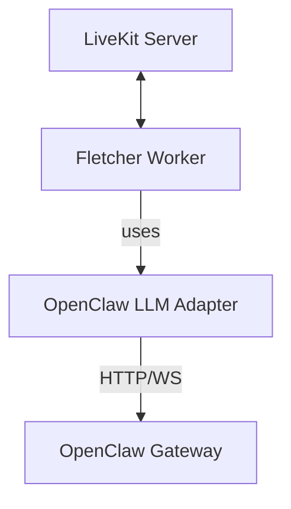
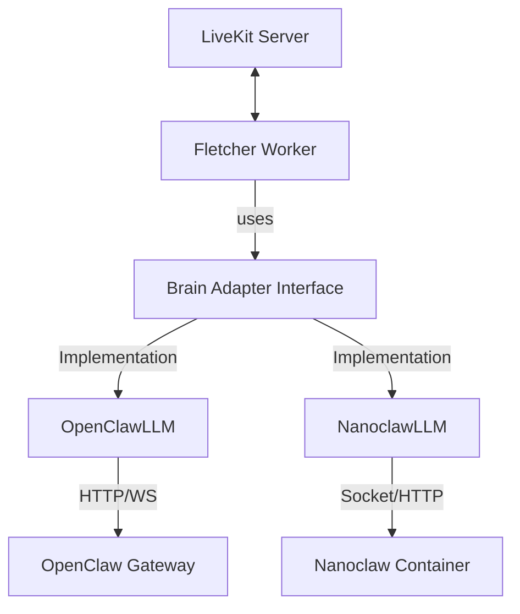

# Nanoclaw Integration Spec

## Overview

This document outlines the architecture and implementation plan for integrating Nanoclaw as an alternative "brain" for the Fletcher voice interface. Currently, Fletcher uses `@knittt/livekit-agent-openclaw` to connect to OpenClaw. We will generalize this to support Nanoclaw, making the backend pluggable.

## Architecture

The goal is to abstract the LLM/Agent backend so the LiveKit worker can switch between OpenClaw and Nanoclaw via configuration.

### Current Architecture


### Proposed Architecture


## Interface Abstraction

We will define a common interface that extends the `@livekit/agents` LLM class but adds specific session management capabilities required by our application logic.

### `BrainAdapter` Interface

The `BrainAdapter` will effectively be the `LLM` class from `@livekit/agents`, but we need to standardize how we initialize it and pass session context.

```typescript
import { LLM } from '@livekit/agents';

export interface BrainSessionInfo {
  roomName?: string;
  participantIdentity?: string;
  customSessionId?: string;
}

export interface BrainConfig {
  type: 'openclaw' | 'nanoclaw';
  // OpenClaw specific
  openclaw?: {
    endpoint: string;
    token: string;
  };
  // Nanoclaw specific
  nanoclaw?: {
    socketPath?: string; // If using Unix sockets
    url?: string;        // If using HTTP
    agentId?: string;    // If addressing a specific swarm agent
  };
}

// The factory function
export function createBrain(config: BrainConfig): LLM;
```

## Nanoclaw Integration Details

Nanoclaw runs agents in containers. Communication usually happens via:
1.  **Filesystem/Sockets**: For local agents.
2.  **HTTP/WebSocket**: If exposed via a bridge (likely required for the LiveKit worker if running in a separate container/pod).

Since Fletcher (LiveKit worker) likely runs in a container or separate process from Nanoclaw, we need a network-accessible endpoint for Nanoclaw.

### Nanoclaw Client Implementation

We need to create `NanoclawClient` and `NanoclawLLM` mirroring the OpenClaw implementation.

1.  **NanoclawClient**: Handles the low-level communication with Nanoclaw.
    *   *Challenge*: Nanoclaw is "one process, a handful of files". We need to ensure it exposes an API compatible with request/response or streaming for the LiveKit worker.
    *   *Strategy*: If Nanoclaw doesn't have a native API, we might need a small "sidecar" or use its existing IPC mechanism if accessible. Assuming Nanoclaw supports some form of external input (e.g. via a simplified HTTP server or WebSocket), we will target that.

2.  **NanoclawLLM**: Implements the `@livekit/agents` LLM interface.
    *   `chat(ctx)`: Converts LiveKit chat context to Nanoclaw input format.
    *   Stream response back to LiveKit.

## Implementation Steps

### Phase 1: Abstraction (Refactor)
1.  **Create `packages/livekit-brain-interface`**: (Optional) or just refactor `livekit-agent-openclaw` to be generic.
2.  **Rename/Refactor**: Rename `livekit-agent-openclaw` to `livekit-agent-interface` or keep it and add a new package `livekit-agent-nanoclaw`.
    *   *Better approach*: Create a new package `@knittt/livekit-agent-nanoclaw` for the Nanoclaw implementation to keep dependencies clean.
3.  **Define Shared Types**: Extract common session/config types.

### Phase 2: Nanoclaw Adapter
1.  **Develop `NanoclawClient`**:
    *   Implement connection logic (likely WebSocket or HTTP POST with streaming).
    *   Handle authentication (if any).
2.  **Develop `NanoclawLLM`**:
    *   Map `ChatContext` -> Nanoclaw Message History.
    *   Map Nanoclaw Stream -> `ChatChunk`.
    *   Handle Tool Calls (if Nanoclaw supports them in a compatible way).

### Phase 3: Integration
1.  **Update Fletcher Worker**:
    *   Update `agent.ts` to load configuration (likely from `.env`).
    *   Instantiate the correct LLM adapter based on `BRAIN_TYPE` env var.
2.  **Testing**:
    *   Verify switching between OpenClaw and Nanoclaw works without code changes (just config).

## Feasibility Notes

- **Nanoclaw API**: We need to verify Nanoclaw's external API capabilities. If it strictly runs locally via TTY/CLI, we may need to add a small API layer to it or run it in a mode that accepts external input.
- **Tool Calling**: Ensure Nanoclaw's agent definition supports the function calling format LiveKit expects, or build a translation layer.
- **Latency**: Ensure the Nanoclaw container response time is low enough for real-time voice (aim for <500ms TTFB).
