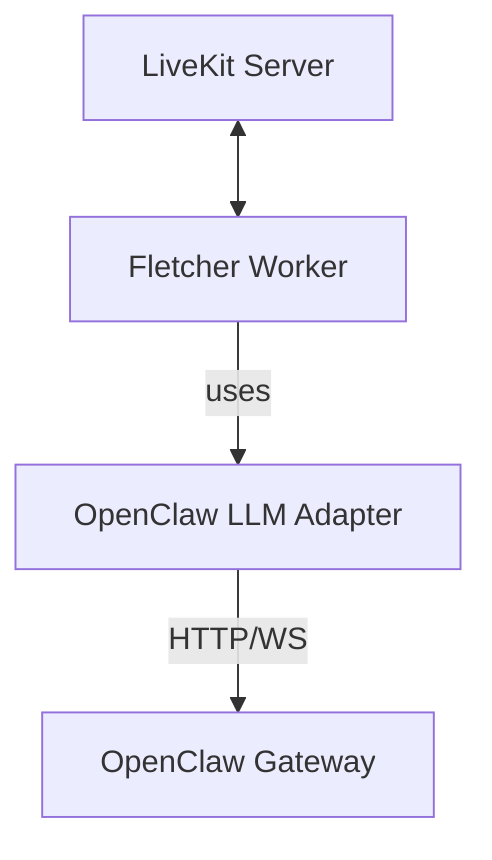
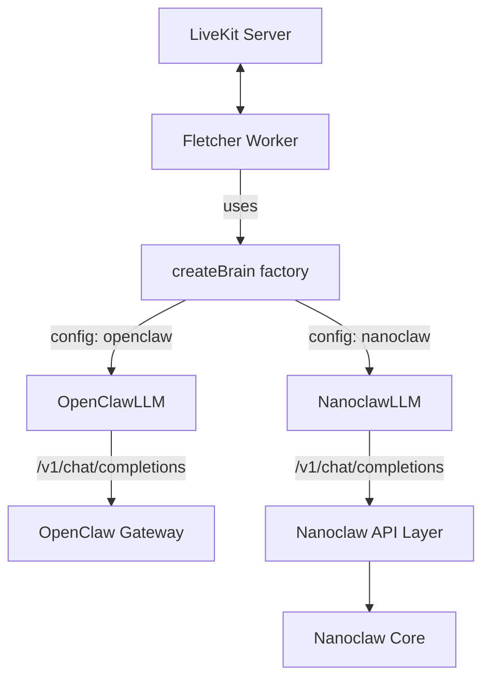

# Nanoclaw Integration Spec

## Overview

This document outlines the architecture and implementation plan for integrating Nanoclaw as an alternative "brain" for the Fletcher voice interface. Currently, Fletcher uses `@knittt/livekit-agent-openclaw` to connect to OpenClaw. We will generalize this to support Nanoclaw, making the backend pluggable.

## Key Differences: OpenClaw vs Nanoclaw

| Aspect | OpenClaw | Nanoclaw |
|--------|----------|----------|
| **Architecture** | Multi-user, microservices | Single-user, single process |
| **API** | Exposes `/v1/chat/completions` (OpenAI-compatible) | No external API (yet) |
| **Integration model** | Plugin/SDK | Claude Code Skills (codebase modification) |
| **Channels** | Plugin system | Direct channel implementations |
| **Message storage** | Per-account | SQLite, all channels unified |

**Key insight**: Nanoclaw doesn't expose an HTTP API. Integrations are done via Claude Code Skills that modify the Nanoclaw codebase. We need to create an `/add-openai-api` skill to expose an OpenAI-compatible endpoint.

## Architecture

### Current Architecture


### Proposed Architecture


Both backends expose OpenAI-compatible APIs, so the client code is nearly identical - just different URLs and session headers.

## Cross-Channel History

### The Single-User Advantage

Nanoclaw is a **single-user personal assistant**. All messages in the database belong to the same user, just via different channels (WhatsApp, Telegram, Voice).

This makes cross-channel history trivial:

```sql
-- Load all recent context, regardless of channel
SELECT * FROM messages ORDER BY timestamp DESC LIMIT 100
```

### Example Flow

```
[WhatsApp 9:00am] User: "Remind me to call mom tomorrow at 5pm"
[WhatsApp 9:01am] Bot:  "I'll remind you to call mom tomorrow at 5pm"
[Voice 2:00pm]    User: "What reminders do I have?"
[Voice 2:00pm]    Bot:  "You have one reminder: call mom tomorrow at 5pm"
```

The voice channel has full context from WhatsApp because all messages are in the same SQLite database.

### JID Prefixes

Each channel uses a distinct JID prefix:
- WhatsApp: `1234567890@s.whatsapp.net`
- Telegram: `tg:123456789`
- LiveKit/Voice: `lk:<participant-identity>`

Messages are stored with their channel JID, enabling channel-specific queries if needed while maintaining unified history.

## Interface Abstraction

### Package Structure

```
packages/
├── livekit-brain-interface/     # Shared types, factory
│   ├── src/types.ts             # BrainConfig, BrainSessionInfo
│   ├── src/factory.ts           # createBrain()
│   └── package.json
├── livekit-agent-openclaw/      # OpenClaw implementation
│   └── ...
└── livekit-agent-nanoclaw/      # Nanoclaw implementation (optional)
    └── ...                      # May not be needed if API is identical
```

### BrainConfig Interface

```typescript
export interface BrainSessionInfo {
  roomName?: string;
  participantIdentity?: string;
  customSessionId?: string;
}

export interface OpenClawConfig {
  endpoint: string;
  token: string;
}

export interface NanoclawConfig {
  url: string;
  // Single-user, so no auth token needed (local network only)
}

export type BrainConfig =
  | { type: 'openclaw'; openclaw: OpenClawConfig }
  | { type: 'nanoclaw'; nanoclaw: NanoclawConfig };

export function createBrain(config: BrainConfig): LLM;
```

## Nanoclaw API Layer

Since Nanoclaw has no external API, we create one via a Claude Code skill.

### `/add-openai-api` Skill

This skill adds an OpenAI-compatible HTTP endpoint to Nanoclaw:

**Files created:**
- `src/api/server.ts` - HTTP server (Express/Hono)
- `src/api/history.ts` - Cross-channel history loading

**Files modified:**
- `src/index.ts` - Start API server on boot
- `src/config.ts` - Add `API_PORT` config

### API Specification

```typescript
// Request
POST /v1/chat/completions
Content-Type: application/json
X-Nanoclaw-Channel: lk:participant-id

{
  "model": "nanoclaw",
  "messages": [
    {"role": "user", "content": "What reminders do I have?"}
  ],
  "stream": true
}

// Response (SSE) - Standard content
data: {"id":"chatcmpl-xxx","choices":[{"delta":{"role":"assistant"}}]}
data: {"id":"chatcmpl-xxx","choices":[{"delta":{"content":"You have"}}]}
data: {"id":"chatcmpl-xxx","choices":[{"delta":{"content":" one reminder"}}]}
data: [DONE]
```

### Extended Events for Voice UX

For long-running operations and visual artifacts, the API emits additional event types:

```typescript
// Status events (for "working" feedback during multi-step operations)
data: {"type":"status","action":"searching_files","detail":"src/**/*.ts"}
data: {"type":"status","action":"reading_file","file":"src/utils.ts"}
data: {"type":"status","action":"web_search","query":"typescript best practices"}
data: {"type":"status","action":"thinking"}

// Artifact events (visual content, not spoken)
data: {"type":"artifact","artifact_type":"diff","file":"src/utils.ts","diff":"@@ -10,3 +10,5 @@..."}
data: {"type":"artifact","artifact_type":"code","language":"typescript","content":"function foo() {...}"}
data: {"type":"artifact","artifact_type":"file","path":"src/utils.ts","content":"..."}

// Content events (spoken via TTS)
data: {"type":"content","delta":"I've updated the function to handle edge cases."}
```

### Fletcher Routing

Fletcher routes events differently based on type:

| Event Type | Destination | Action |
|------------|-------------|--------|
| `content` | TTS | Speak to user |
| `status` | Visualizer + optional TTS | Show "working" state, optionally say "Let me search for that..." |
| `artifact` | LiveKit Data Channel | Send to Flutter app for visual display |

```typescript
// In Fletcher worker
for await (const event of sseStream) {
  switch (event.type) {
    case 'content':
      await tts.speak(event.delta);
      break;
    case 'status':
      updateVisualizerState(event.action);
      if (shouldAnnounce(event)) {
        await tts.speak(statusToSpeech(event)); // "Let me check that file..."
      }
      break;
    case 'artifact':
      room.localParticipant.publishData(
        JSON.stringify(event),
        { reliable: true }
      );
      break;
  }
}
```

### Flutter Client Display

The Flutter app receives artifacts via LiveKit data channel and renders:

- **Diff viewer**: Side-by-side or unified diff with syntax highlighting
- **Code blocks**: Syntax-highlighted code snippets
- **File preview**: Full file content with line numbers
- **Status bar**: "Reading package.json..." / "Searching web..."

This enables voice-first interaction with visual augmentation for code/document work.

### Context Loading

When the API receives a request:

1. Extract channel JID from `X-Nanoclaw-Channel` header
2. Load recent messages across ALL channels:
   ```sql
   SELECT * FROM messages ORDER BY timestamp DESC LIMIT 100
   ```
3. Format as conversation history for Claude
4. Run Claude in container, stream response
5. Store bot response with `lk:<participant>` JID

## Implementation Phases

### Phase 1: Abstraction
1. Create `livekit-brain-interface` package with types and factory
2. Refactor `livekit-agent-openclaw` to use interface
3. Update worker to use `createBrain()` factory
4. Verify OpenClaw still works (regression test)

### Phase 2: Nanoclaw API Layer
1. Create `/add-openai-api` skill in Nanoclaw repo
2. Implement OpenAI-compatible endpoint
3. Implement cross-channel history loading
4. Test API standalone

### Phase 3: Fletcher Integration
1. Add Nanoclaw support to factory (may just be config)
2. Test end-to-end voice with Nanoclaw
3. Test cross-channel context (WhatsApp → Voice)

### Phase 4: Testing & Validation
1. Verify both backends work via `BRAIN_TYPE` env var
2. Measure latency (target: <500ms TTFB)
3. Document any differences in behavior

## Tool-Based Visual Feedback (Both Backends)

A key insight: **Fletcher executes tools**, not the brain. This means Fletcher has full access to tool calls, execution, and results regardless of backend.

### Tool Execution Flow

```
1. Brain streams:    tool_calls: [{name: "read_file", args: {path: "src/utils.ts"}}]
2. Fletcher:         Sends status to data channel ("Reading src/utils.ts...")
3. Fletcher:         Executes tool locally
4. Fletcher:         Sends artifact to data channel (file contents)
5. Fletcher:         Returns result to brain
6. Brain continues:  Generates spoken response using result
```

### Fletcher Tool Interception

```typescript
// Works for BOTH OpenClaw and Nanoclaw
stream.on('tool_call', async (toolCall) => {
  // Status event → Data Channel
  publishData({
    type: 'status',
    action: toolCall.name,
    detail: toolCall.args
  });

  // Execute tool
  const result = await executeTool(toolCall);

  // Artifact event → Data Channel (if applicable)
  if (toolCall.name === 'read_file') {
    publishData({
      type: 'artifact',
      artifact_type: 'code',
      file: toolCall.args.path,
      content: result
    });
  }

  if (toolCall.name === 'edit_file' || toolCall.name === 'apply_diff') {
    publishData({
      type: 'artifact',
      artifact_type: 'diff',
      file: toolCall.args.path,
      diff: toolCall.args.diff
    });
  }

  if (toolCall.name === 'web_search') {
    publishData({
      type: 'artifact',
      artifact_type: 'search_results',
      query: toolCall.args.query,
      results: result
    });
  }

  return result;
});
```

### Backend Capability Matrix

| Feature | OpenClaw | Nanoclaw |
|---------|----------|----------|
| Content streaming | ✅ | ✅ |
| Tool calls (OpenAI format) | ✅ | ✅ |
| Status from tool calls | ✅ (Fletcher) | ✅ (Fletcher) |
| Artifacts from tool results | ✅ (Fletcher) | ✅ (Fletcher) |
| Server-side status events | ❌ | ✅ |
| Data channel visuals | ✅ | ✅ |

**Nanoclaw-exclusive**: Server-side status events for non-tool operations (pure thinking phases, internal reasoning). Everything else works on both backends.

## Feasibility Notes

- **API Layer Complexity**: The `/add-openai-api` skill is the main work item. Once Nanoclaw has an OpenAI-compatible endpoint, Fletcher integration is straightforward.
- **Tool Calling**: Both backends support OpenAI-format tool calls. Fletcher executes tools and can extract status/artifacts from them.
- **Latency**: Nanoclaw runs Claude in containers. Container startup time may add latency on first message. Warm containers should be fast.
- **Security**: Nanoclaw API should only listen on localhost/private network since it's single-user with no auth.
- **Unified UX**: Tool-based visual feedback works for both backends, providing consistent experience.

## Success Criteria

- [ ] Fletcher switches between OpenClaw and Nanoclaw via `BRAIN_TYPE` env var
- [ ] No code changes required to switch backends
- [ ] Voice can access context from WhatsApp/Telegram conversations (Nanoclaw)
- [ ] Latency meets <500ms TTFB target
- [ ] Both backends support streaming responses
- [ ] Tool calls surface as status events via data channel (both backends)
- [ ] Tool results surface as artifacts via data channel (both backends)
- [ ] Flutter app renders status and artifacts from data channel
