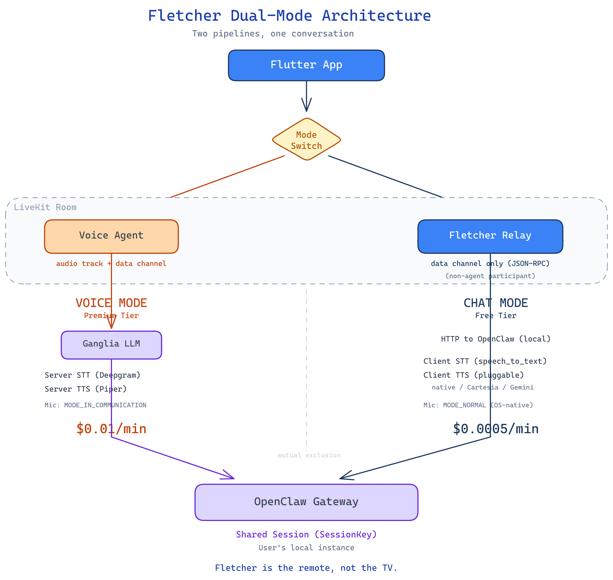

# Epic 22: Dual-Mode Architecture (Voice / Chat Split)

**Goal:** Split the single voice-agent pipeline into two distinct operating modes — **Voice Mode** (LiveKit agent, server-side STT/TTS) and **Chat Mode** (Fletcher Relay, client-side STT/TTS) — so that text conversations don't depend on the voice agent process.

**Problem:** The current architecture routes all communication — voice and text — through the LiveKit voice agent via a data channel. This means:

1. **Text mode keeps the voice pipeline alive.** WebRTC holds the Android mic in `MODE_IN_COMMUNICATION` even when muted, blocking native keyboard STT. The ICE connection stays up, triggering audio track refreshes on network handoffs — all for a text conversation.
2. **Sleep/wake is overloaded.** It handles both "user stopped talking" (voice concern) and "no recent activity" (session concern). Wake-up requires re-syncing TTS state, segment IDs, and audio tracks because the agent doesn't know if it's waking into voice or text.
3. **Every fix adds coupling.** The settle window, mute guards, segment ID resets, thinking-state timer resets — each patches the assumption that one pipeline serves both modes.

Evidence: 10 of 14 bugs from the March 9–10 field testing sessions trace directly to sleep/wake state management or the voice pipeline being active during text input (see `docs/field-tests/20260309-buglog.md` and `docs/field-tests/20260310-buglog.md`).

**Solution:** Two clean pipelines that share a conversation session but nothing else:

```
VOICE MODE                                    CHAT MODE
──────────                                    ─────────
LiveKit Room (active, agent connected)        LiveKit Room (active, relay participant)
Server STT (Deepgram)                         Client STT (native speech_to_text)
Agent → Ganglia → ACP → OpenClaw              Flutter → data channel → Relay → ACP → OpenClaw
Server TTS (Piper/Google)                     Client TTS (pluggable: native / Cartesia / Gemini)
Mic: WebRTC audio track (MODE_IN_COMM)        Mic: OS-native (MODE_NORMAL) — no audio track
Agent sleep/wake: YES                         Agent sleep/wake: N/A
```

Both modes use **ACP (Agent Communication Protocol)** to talk to OpenClaw — not the OpenClaw HTTP/SSE completions API. Both share the same **OpenClaw Gateway session** (via `session_key` in ACP `session/new` `_meta`) so conversation context, memory, and artifacts are continuous across mode switches.

## Fletcher Relay — The Chat Mode Backend

Chat mode is powered by the **Fletcher Relay** (`fletcher-relay`), a lightweight Bun service that joins LiveKit rooms as a **non-agent participant** using `@livekit/rtc-node`. It communicates with the Flutter app over the LiveKit data channel using JSON-RPC 2.0, and proxies requests to the local OpenClaw Gateway.

**Why a relay participant instead of direct HTTP to OpenClaw?**

| Concern | Direct HTTP/SSE | Relay via LiveKit data channel |
|---|---|---|
| Network resilience | TCP/SSE dies on WiFi→5G | ICE restart — survives network switches |
| Flutter code reuse | New HTTP client needed | Already speaks data channel |
| Backend flexibility | Hardcoded to OpenClaw | Pluggable (OpenClaw, Claude Agent SDK, etc.) |
| Session management | Client-side (fragile) | Server-side in relay (survives reconnects) |
| Server push | Needs polling or second channel | JSON-RPC notifications for free |
| NAT traversal | Requires tunnel/Tailscale config | LiveKit handles STUN/TURN |

**Economics:**
- Voice agent session: ~$0.01/min (agent-minute billing)
- Relay participant: ~$0.0005/min (participant-only)
- 10-second text interaction via agent: $0.01 (1-min minimum). Via relay: ~$0.000167.
- **Savings: ~60x for text interactions**

**Relay lifecycle:**
```
1. Mobile requests token from token server
2. Token server signals relay: "join room X"
3. Relay joins LiveKit room as non-agent participant
4. JSON-RPC messages flow over data channel
5. No messages for ~5 min → relay disconnects
6. Next interaction → relay rejoins
```

The relay runs locally alongside OpenClaw — it's part of the Fletcher product, not a cloud service. The installer bundles relay + LiveKit + token server + voice agent as one package. The user's only external dependency is their own OpenClaw instance.

**Mutual exclusion:** When voice mode is active (agent connected), the relay is passive — it stays in the room but defers to the agent. When chat mode is active, the agent is absent or sleeping. Handoff is coordinated via room metadata or data channel signals.

## ACP as the Unified Protocol

Both modes connect to OpenClaw via **ACP (Agent Communication Protocol)** — a full-duplex JSON-RPC 2.0 protocol over stdio or WebSocket. The current ganglia transport (HTTP POST to `/v1/chat/completions` + SSE streaming) is **half-duplex** and cannot support:

1. **Push from backend mid-turn** — inject context, cancel a response, or redirect while the agent is speaking
2. **Real-time event streaming** — observe pipeline state (STT, EOU, TTS, tool calls) without polling
3. **Multi-modal coordination** — e.g., a tool call result that the voice agent should incorporate immediately, not on the next turn boundary

ACP solves all three. Both the relay and the voice agent are **independent, disposable ACP clients** — each spawns its own ACP subprocess (or connects via WebSocket) and manages its own session lifecycle. All conversation state lives in OpenClaw, keyed by `session_key`.

```
CHAT MODE                              VOICE MODE
─────────                              ──────────
Mobile                                 Mobile
  │ data channel ("relay" topic)         │ WebRTC audio track
  ▼                                      ▼
Relay (Bun, non-agent participant)     livekit-agent (STT/TTS/VAD)
  │ ACP (stdio)                          │ ACP (stdio or WebSocket)
  ▼                                      ▼
OpenClaw (ACP agent)                   OpenClaw (ACP agent)
  │                                      │
  └──── same session_key ────────────────┘
```

The relay's ACP client is **already implemented** (`apps/relay/src/acp/client.ts`). The voice agent's ACP backend (`GANGLIA_TYPE=acp`) replaces the current HTTP/SSE transport in ganglia — see task 052 and the full spec at `apps/relay/docs/acp-transport.md`.

## What This Eliminates

| Bug cluster | Why it goes away |
|---|---|
| Mic release hacks (BUG-001/003 Mar 9, BUG-009 Mar 10) | No audio tracks published in chat mode → OS mic is free |
| TTS re-sync races (BUG-001 Mar 10, BUG-002 Mar 9) | Chat mode doesn't wake an agent |
| Artifact clumping (BUG-004 Mar 10) | Chat mode associates artifacts with relay responses |
| ICE cycling after idle (BUG-010 Mar 10) | Relay participant doesn't trigger ICE instability |
| Timer complexity (BUG-002/006/007 Mar 10) | Idle timer only runs in voice mode |
| Degraded status confusion (BUG-003 Mar 10) | Chat mode has its own health concept |

## Architecture



> Source: [`dual-mode-architecture.excalidraw`](./dual-mode-architecture.excalidraw) — open in [excalidraw.com](https://excalidraw.com) to edit.

## Status

**Epic Status:** [~] IN PROGRESS

## Tasks

### Core Relay Infrastructure (Epic 24) ✅
The relay service itself is fully built — see [Epic 24: WebRTC ACP Relay](../24-webrtc-acp-relay/EPIC.md). All 9 tasks complete (LiveKit participant, ACP stdio client, data channel bridge, room lifecycle, health, resilience).

### Implemented ✅

- [x] **044: Client-Side STT** — Removed. Unnecessary — OS keyboard and platform handle this natively.
- [x] [**053: Dual-Mode Chat / Live Split**](./053-dual-mode-chat-live-split.md) [~] — Chat/live routing works; mic button toggles mode; relay handles text in chat mode. **Remaining:** remove `text_message` handler from `agent.ts`, field-verify session key continuity.
- [x] [**054: Mobile ACP Client**](./054-mobile-jsonrpc-client.md) [~] — JSON-RPC codec, AcpClient service, streaming text into ChatTranscript, error handling, 30 unit tests. **Remaining:** wire `session/cancel` to UI cancel button, inline error cards (currently system events).
- [x] [**055: Serialize relay `forwardToMobile` calls**](./_closed/055-relay-serialize-forward-to-mobile.md) — sendQueue Promise chain; chunk always arrives before result.
- [x] [**056: Fix ACP Subprocess Leak**](./_closed/056-acp-subprocess-leak.md) — SIGKILL escalation after 3s SIGTERM grace period; process group kill.
- [x] [**059: Deferred Teardown on `participant_left`**](./_closed/059-relay-deferred-teardown.md) — 120s grace period survives WiFi→cellular network switches.

### In Progress 🔄

- [~] [**052: ACP Backend for Ganglia**](./052-relay-llm-wrapper.md) — `GANGLIA_TYPE=acp` LLM backend. Not started. Needed for voice mode to use ACP instead of HTTP/SSE completions API.
- [~] [**057: Relay-Side ACP Response Timeout**](./057-relay-acp-response-timeout.md) — Not started. Configurable timeout for hung ACP responses; mobile error surface; subprocess re-init.

### Backlog 📋

These tasks complete the full dual-mode vision. Currently deferred — chat mode works for text without them.

- [ ] **042: Relay Integration for Chat Mode (Flutter)** — Superseded by 054 (Mobile ACP Client). Remaining work tracked there.
- [ ] **043: Pluggable TTS Engine Abstraction** — `TtsEngine` interface with NativeTTS/Cartesia/Gemini implementations. Sentence-level streaming from relay text deltas.
- [ ] **045: Chat Mode Streaming Pipeline** — Full pipeline: text input → relay JSON-RPC → sentence buffer → TtsEngine → audio out.
- [ ] **046: Mode Switch Controller** — State machine for voice↔chat transitions. Audio track teardown/publish, agent dispatch/release, in-flight response handling.
- [ ] **047: Chat Mode Artifact Delivery** — Artifacts via JSON-RPC `session/update` from relay (currently voice-mode only via `ganglia-events`).
- [ ] **048: Unified Transcript Across Modes** — Seamless merge of voice and chat messages. Session key continuity verification.
- [ ] **049: Voice Pipeline Clean Teardown** — `removePublishedTrack`, release `MODE_NORMAL`, keep room alive for relay. Root fix for BUG-001/003/009.
- [ ] **050: Migrate Text Input from Agent to Relay** — Text always routes through relay, never agent. Partly done via 053.
- [ ] **051: Chat Mode Health & Error Handling** — Relay-specific health semantics. Agent absence is normal in chat mode.

---

## Mode Comparison

| Concern | Voice Mode | Chat Mode |
|---|---|---|
| Input | Server STT (Deepgram via LiveKit) | Native STT (`speech_to_text`) or keyboard |
| LLM routing | Agent → Ganglia → ACP → OpenClaw | Flutter → data channel → Relay → ACP → OpenClaw |
| Output | Server TTS (Piper/Google via agent) | Client TTS (pluggable engine) |
| LiveKit room | Active, agent + relay in room | Active, relay only in room |
| Agent process | Running, sleep/wake managed | Absent or sleeping |
| Relay process | Passive (defers to agent) | Active (handles all text) |
| Mic ownership | WebRTC audio track (`MODE_IN_COMMUNICATION`) | OS-native (`MODE_NORMAL`) — no audio track |
| Idle management | Agent sleep timer (Epic 20) | Relay idle timeout (~5 min) |
| Cost when active | ~$0.01/min (agent) + ~$0.001/min (participants) | ~$0.001/min (participants only) |
| Artifacts | Data channel (`ganglia-events`) from agent | JSON-RPC from relay |
| Latency (first response) | STT + LLM + TTS (~1.5-3s) | LLM TTFT + client TTS (~0.5-1.5s) |

## Key Decisions

- **Relay is the chat mode backend.** The Flutter app does not talk to OpenClaw directly. All chat mode communication goes through the relay via LiveKit data channel, getting ICE resilience and session management for free.
- **Relay is part of the Fletcher product.** It ships alongside the voice agent, LiveKit server, and token server as one installable package. It is not a separate product or optional add-on.
- **ACP replaces HTTP/SSE for both modes.** The OpenClaw completions API (`/v1/chat/completions`) is half-duplex and cannot support mid-turn push, real-time events, or multi-modal coordination. Both the relay (chat) and voice agent (live) connect to OpenClaw as independent ACP clients using full-duplex JSON-RPC 2.0. See `apps/relay/docs/acp-transport.md` for the full spec.
- **Session continuity via session key.** Both the relay and the voice agent use the same `SessionKey` (via `_meta` in ACP `session/new`) so OpenClaw maintains one conversation thread.
- **Client-side TTS is pluggable.** Start with `flutter_tts` (free/offline). Add cloud engines (Cartesia, Gemini) as separate implementations behind the same interface.
- **Text input defaults to chat mode.** When user taps the mic to switch to text, they're in chat mode — relay handles it.
- **Voice mode is opt-in.** User explicitly activates voice (unmute / tap mic). This dispatches the agent.
- **Mutual exclusion.** Agent and relay don't both handle messages simultaneously. When the agent is active, the relay is passive. Handoff coordinated via room metadata.
- **LiveKit room stays connected across modes.** The room is the shared transport layer. Voice mode publishes audio tracks into it. Chat mode uses only the data channel. Switching modes doesn't require disconnecting/reconnecting the room.

## Business Model Alignment

This architecture enables a natural tiered product:

- **Free tier (Chat Mode):** Relay participant handles text, native STT/TTS. Cost: fractions of a penny per interaction. Rock-solid — no agent state management, no sleep/wake bugs.
- **Premium tier (Voice Mode):** Full STT/TTS/VAD pipeline via transient voice agent. Higher per-minute cost justified by real-time voice interaction. Could support longer/persistent agent sessions for paying users.
- **The product is the whole stack.** Fletcher = app + relay + voice agent + LiveKit, packaged as one installer. User brings their own OpenClaw. QR code pairing (Epic 7) makes setup a 5-minute experience.

## Dependencies

- **Fletcher Relay** (`apps/relay`) — the relay service itself (see `apps/relay/tasks/relay-mvp/`)
- **Epic 4 (Ganglia)** — session key routing for shared context
- **Epic 7 (Sovereign Pairing)** — QR code setup, token server signals relay to join rooms
- **Epic 17 (Text Input)** — existing text input UI to migrate
- **Epic 20 (Cost Optimization)** — agent dispatch/sleep mechanics
- **Epic 3 (Flutter App)** — mobile client foundation

## Anti-Goals

- **No direct HTTP to OpenClaw from the app.** All LLM communication goes through either the agent (voice) or the relay (chat). The app never talks to OpenClaw directly.
- **No hybrid pipeline.** A message is routed through the agent OR the relay. Never both simultaneously.
- **No server-side TTS in chat mode.** The whole point is to eliminate the agent dependency for text conversations.
- **No breaking voice mode.** Voice mode continues to work exactly as today. This epic adds chat mode alongside it.
- **Fletcher does not install or manage OpenClaw.** It connects to the user's existing instance. Fletcher is the remote, not the TV.

## References

- [Fletcher Relay architecture](../../apps/relay/docs/architecture.md)
- [ACP transport spec](../../apps/relay/docs/acp-transport.md) — full wire format, OpenClaw specifics, voice extensions
- [Fletcher Relay epic](../../apps/relay/tasks/relay-mvp/)
- [Bug log: March 9 field test](../../docs/field-tests/20260309-buglog.md)
- [Bug log: March 10 field test](../../docs/field-tests/20260310-buglog.md)
- [Bug log: March 12 field test](../../docs/field-tests/20260312-buglog.md) — BUG-001: ACP schema mismatch (confirmed OpenClaw wire format)
- [ACP official spec](https://agentclientprotocol.com/protocol/overview.md)
- [flutter_tts](https://pub.dev/packages/flutter_tts) — platform-native TTS
- [speech_to_text](https://pub.dev/packages/speech_to_text) — platform-native STT
- [Cartesia TTS API](https://cartesia.ai/product/python-text-to-speech-api-tts) — 40ms TTFA cloud TTS
- [Gemini TTS](https://fallendeity.github.io/gemini-ts-cookbook/quickstarts/Get_started_TTS.html) — Google cloud TTS
- [just_audio](https://pub.dev/packages/just_audio) — audio playback for cloud TTS engines
